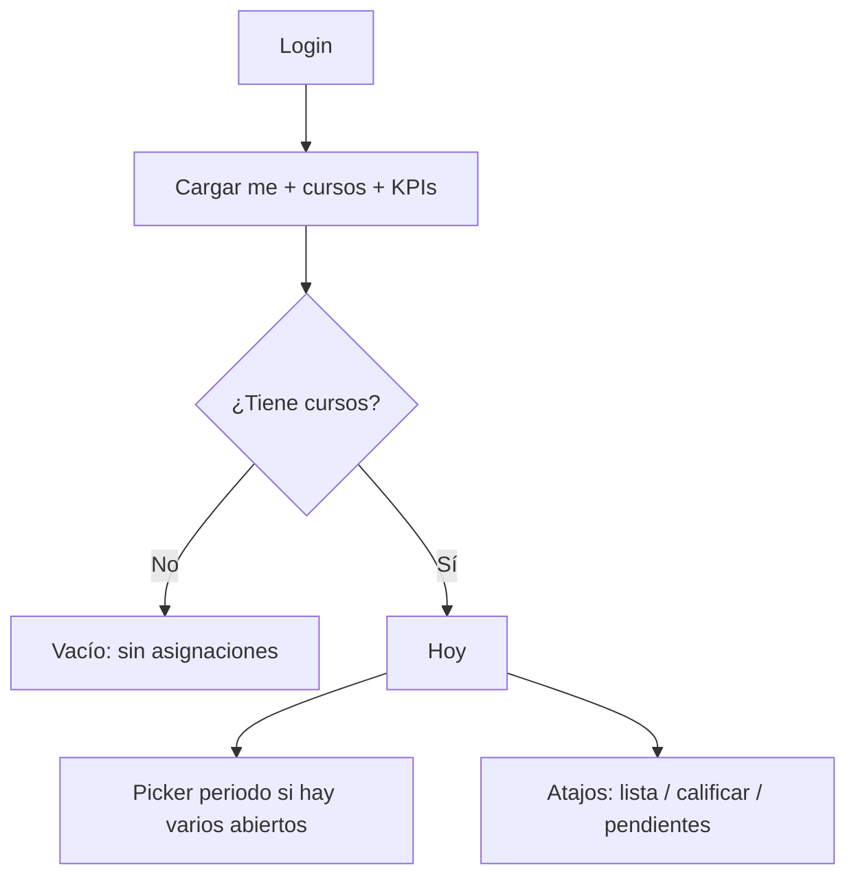
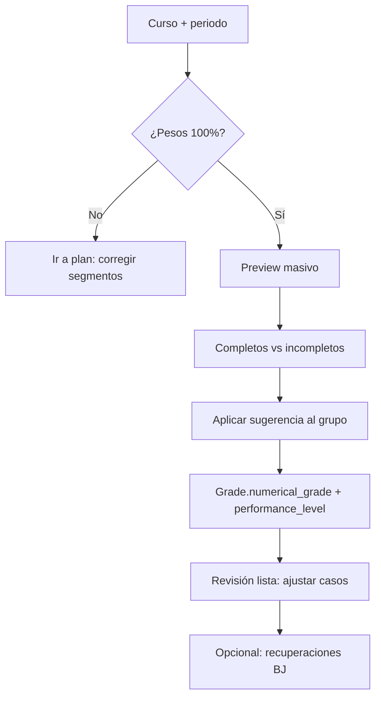

# Brief de diseño — interfaz phone + tablet para el docente

**Audiencia:** agente o diseñador de UI (no es una especificación de implementación).  
**Producto:** eduCalc — Registro Escolar de Valoración e Indicadores Académicos (Colombia, Decreto 1290).  
**Fuente de verdad de capacidades:** `backend/docs/openapi/schema.json` (API 1.0.0), cruzada con scope RBAC del rol `TEACHER`.  
**Fecha:** agosto 2026.

Este documento describe **qué puede hacer hoy un docente** en el sistema, **cómo se agrupan esas capacidades en flujos de trabajo reales**, y **qué debe respetar una interfaz phone-first con soporte de primer nivel para tablet**. No inventar pantallas para roles `ADMIN` / `COORDINATOR` ni para carga masiva CSV.

---

## 0. Instrucciones para el agente de diseño

Diseñar **una sola app adaptativa**: nace en teléfono y **debe funcionar de igual calidad en tablet**. El usuario está en un aula, entre 20 y 45 estudiantes, y poco tiempo. En teléfono suele ir con una mano (de pie o circulando); en tablet suele estar en el escritorio, en landscape, con el grupo a la vista.

### Breakpoints de diseño (obligatorios)

Entregar cada pantalla clave en **estos tres marcos**. No es “el phone estirado”.

| Nombre | Ancho CSS | Orientación de referencia | Dispositivo típico |
|--------|-----------|---------------------------|-------------------|
| **Phone** | 360–430 px | Portrait | 390×844 |
| **Tablet portrait** | 744–834 px | Portrait | iPad mini / iPad 768×1024 lógico |
| **Tablet landscape** | 1024–1194 px | Landscape | iPad 11" 1194×834; Android 10" ~1280×800 |

Regla: a partir de **768 px de ancho** entra el layout tablet (rail + split view). Por debajo, el layout phone (tabs inferiores + stack). Rotar la tablet debe **recomponer**, no recortar. Si el SO pone la app en ventana compacta o split-screen (~640 px), volver al layout phone.

### Debe

- Organizar la IA alrededor de **trabajos del docente**, no alrededor de tablas CRUD del OpenAPI.
- Usar `CourseAssignment` (asignatura + grupo + año) como **unidad de navegación principal**.
- Tratar el **periodo académico** (P1–P4) como contexto persistente, no como un filtro escondido.
- Distinguir dos sombreros: **docente de asignatura** y **director de grupo** (homeroom).
- Diseñar estados vacíos, de carga, de error 403/404 y de “fuera de periodo”.
- Priorizar toques grandes (≥ 44 px), listas verticales, acciones sticky y confirmaciones cortas. En tablet los targets siguen siendo táctiles: no pasar a densidad de mouse.
- Usar español de Colombia en copy (asistencias SE/CE, Bajo/Básico/Alto/Superior, boletín).
- Diseñar **phone y tablet como variantes del mismo flujo**, no dos productos. Misma jerarquía, distinto layout (stack vs split).
- Aprovechar el ancho de tablet para **lista + detalle**, **matriz de notas** y **visor PDF al lado**, sin añadir módulos de administración.

### No debe

- Copiar el menú web actual (más de 20 entradas de staff).
- Tratar la tablet como “la web en un iPad”: nada de sidebar de 10 secciones ni grillas CRUD.
- Diseñar carga CSV, traslados, recálculo institucional, consolidado de notas ni gestión de usuarios.
- Inventar tardanzas, notificaciones push, chat con acudientes u offline sync: **no existen en la API**.
- Asumir que el docente ve toda la institución: el alcance es **sus asignaciones de curso**.
- Tratar `numerical_grade` y `definitive_grade` como el mismo campo.
- Permitir editar a mano la fila general de inasistencias (la produce el llamado a lista).
- Dejar pantallas tablet con marcos vacíos, texto gigante o un único listado centrado a 400 px.

### Entregables esperados

1. Mapa de información (IA) **phone** (tabs inferiores) y **tablet** (rail + split).
2. Flujos clave con pantallas, decisiones y feedback — cada flujo P0/P1 en phone y en tablet landscape.
3. Componentes reutilizables con variantes compact / regular (selector de curso/periodo, lista de estudiantes, teclado numérico de notas, chips de asistencia).
4. Variantes director de grupo vs solo asignatura.
5. Comportamiento al rotar (portrait ↔ landscape) y en ventana compacta.
6. Criterios de éxito por flujo (qué se considera “listo para implementar”).

---

## 1. Contexto del producto

eduCalc registra la vida académica de un colegio: estructura (sede, grado, grupo, asignatura), personas, matrículas, evaluación, asistencia, convivencia e informes.

El docente **no configura la institución**. Recibe:

| Concepto | Qué es para el docente |
|----------|------------------------|
| **Institución / sede** | Contexto de lectura. No la administra. |
| **Año lectivo** | Filtro de temporada. Preferir el año `is_active`. |
| **Periodo** (`AcademicPeriod`, P1–P4) | Marco de casi toda evaluación y asistencia. |
| **Grupo** | Curso (grado + sección + sede + año). Lista de estudiantes vía matrícula `active`. |
| **Asignatura** | Lo que enseña. Puede tener énfasis. Pertenece a un área académica. |
| **Asignación de curso** (`CourseAssignment`) | El “yo doy X en el grupo Y este año”. Es la llave de casi todo. |
| **Director de grupo** (`GradeDirector`) | Un docente asignado como homeroom de un grupo en un año. Rol extra, no un login distinto. |

Roles de la API: `ADMIN`, `COORDINATOR`, `TEACHER`, `PARENT`. Este brief cubre **solo `TEACHER`**.

---

## 2. Persona y escenarios

### Persona A — Docente de asignatura

Da 4–8 asignaciones (misma asignatura en varios grupos, o varias asignaturas). Entra al salón, llama a lista, califica un taller, cierra notas del periodo, redacta un indicador cualitativo y, si hay Bajo, registra una recuperación.

### Persona B — Director de grupo (mismo usuario)

Además es homeroom de uno o más grupos. Ve el grupo completo (no solo “su” asignatura): llamado general, observaciones de convivencia, informe de indicadores del periodo, registro escolar y boletín del grupo.

La UI debe detectar si `GET /api/grade-directors/?teacher={teacher_id}` devuelve filas. Si sí, mostrar un modo “Mi grupo”; si no, ocultarlo.

### Restricciones de uso

- Conectividad inestable en algunas sedes (diseñar save atómico y reintento; no hay API offline).
- Nombres largos, documentos, y listas de ~40 estudiantes: búsqueda local y anclas alfabéticas.
- Escala 0.00–5.00 con dos decimales. Niveles: `SP` Superior, `AL` Alto, `BS` Básico, `BJ` Bajo (Decreto 1290).
- **Phone:** una mano, bolsillo, circulando por el aula. Gestos y tabs al pulgar.
- **Tablet:** dos manos o atril/escritorio; landscape es el modo de trabajo para lista, calificación y PDF. Portrait sirve para consultar ficha y leer informes. Safe areas (notch, home indicator, teclado en pantalla) aplican en ambos.

---

## 3. Autenticación y sesión

| Acción | Endpoint | Notas de UI |
|--------|----------|-------------|
| Login | `POST /api/auth/login/` | `username` + `password`. Devuelve `access`, `refresh`, `user` (`id`, `username`, `email`, `role`, `institution_id`). |
| Perfil | `GET /api/auth/me/` | Añade `teacher_id` y `parent_id`. **Usar `teacher_id` como identidad docente.** Si `role !== TEACHER` o falta `teacher_id`, no entrar a esta app. |
| Refresh | `POST /api/auth/refresh/` | Renovar `access` en segundo plano. |
| Listas | casi todos los GET | Paginación `limit` + `offset`. Respuesta `{ count, next, previous, results }`. |

Header: `Authorization: Bearer <access>`.

Tras login, cargar de una vez el universo del docente:

```
GET /api/auth/me/
GET /api/course-assignments/for-teacher/?teacher={teacher_id}&academic_year={año_activo}
GET /api/grade-directors/?teacher={teacher_id}
GET /api/dashboard/kpis/?academic_period={periodo_actual}
GET /api/academic-periods/?academic_year={año}
GET /api/grading-scales/?institution={institution_id}
```

`for-teacher` no pagina (máx. 2000 filas; `truncated: true` si se corta). Es el **índice de “Mis cursos”**.

---

## 4. Alcance de datos (qué ve el docente)

El servidor filtra por `CourseAssignment` del `teacher_id` del perfil.

| Recurso | El docente ve |
|---------|----------------|
| Estudiantes | Solo matriculados en grupos donde imparte |
| Notas, indicadores, recuperaciones | Solo de sus asignaciones |
| Asistencia por asignatura | Sus asignaciones |
| Asistencia general del grupo / llamado a lista | Grupos donde imparte (o dirige) |
| Esquemas, segmentos, actividades, notas por actividad | Sus asignaciones |
| Catálogo de indicadores | Áreas y grados de sus grupos |
| Componentes de asignatura | Lectura (los crea el admin; pesos 100% por asignatura) |
| Padres / acudientes | Los de sus estudiantes (API sí; **web actual los oculta del menú** — en esta app, mostrar solo en ficha del estudiante, no como módulo) |
| Sí mismo en `/api/teachers/` | Solo su ficha |
| Instituciones, sedes, años, periodos, grupos, asignaturas | Subconjunto ligado a sus asignaciones |
| Usuarios, CSV, traslados, recálculos masivos, consolidado CSV | **No.** 403 o ruta bloqueada |

Si no hay asignaciones: home vacío con mensaje “Aún no tienes cursos asignados. Pide a coordinación que te vincule a un grupo.”

---

## 5. Inventario de features (lo que existe hoy)

Prioridad phone/tablet: **P0** = uso diario en aula · **P1** = cierre de periodo · **P2** = consulta / informes · **P3** = referencia, no merece tab propio.

### 5.1 Identidad y arranque — P0

| Feature | Capacidad real | API |
|---------|----------------|-----|
| Iniciar sesión | JWT + rol | `POST /api/auth/login/` |
| Sesión | perfil + `teacher_id` | `GET /api/auth/me/` |
| Mis cursos | asignaciones sin paginar | `GET /api/course-assignments/for-teacher/` |
| Home | conteos de su alcance; notas pendientes del periodo | `GET /api/dashboard/kpis/?academic_period=` |

KPI útil en home (cuando hay `academic_period`): `grades_period` → `expected_slots`, `filled_slots`, `pending_slots`, estudiantes con nota faltante. El resto de `counts` es inventario; **no diseñar un dashboard de 25 tarjetas**.

Campos de `CourseAssignment` a mostrar: `subject_name`, énfasis, `group_name`, `group_grade_level_name`, `campus_name`, `academic_year_year`.

### 5.2 Llamado a lista (asistencia diaria) — P0

Feature estrella para móvil. Escritura **solo** por save atómico, no por CRUD de filas diarias.

| Feature | Detalle |
|---------|---------|
| Abrir lista del día | `GET /api/daily-attendances/roster/?group=&date=&course_assignment=` (omitir asignatura = llamado **general**) |
| Marcar estudiantes | `PRESENT` / `EXCUSED` / `UNEXCUSED` |
| Nota de excusa | `notes` obligatorio en la práctica cuando `EXCUSED` |
| Guardar todo el grupo | `POST /api/daily-attendances/save-roll-call/` — una petición, recalcula acumulado del periodo |
| Reescribir | volver a guardar el **mismo origen** (grupo+fecha+asignatura o general) sobrescribe, no duplica |
| Historial | `GET /api/daily-attendances/` (solo lectura) |

**Dos orígenes**

1. **General del grupo** — típico del director de grupo. `course_assignment` nulo.
2. **Por asignatura** — el docente de la clase. Debe enviar su `course_assignment`.

**Consolidación del día** (mostrar en UI, no editar):

```
falta con excusa (CE)  >  falta sin excusa (SE)  >  presente
```

Varios docentes pueden llamar el mismo día. `consolidated_status` es el estado único; `other_sources` indica cuántos otros orígenes ya marcaron. Una fecha cuenta **una sola vez** en el acumulado del periodo.

Si la fecha no cae en ningún periodo, el roster trae `academic_period: null` y hay que pedir periodo al guardar.

**No hay tardanzas.**

### 5.3 Inasistencias acumuladas del periodo — P1

`Attendance` tiene dos tipos de fila:

| Tipo | `course_assignment` | Origen | UI |
|------|---------------------|--------|----|
| Por asignatura | obligatorio | Manual o CSV (CSV no es del docente) | El docente puede crear/editar SE/CE de **su** asignatura |
| General del grupo | nulo | Derivada del llamado a lista | **Solo lectura** (`is_general: true`) |

Campos: `unexcused_absences` (SE), `excused_absences` (CE).  
API: `GET/POST/PATCH /api/attendances/`.

En phone y tablet, el camino feliz es el llamado diario; la edición manual de SE/CE por asignatura es secundaria (ajuste al cierre).

### 5.4 Estudiantes y ficha — P0 consulta / P3 escritura

| Feature | API | UI sugerida |
|---------|-----|-------------|
| Listar / buscar | `GET /api/students/?search=` | Buscador por nombre o documento, filtrado por grupo del curso activo |
| Ficha | `GET /api/students/{id}/` | Identidad, contacto, SISBEN, estrato, discapacidad, EPS |
| Resumen de notas | `GET /api/students/{id}/grades-summary/` | Notas por periodo y asignatura |
| Matrícula | `GET /api/enrollments/?student=&academic_year=` | Grupo, sede, estado `active` / `withdrawn` / `graduated` |
| Acudientes | `GET /api/student-guardians/?student=` + padre | Teléfono/email en ficha, no módulo aparte |
| Ranking del grupo | `GET /api/groups/{id}/students-rankings/?period_id=` | Puesto y promedio (usa `PerformanceSummary`) |

CRUD de estudiantes/matrículas existe en API para staff, pero **en esta app no diseñar alta/baja/traslado**. Traslado (`POST /api/students/{id}/transfer/`) es coordinador/admin.

### 5.5 Evaluación por actividades (planear + calificar) — P0/P1

Jerarquía (no aplanar en una sola tabla):

```
SubjectComponent          ← catálogo institucional, SOLO LECTURA para el docente
  GradingScheme           ← 1 por (CourseAssignment + AcademicPeriod)
    ComponentSegment      ← el docente los crea; pesos del segmento suman 100% por componente
      GradingActivity     ← nombre, fecha, max_score (default 5.00)
        StudentActivityScore  ← score null = pendiente; NO escribe Grade
```

| Feature | API | Notas |
|---------|-----|-------|
| Ver componentes | `GET /api/subject-components/?subject=` | Admin los define; pesos de componente = 100% |
| Crear/activar esquema | `POST/GET /api/grading-schemes/` | `is_active`; unique (asignación, periodo) |
| Validar pesos | `GET /api/grading-schemes/{id}/validate-weights/` | Flags `subject_component_weights_valid`, `segment_weights_valid` |
| Segmentos | CRUD `/api/component-segments/` | Configurable por docente |
| Actividades | CRUD `/api/grading-activities/` | `activity_date`, `max_score`, `sort_order` |
| Calificar | CRUD `/api/student-activity-scores/` | `score` nullable; `score_pending` read-only |
| Desglose | `GET /api/grading-schemes/{id}/breakdown/?student=` | Sugerida + árbol componente→segmento→actividad |
| Sugerencia suelta | `GET /api/grades/suggested/?student=&course_assignment=&academic_period=` | No persiste |
| Aplicar a un estudiante | `POST /api/grading-schemes/{id}/apply-suggestion/` | Escribe `Grade.numerical_grade` + `performance_level`. **No toca `definitive_grade`** |
| Preview masivo | `GET /api/grading-schemes/{id}/apply-suggestion-bulk-preview/` | Quién está completo / incompleto |
| Aplicar al grupo | `POST /api/grading-schemes/{id}/apply-suggestion-bulk/` | Solo estudiantes con **todas** las actividades con `score` no nulo |

La web separa **Planeación** (`/activity-planning`: resumen, calendario, planeador) y **Calificación** (`/activity-grading`: esquemas, notas, sugeridas). En móvil pueden ser dos modos del mismo curso, no dos apps.

Estados de actividad (calculados en cliente; la API no tiene `status`):

- Planificada (fecha futura, sin notas)
- Pendiente de calificar (fecha ≤ hoy, hay `score` null)
- Calificada (todos los estudiantes del grupo activo tienen score)

### 5.6 Notas oficiales del periodo — P1

Entidad `Grade`: una fila por estudiante + asignación + periodo.

| Campo | Significado | Quién lo escribe |
|-------|-------------|------------------|
| `numerical_grade` | Nota del periodo (0.00–5.00) | Docente, o “aplicar sugerencia” |
| `performance_level` | FK a `GradingScale` (BJ/BS/AL/SP) | Suele inferirse al aplicar sugerencia; editable |
| `definitive_grade` | Nota definitiva (puede diferir) | Recuperación, o carga/edición explícita. La sugerencia **no** la pisa |

API: CRUD `/api/grades/`. Crear requiere `student`, `course_assignment`, `academic_period`, `numerical_grade`.

En phone: lista compacta “estudiantes × una asignatura × un periodo”. En tablet: tabla táctil del mismo recorte. No un formulario genérico de 12 campos.

### 5.7 Recuperaciones — P1

Solo si `numerical_grade` está en banda **Bajo** (escala `BJ` / nombre “Bajo”; fallback `<= 2.99`).

| Feature | API |
|---------|-----|
| Elegibles | `GET /api/grade-recoveries/eligible/` |
| Registrar | `POST /api/grade-recoveries/` body: `grade`, `recovery_grade`, `description` |
| Historial | `GET /api/grade-recoveries/` |

Efecto: crea historial y **sobrescribe** `Grade.definitive_grade`. No cambia `numerical_grade` ni el nivel de desempeño. Se puede recuperar otra vez (nuevo registro).

### 5.8 Indicadores cualitativos (logros) — P1

Texto de logro por estudiante, asignatura y periodo. Se alimenta de un catálogo institucional.

| Feature | API |
|---------|-----|
| Catálogo | `GET /api/academic-indicator-catalogs/` — textos `achievement_below_basic` y `achievement_basic_or_above` por área, grado y periodo (periodo vacío = plantilla genérica) |
| CRUD indicador | `/api/academic-indicators/` |

Campos de escritura: `student`, `course_assignment`, `academic_period`, `catalog` (opcional), `outcome` (`below_basic` | `basic_or_above`), `description`, `numerical_grade`, `performance_level`.

Si hay catálogo y `outcome`, la descripción puede copiarse del logro positivo o negativo. La API puede inferir `outcome` desde la nota / nivel.

En phone y tablet: partir de la nota ya registrada → sugerir texto del catálogo → permitir editar.

### 5.9 Convivencia — P1 (director) / P2 (asignatura)

`DisciplinaryReport`: `student`, `academic_period`, `report_text`, `created_by` (docente).  
API: CRUD `/api/disciplinary-reports/`.

Un texto cualitativo por estudiante y periodo (el docente puede crear varios; diseñar como bitácora). No hay tipos de falta ni severidad en el modelo.

### 5.10 Desempeño y ranking — P2

`PerformanceSummary`: promedio de periodo, puesto, promedio definitivo. El recálculo masivo es de coordinación. El docente **consulta**.

- `GET /api/performance-summaries/?group=&academic_period=`
- `GET /api/groups/{id}/students-rankings/`

No diseñar botones “Recalcular institución/grado”.

### 5.11 Informes y PDF — P2

| Informe | Cuándo | API | Quién |
|---------|--------|-----|-------|
| Boletín de calificaciones | Cierre de periodo / entrega a familia | `GET /api/academic-grades/bulletin/?academic_year=` + `student` **o** `group`; opcional `period_ids` | Docente de los estudiantes a su alcance; PDF binario |
| Informe de indicadores | Requiere director de grupo | `GET /api/academic-indicators-reports/{student_id}/{period_id}/` (get-or-create); list/detail/POST | Director; campos `general_observations`, `grade_director` |
| Registro escolar de valoración | Anual | `GET /api/school-records/{student_id}/{academic_year_id}/` (get-or-create) | Staff con alcance al estudiante |

Diseñar **descarga / compartir PDF** y una ficha de observaciones, no un editor de documentos.

### 5.12 Estructura académica — P3 (solo lectura en esta app)

El docente puede listar (y la API técnicamente permite escribir) sedes, años, periodos, grados, grupos, áreas, asignaturas, escalas. **En phone y tablet: consulta contextual**, no administración.

Escalas (`GradingScale`): `code` SP/AL/BS/BJ, `min_score`, `max_score`, `name`. Necesarias para colorear notas y validar recuperaciones.

### 5.13 Fuera de la app docente

No diseñar:

| Área | Motivo |
|------|--------|
| `POST .../bulk-load/` (cualquier recurso) | Solo admin/coordinador |
| `POST /api/students/{id}/transfer/` | Traslados |
| `POST /api/performance-summaries/recalculate-by-*` | Recálculo masivo |
| `GET /api/reports/grading-consolidated/` | CSV institucional; 403 docente |
| `/api/users/` | Solo admin |
| Alta de instituciones, docentes, padres como módulos | Administración |
| Componentes de asignatura en escritura | `IsAdminUserOrReadOnlyStaff` |

---

## 6. Arquitectura de información (phone y tablet)

Los destinos son los mismos en ambos tamaños. Cambia el **chrome**, no el modelo mental.

### Destinos (4)

1. **Hoy** — home operativo (no inventario).
2. **Cursos** — lista de `CourseAssignment` del año activo.
3. **Grupo** — visible si es director; si no, ocultar o sustituir por “Estudiantes”.
4. **Más** — perfil, año/periodo, escalas, cerrar sesión, informes.

Acciones rápidas en Hoy (máximo 4): Llamar a lista · Calificar · Notas del periodo · Recuperaciones.

### Phone (< 768 px) — tabs inferiores + stack

Barra inferior fija. Un panel a la vez. Selectores de curso/periodo en **bottom sheet**. Detalle de estudiante y PDF a pantalla completa.

### Tablet (≥ 768 px) — rail + split view

- **Rail izquierdo** (icono + etiqueta corta; ~72–88 px en landscape, expandible en portrait si hay espacio): Hoy, Cursos, Grupo, Más. No usar un sidebar de módulos administrativos.
- **Columna maestra** (~320–380 px): lista de cursos, roster o estudiantes.
- **Columna detalle** (el resto): la tarea activa (pasar lista, teclado de notas, ficha, PDF).
- Si no hay selección, el detalle muestra un empty state útil (“Elige un curso” / “Elige un estudiante”), nunca un lienzo en blanco.
- En tablet portrait, el split puede ser 40/60; si el detalle necesita teclado (calificar), priorizar el detalle y colapsar la lista a un selector en header.

### Contexto persistente (header compacto)

Siempre visible cuando se está “dentro” de un curso:

```
[ Matemáticas · 8° A · Sede Norte ]
[ Periodo 2 ▾ ]     [ 2026 ]
```

- **Phone:** cambiar curso o periodo es un bottom sheet, no una página de filtros de 8 campos.
- **Tablet:** el mismo switcher puede ser un popover anclado al header; el rail no se usa para cambiar de asignatura.

### Stacks por curso

```
Curso (CourseAssignment)
 ├─ Asistencia de hoy
 ├─ Actividades
 │    ├─ Plan (segmentos + calendario)
 │    └─ Calificar (lista estudiantes × actividad)
 ├─ Nota del periodo
 │    ├─ Sugeridas / aplicar
 │    └─ Recuperaciones
 ├─ Logros (indicadores)
 └─ Estudiantes del grupo
```

En tablet, estos ítems son **segmentos o tabs del detalle**, con la lista de cursos fija a la izquierda. No anidar otro stack completo que tape el rail.

### Stack director de grupo

```
Mi grupo
 ├─ Llamado general
 ├─ Convivencia
 ├─ Ranking / promedios
 ├─ Informe de indicadores
 ├─ Boletín (PDF grupo o estudiante)
 └─ Registro escolar
```

En tablet landscape: lista de estudiantes del grupo | ficha + acción (llamado, informe, PDF).

### Layouts tablet por tipo de tarea

| Tarea | Phone | Tablet landscape | Tablet portrait |
|-------|-------|------------------|-----------------|
| Hoy | Cards apiladas | Atajos a la izquierda, pendientes/KPIs a la derecha | 2 columnas de atajos; más aire |
| Llamado a lista | Roster a pantalla completa | Roster en 2 columnas de nombres + panel origen/fecha/resumen SE-CE | Roster completo; resumen sticky arriba |
| Calificar actividad | Lista + teclado overlay | Lista de estudiantes \| keypad + actividad anclada | Lista; keypad dock inferior más ancho |
| Cerrar periodo | Lista vertical sugerida/oficial | Tabla táctil estudiantes × (sugerida, oficial, nivel, definitiva) | Tabla con columnas esenciales; resto en ficha |
| Ficha estudiante | Stack de tabs | Lista del grupo \| ficha con tabs | Lista colapsable + ficha |
| Plan / pesos | Acordeón | Componentes \| segmentos y actividades del seleccionado | Acordeón más ancho |
| PDF boletín | Visor + share sheet | Lista de estudiantes \| visor PDF | Visor a pantalla; share en toolbar |

### Orientación y ventana

- Rotar no debe perder la selección (curso, estudiante, actividad, marcas de lista no guardadas).
- Split-screen / Stage Manager / ventana ~640 px: **layout phone**.
- Teclado virtual en landscape no debe tapar la fila activa: scroll-into-view o keypad propio (`ScoreKeypad`) en lugar del teclado del sistema cuando se califica.

---

## 7. Flujos para diseñar (detalle)

Cada flujo lista objetivo, pantallas, API, reglas y puntos de UI. El agente debe producir wireframes de estos y no de CRUD genérico.

### Flujo 0 — Entrar y entender el día



**Pantallas:** Splash/login · Hoy · Empty sin cursos.  
**Puntos:** mostrar nombre del docente (ficha `GET /api/teachers/{teacher_id}`); chip de director si aplica; barra “notas pendientes del periodo” usando `grades_period`.  
**Tablet:** Hoy en dos columnas (atajos + pendientes del periodo / próximos a calificar). Login centrado con max-width ~420 px, no estirado a 1200 px.

### Flujo 1 — Llamado a lista en el aula (P0)

**Objetivo:** en < 60 s marcar 30–40 estudiantes y guardar.

1. Hoy → “Llamar a lista” **o** Curso → Asistencia.
2. Confirmar: grupo, fecha (hoy por defecto), origen (asignatura vs general).
3. Cargar roster.
4. Lista: avatar/iniciales, nombre, documento. Tres estados táctiles grandes. Default sugerido: todos `PRESENT`, el docente solo marca faltas (patrón “marcar excepciones”).
5. Si `EXCUSED`, sheet para `notes`.
6. Si `other_sources > 0`, badge “ya hay otro llamado” y mostrar `consolidated_status`.
7. Sticky “Guardar (n estudiantes)”.
8. Éxito: resumen created/updated + acumulado SE/CE del periodo (si la respuesta lo trae). Permitir deshacer volviendo a guardar.

**API:** roster GET → save-roll-call POST.  
**Errores:** grupo fuera de alcance (404); fecha sin periodo (pedir periodo); estudiante no activo (400).  
**Accesibilidad:** targets ≥ 44 px; no depender de swipe horizontal como única vía.  
**Tablet:** roster en dos columnas de estudiantes; panel derecho (o superior en portrait) con origen (asignatura vs general), fecha y conteo Presente/CE/SE. Guardar fijo abajo a la derecha. En landscape, apuntar a ver ~40 nombres sin scroll infinito. Si `EXCUSED`, popover de `notes` junto a la fila, no un sheet a pantalla completa.  
**Tablet:** roster en dos columnas de estudiantes; panel derecho con origen (asignatura vs general), fecha y conteo Presente/CE/SE. El botón Guardar queda fijo abajo a la derecha. En landscape, no forzar scroll de toda la lista si cabe en dos columnas (~20+20).

### Flujo 2 — Calificar una actividad (P0)

**Objetivo:** registrar `StudentActivityScore` de todo el grupo para una actividad de hoy.

1. Curso → Actividades pendientes (fecha ≤ hoy, scores null).
2. Elegir actividad (nombre, `max_score`, segmento/componente).
3. Lista de matrículas activas: input numérico 0–`max_score`, stepper ±0.1, o chips 1 / 2 / 3 / 4 / 5.
4. `score` vacío = pendiente (explícito, no “cero”).
5. Notas opcionales por estudiante.
6. Guardar por fila (PATCH) o lote de POST/PATCH. La API es por recurso, no hay endpoint bulk para el docente (el CSV bulk no es suyo): diseñar cola de guardado y indicador “guardando 12/35”.
7. Al completar el grupo, CTA “Ver nota sugerida del periodo”.

**No** escribir `Grade` en este flujo.

**Tablet:** split lista de estudiantes | keypad persistente (no overlay). Al tocar una fila, el keypad carga ese estudiante; flechas anterior/siguiente para avanzar sin soltar la vista. Mostrar `max_score` y segmento siempre visibles. La cola “guardando 12/35” vive en el header del detalle.

### Flujo 3 — Planear segmentos y actividades (P1, no en el pasillo)

1. Curso → Plan.
2. Si no hay `GradingScheme` para (asignación, periodo): crear uno (`is_active: true`).
3. Mostrar componentes del catálogo (solo lectura) con su peso %.
4. Por componente: segmentos. Validar suma 100%. Bloquear “listo” si `validate-weights` falla.
5. Dentro del segmento: actividades (fecha, nombre, escala).
6. Calendario mensual del esquema (la API no filtra por rango: agrupar en cliente por `activity_date`).

Plantillas de segmento sugeridas en UI (nombres): Evaluaciones, Talleres, Exposiciones, Tareas — el modelo solo tiene `name` + `weight_percent`.

**Tablet:** calendario mensual a la derecha; acordeón de componentes a la izquierda. El `WeightBar` permanece visible al editar un segmento. Landscape es el tamaño natural de este flujo (no es un flujo de pasillo).

### Flujo 4 — Cerrar nota del periodo (P1)



**Reglas de copy**

- “Nota sugerida” ≠ “nota oficial” ≠ “nota definitiva”.
- Aplicar sugerencia **no** cambia la definitiva.
- Estudiantes con actividades pendientes **no** entran al bulk.

Pantalla de revisión: estudiante, sugerida, oficial, nivel (chip de color por BJ/BS/AL/SP), definitiva.

**Tablet:** tabla táctil (una fila = estudiante). Columnas: nombre, sugerida, oficial (editable), nivel, definitiva. Cabecera sticky. Completos vs incompletos como filtros chip, no como pantallas distintas. Preview masivo puede ser un panel lateral antes de confirmar.

### Flujo 5 — Recuperar un Bajo (P1)

1. Más / Curso → Recuperaciones, o deep-link desde nota BJ.
2. Lista `eligible`.
3. Captura: `recovery_grade` + `description` (evidencia: “taller de recuperación 14-ago”).
4. Confirmar: “La definitiva pasará de X a Y. La nota del periodo (numérica) no cambia.” En el boletín, **ese periodo** muestra Y.
5. Historial visible (reintentos).

**Tablet:** lista de elegibles a la izquierda; formulario + historial a la derecha. Confirmar en el detalle, no en un modal que tape la nota original.

### Flujo 6 — Redactar logro / indicador (P1)

1. Tras tener `Grade` del periodo, “Logro”.
2. Cargar catálogo del área + grado (+ periodo).
3. Inferir `outcome` desde nivel/nota.
4. Prefill `description` con logro positivo o negativo.
5. Editar tono; guardar.

Si no hay catálogo: textarea libre y `outcome` manual.

**Tablet:** lista de estudiantes del curso | editor de logro con catálogo (dos textos: below_basic vs basic_or_above) y preview del párrafo. Permite recorrer el grupo sin salir del editor.

### Flujo 7 — Director: informe de indicadores y boletín (P2)

1. Mi grupo → estudiante.
2. Observación general del periodo (`general_observations`).
3. Generar/abrir informe (`GET .../{student}/{period}/` get-or-create).
4. Descargar boletín PDF (estudiante o grupo entero). En phone: visor a pantalla completa + share sheet. En tablet landscape: lista de estudiantes | visor PDF; share y “boletín del grupo” en la toolbar del visor.

Requisito: existe `GradeDirector` para ese grupo y año. Si el usuario no es director, ocultar generación y dejar solo consulta de notas de **su** asignatura.

### Flujo 8 — Consultar un estudiante (P0/P2)

Desde Curso o búsqueda global (solo su universo):

- Encabezado: nombre, documento, grupo, estado de matrícula.
- Tabs: Notas · Asistencia · Logros · Convivencia · Familia.
- Acciones: llamar (teléfono del estudiante o acudiente), boletín, ranking.

No exponer edición de datos de matrícula ni traslado.

**Tablet:** master-detail (lista del grupo | ficha). Los tabs de la ficha pueden ser horizontales; familia y convivencia no merecen una navegación aparte.

### Flujo 9 — Convivencia (P1 director)

1. Elegir estudiante + periodo.
2. Editor de `report_text` (párrafo).
3. Lista cronológica de reportes (`created_by_name`, fecha).

**Tablet:** lista de estudiantes | editor + historial del seleccionado.

---

## 8. Modelo mental de evaluación (obligatorio en la UI)

```
Actividades (puntuales, pendientes permitidos)
        ↓  ponderación componentes × segmentos
Nota sugerida          ← cálculo, no se guarda sola
        ↓  docente aplica o escribe a mano
Grade.numerical_grade + performance_level
        ↓  si estaba en Bajo, recuperación
Grade.definitive_grade
        ↓
Boletín / registro escolar / ranking
```

Colores sugeridos (alineados a escala, no decorativos):

| Código | Nombre | Uso |
|--------|--------|-----|
| BJ | Bajo | Alerta, elegible a recuperación |
| BS | Básico | Neutro |
| AL | Alto | Positivo |
| SP | Superior | Destacado |

Asistencia:

| Código | Estado API | Copy |
|--------|------------|------|
| — | `PRESENT` | Presente |
| CE | `EXCUSED` | Falta con excusa |
| SE | `UNEXCUSED` | Falta sin excusa |

---

## 9. Componentes de UI a diseñar (sistema)

Cada componente tiene variante **compact** (phone) y **regular** (tablet). Misma API visual, distinto chrome.

| Componente | Phone | Tablet |
|------------|-------|--------|
| **CourseSwitcher** | Bottom sheet: sede → grado → grupo → asignatura | Popover anclado al header; rail no sustituye este control |
| **PeriodSwitcher** | Sheet o chips P1–P4 | Segmented control o popover; fechas `start`/`end` visibles |
| **StudentRosterList** | 1 columna; búsqueda; ancla A–Z | 1 o 2 columnas según tarea; fila más ancha, documento siempre visible |
| **AttendanceTriple** | Tres botones a la derecha de la fila | Igual, más aire; no reducir a un dropdown |
| **ScoreKeypad** | Overlay / dock inferior | Panel persistente en el detalle; flechas anterior/siguiente |
| **LevelChip** | BJ/BS/AL/SP | Igual (no agrandar de forma decorativa) |
| **WeightBar** | Bajo el componente | Fija al editar segmentos en el split |
| **SaveQueueBar** | Sticky inferior | Sticky del panel detalle (no tapar el rail) |
| **PdfShareSheet** | Share nativo a pantalla | Toolbar del visor + share; visor ocupa el detalle |
| **EmptyAssignment** | Full screen | Empty en el detalle, lista de destinos a la izquierda |
| **PendingGradesBanner** | Banner en Hoy | Tarjeta en la columna derecha de Hoy |
| **SplitScaffold** | No aplica | Rail + master (~320–380 px) + detail; empty state si no hay selección |
| **ResponsiveTable** | No usar en phone (lista) | Tabla táctil para cierre de periodo; celdas ≥ 44 px de alto |

Densidad:

- **Phone:** una columna. Evitar tablas con scroll X salvo matriz de una actividad × grupo con cabecera sticky del nombre.
- **Tablet:** split o tabla táctil según la tarea (§6). Máximo contenido ~1200 px; no estirar filas a 1400 px de ancho vacío.
- En ambos: toque, no hover como única affordance. Hover puede ser extra en tablet con trackpad, nunca requisito.

---

## 10. Estados, errores y límites

| Situación | Tratamiento UI |
|-----------|----------------|
| Sin `teacher_id` | No es app docente |
| Sin asignaciones | Empty state, no menús rotos |
| `truncated: true` en for-teacher | Aviso “se muestran 2000 cursos” (caso extremo) |
| 403 | Acción de coordinación (CSV, consolidado, traslado) |
| 404 de roster | Grupo fuera de alcance |
| Pesos ≠ 100% | Bloquear aplicar sugerencia; explicar qué componente falla |
| `score` null | Nunca mostrar como 0.00 |
| Fila `Attendance.is_general` | Candado / solo lectura |
| Fecha fuera de periodos | Pedir periodo antes de guardar lista |
| Lista paginada | Infinite scroll o “cargar más”; no asumir un solo page |
| Nombres homónimos | Mostrar documento siempre |

---

## 11. Relación con la web actual (no clonar)

La web staff (`frontend/`) es un backoffice de tablas para admin/coordinador/docente. El docente ya entra a esas pantallas, pero **no son el modelo phone ni el modelo tablet**.

| Web escritorio | Phone | Tablet |
|----------------|-------|--------|
| Sidebar de 10 secciones | 4 tabs inferiores | Rail de 4 destinos |
| Filtros exactos (`teacher__document_number`, etc.) | Contexto recortado por API | Igual; CourseSwitcher en header |
| Planeación y calificación como módulos hermanos | Dos modos de un curso (stack) | Dos modos en tabs del detalle |
| Dashboard de conteos globales | Hoy operativo, 1 columna | Hoy operativo, 2 columnas |
| Páginas de padres, directores, matrículas | Ficha y “Mi grupo” | Master-detail de “Mi grupo” |
| Tablas densas con scroll X | Listas | Tablas táctiles solo en cierre de periodo |

Se puede reutilizar copy i18n (`es.json`: asistencia, recuperaciones, planeación) pero no el layout MUI de escritorio. La tablet **no** es un atajo para reutilizar esas páginas.

---

## 12. Contrato de datos — campos que la UI debe mostrar o editar

Identificadores: UUID salvo `LoginUser.id` (entero Django).

### Sesión

`role`, `institution_id`, `teacher_id`, `username`, `email`.

### Curso

`id`, `subject_name`, énfasis (en listados de assignment), `group_name`, `group_grade_level_name`, `campus_name`, `academic_year_year`.

### Roster / save

Entrada: `student`, `status`, `notes`.  
Roster estudiante: `full_name`, `document_number`, `status`, `consolidated_status`, `other_sources`.

### Nota de actividad

`activity`, `student`, `score` (null = pendiente), `notes`; lectura: `max_score`, `score_pending`.

### Nota oficial

`numerical_grade`, `performance_level`, `definitive_grade`.

### Recuperación

`grade`, `recovery_grade`, `description`.

### Indicador

`outcome`: `below_basic` | `basic_or_above`; `description`; `catalog`.

### Informe indicadores

`general_observations`; requiere `grade_director`.

Listados: `search` texto + filtros exactos por UUID. No diseñar 12 filtros; con curso + periodo basta.

---

## 13. Prioridad de diseño (orden de wireframes)

Para cada ítem P0/P1, entregar **phone 390×844** y **tablet landscape 1194×834**. Portrait de tablet (768×1024) al menos para Hoy, llamado a lista y calificar.

1. Login, Hoy, selector de curso/periodo, empty sin asignaciones.
2. Llamado a lista (asignatura y general).
3. Calificar actividad (roster + teclado).
4. Cerrar periodo (preview → aplicar → revisar Grades).
5. Recuperación BJ.
6. Logros con catálogo.
7. Ficha de estudiante (master-detail en tablet).
8. Plan de esquema (segmentos/pesos/calendario).
9. Director: convivencia, informe, boletín PDF.
10. Más: perfil, cambio de año, escalas (consulta).

Si hay que recortar un MVP: **1–5** en phone **y** tablet landscape. El resto puede vivir en “Más” como lista simple (phone) o split (tablet).

---

## 14. Criterios de aceptación del diseño

- Un docente con 6 cursos encuentra el curso de “ahora” en ≤ 2 toques desde Hoy (phone y tablet).
- El llamado a lista no requiere scroll horizontal ni teclado para el caso “todos presentes salvo 2 faltas”.
- Se entiende la diferencia sugerida / oficial / definitiva sin leer un manual.
- El director ve “Mi grupo”; quien no lo es no ve generación de informe de indicadores ni llamado general como default (sí puede llamar por asignatura).
- No aparecen entradas de carga CSV, usuarios, instituciones ni consolidado.
- Todas las acciones de escritura mapean a un endpoint existente en este brief.
- Los estados vacíos y de error cubren: sin cursos, sin periodo para la fecha, pesos inválidos, actividades incompletas, no elegible a recuperación.
- A ≥ 768 px el layout es rail + split; a < 768 px es tabs + stack. Rotar la tablet no pierde curso, estudiante ni marcas sin guardar.
- En tablet, ninguna pantalla clave es el layout phone centrado con márgenes vacíos.
- Targets táctiles ≥ 44 px también en tablas de cierre de periodo.
- Split-screen / ventana ~640 px usa layout phone.
- El visor PDF en tablet landscape convive con la lista de estudiantes; en phone es pantalla completa.

---

## 15. Referencias

| Recurso | Uso |
|---------|-----|
| `backend/docs/openapi/schema.json` | Contrato de endpoints y schemas |
| `docs/modulo-asistencia.md` | Llamado a lista y SE/CE |
| `docs/modulo-gestion-calificaciones-por-actividades.md` | Esquemas, sugerencia, pesos |
| `docs/modulo-planeacion-actividades.md` | UX de plan sobre la misma API |
| `docs/modulo-recuperaciones.md` | Bajo y `definitive_grade` |
| `docs/analisis-filtros-api-docente-seguridad.md` | Scope `TEACHER` |
| `frontend/src/app/routeAccess.ts` | Qué ve el docente en web (referencia, no IA de esta app) |

---

## 16. Prompt corto para arrancar el diseño

> Diseña la app de eduCalc para el rol TEACHER según `docs/brief-ui-docente-mobile-first.md`. Una sola app adaptativa: phone (390×844) y tablet (768×1024 portrait + 1194×834 landscape). Español de Colombia. Destinos: Hoy / Cursos / Grupo (si director) / Más. Phone = tabs inferiores; tablet ≥768 px = rail + split (lista + detalle). Unidad de navegación: CourseAssignment + periodo. Flujos P0/P1 primero: llamado a lista, calificar actividades, cerrar nota del periodo, recuperaciones — cada uno en phone y tablet landscape. No clones el backoffice web ni trates la tablet como escritorio. No inventes CSV, traslados, tardanzas ni chat. Entrega: mapa de pantallas, wireframes de los flujos 0–5 en ambos tamaños, componentes del §9 (compact + regular) y decisiones de copy para nota sugerida vs oficial vs definitiva.
