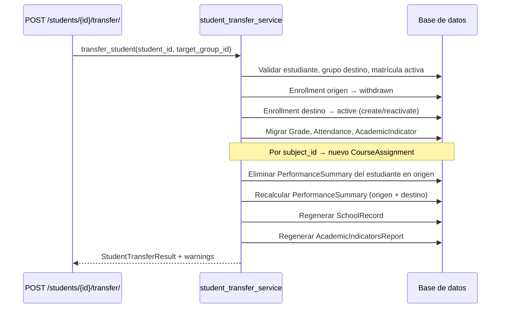

# Estado de implementación — Traslado de estudiantes (eduCalc)

**Última actualización:** 2026-06-07  
**Alcance:** Traslado de un estudiante entre grupos dentro del mismo año lectivo (cambio de sede, grado o grupo), con migración de datos de evaluación y regeneración de reportes.

Este documento permite **retomar el trabajo sin contexto previo**: resume el estado del código, reglas de negocio acordadas, contrato de API, flujo técnico y pendientes.

---

## 1. Resumen ejecutivo

| Área | Estado |
|------|--------|
| **Backend — servicio de dominio** | Implementado |
| **Backend — endpoint REST** | Implementado |
| **Backend — OpenAPI / Swagger** | Documentado con schemas, ejemplos y códigos de error |
| **Backend — tests automatizados** | 4 casos en `StudentTransferApiTests` (todos pasan) |
| **Frontend — UI de traslado** | Pendiente |
| **RBAC específico para traslados** | Pendiente (hoy usa `IsAuthenticated` como el resto de ViewSets) |

---

## 2. Reglas de negocio

### 2.1 Alcance del traslado

El traslado permite mover a un estudiante a otro **grupo** (`Group`) dentro del **mismo año lectivo**. Un grupo define:

- **Sede** (`Group.campus`)
- **Grado** (`Group.grade_level`)
- **Nombre de grupo** (p. ej. 601, 602)
- **Año lectivo** (`Group.academic_year`)

Casos soportados:

| Escenario | Ejemplo | Soportado |
|-----------|---------|-----------|
| Cambio de sede (mismo grado) | 601 Sede Norte → 602 Sede Sur | Sí |
| Cambio de grado (misma sede) | 601 Sexto → 701 Séptimo | Sí |
| Cambio de sede y grado | 601 Sexto Norte → 702 Séptimo Sur | Sí |
| Cambio solo de grupo (misma sede y grado) | 601 → 602 | Sí |
| Traslado entre años lectivos distintos | 2025 → 2026 | **No** |
| Traslado a la misma ubicación (mismo grupo) | 601 → 601 | **No** |

### 2.2 Matrícula

1. El estudiante debe tener una matrícula **activa** (`Enrollment.status = active`) en el año lectivo del grupo destino.
2. La matrícula activa actual se marca como **`withdrawn`** (retirada).
3. Se crea o **reactiva** una matrícula `active` en el grupo destino (clave única: `student + group + academic_year`).
4. `transfer_date` (opcional) se guarda en `Enrollment.enrollment_date` de la nueva matrícula.

### 2.3 Migración de datos del estudiante

Se migran **todos los registros de evaluación** ligados al grupo origen, reasignando `course_assignment` por coincidencia de **asignatura** (`Subject`):

| Entidad | Se migra | Criterio de emparejamiento |
|---------|----------|----------------------------|
| `Grade` (notas) | Sí | Mismo `subject_id` en `CourseAssignment` del grupo destino |
| `Attendance` (asistencia) | Sí | Mismo criterio |
| `AcademicIndicator` (indicadores) | Sí | Mismo criterio |
| `PerformanceSummary` | Recalculado | Se elimina en origen; se recalcula en origen y destino |
| `SchoolRecord` | Regenerado | Actualiza grupo, sede, institución y `generated_at` |
| `AcademicIndicatorsReport` | Regenerado | Actualiza grupo, director de grupo y `generated_at` |
| `DisciplinaryReport` | No requiere migración | No tiene FK a grupo; permanece por estudiante + periodo |
| `StudentGuardian` | No requiere migración | No depende del grupo |

### 2.4 Asignaturas sin equivalente en el destino

- Si una asignatura del grupo origen **no tiene** `CourseAssignment` en el grupo destino, sus registros (notas, asistencia, indicadores) se **omiten**.
- El traslado **no falla** por esto; se agrega un mensaje en `warnings` para que el usuario **concilie manualmente**.
- Los registros omitidos **permanecen** apuntando al `CourseAssignment` del grupo origen.

### 2.5 Conflictos de unicidad

Al migrar, si ya existe un registro del mismo estudiante para la misma terna `(course_assignment destino, academic_period)`, el registro se **omite** y se reporta en `warnings`. Aplica a `Grade` y `Attendance` (tienen `unique_together`); en `AcademicIndicator` se aplica la misma lógica defensiva.

### 2.6 Restricciones que bloquean el traslado

| Regla | Código de error HTTP 400 |
|-------|--------------------------|
| Sin matrícula activa en el año del destino | `no_active_enrollment` |
| Grupo destino igual al origen | `same_group` |
| Grupo destino de otra institución | `institution_mismatch` |
| Grupo destino inexistente | `group_not_found` |
| Estudiante inexistente (ruta) | `404` vía ViewSet |

### 2.7 Regeneración de reportes

- **`SchoolRecord`:** siempre se actualiza o crea con el nuevo grupo, sede, institución y `generated_at` actual.
- **`AcademicIndicatorsReport`:** se regenera para los periodos afectados por la migración. Requiere que el grupo destino tenga un **`GradeDirector`** asignado; si no existe, el traslado continúa pero se agrega un `warning`.

### 2.8 Atomicidad

Toda la operación corre dentro de `transaction.atomic()`. Si ocurre un error no controlado, **no persisten cambios parciales**.

---

## 3. Contrato de API

### Endpoint

```
POST /api/students/{id}/transfer/
```

- **Autenticación:** JWT (`Authorization: Bearer <token>`)
- **Tag OpenAPI:** `Students`
- **Documentación interactiva:** http://localhost:8000/api/docs/

### Request

```json
{
  "target_group_id": "uuid-del-grupo-destino",
  "transfer_date": "2026-06-07"
}
```

| Campo | Tipo | Requerido | Descripción |
|-------|------|-----------|-------------|
| `target_group_id` | UUID | Sí | Grupo destino (define sede, grado y año) |
| `transfer_date` | date | No | Fecha de la nueva matrícula |

### Response 200 (éxito)

```json
{
  "old_enrollment": { "...": "matrícula retirada" },
  "new_enrollment": { "...": "matrícula activa" },
  "source_group_id": "uuid",
  "source_group_name": "601",
  "target_group_id": "uuid",
  "target_group_name": "602",
  "grades_migrated": 2,
  "grades_skipped": 1,
  "attendances_migrated": 1,
  "attendances_skipped": 0,
  "academic_indicators_migrated": 1,
  "academic_indicators_skipped": 0,
  "performance_pairs_synced": 2,
  "school_record_regenerated": true,
  "academic_indicators_reports_regenerated": 1,
  "warnings": [
    "La asignatura 'Tecnología' no existe en el grupo destino; sus registros fueron omitidos."
  ]
}
```

### Response 400 (regla de negocio)

```json
{
  "detail": "No hay matrícula activa para el estudiante en el año lectivo del grupo destino.",
  "code": "no_active_enrollment"
}
```

---

## 4. Flujo técnico (backend)



### Mapeo de asignaturas

Las notas no apuntan al grupo directamente, sino a `CourseAssignment`:

```
Estudiante → Grade → CourseAssignment → Group + Subject
```

Al trasladar, cada fila del grupo origen busca en el destino un `CourseAssignment` con el mismo `subject_id` y `academic_year`.

---

## 5. Archivos del repositorio

| Componente | Ubicación |
|------------|-----------|
| Servicio de dominio | `backend/core/student_transfer_service.py` |
| Endpoint (action) | `backend/core/views.py` → `StudentViewSet.transfer` |
| Serializers OpenAPI | `backend/core/serializers.py` → `StudentTransferSerializer`, `StudentTransferResponseSerializer`, `StudentTransferErrorSerializer` |
| Tests | `backend/core/tests.py` → `StudentTransferApiTests` |
| Recálculo de desempeño (reutilizado) | `backend/core/performance_summary_service.py` |

---

## 6. Tests automatizados

Clase `StudentTransferApiTests` (`TransactionTestCase`):

| Test | Verifica |
|------|----------|
| `test_transfer_cross_campus_migrates_evaluation_data` | Traslado entre sedes, migración de notas/asistencia/indicadores, regeneración de reportes, warnings por asignatura omitida |
| `test_transfer_different_grade_omits_missing_subjects` | Cambio de grado: solo migra asignaturas presentes en destino |
| `test_transfer_rejects_same_group` | Error `same_group` |
| `test_transfer_rejects_without_active_enrollment` | Error `no_active_enrollment` |

Ejecutar:

```bash
cd backend
pipenv run python manage.py test core.tests.StudentTransferApiTests -v 2
```

---

## 7. Documentación OpenAPI

Schemas exportados en componentes:

- `StudentTransferRequest` — cuerpo del POST
- `StudentTransferResponse` — respuesta 200
- `StudentTransferError` — respuesta 400

Incluye ejemplos de request (traslado entre sedes, sin fecha), response exitosa con `warnings` y error `no_active_enrollment`.

Regenerar schema:

```bash
cd backend
pipenv run python manage.py spectacular --file docs/openapi/schema.yaml --validate
```

---

## 8. Pendientes y mejoras sugeridas

### Frontend

- Pantalla o diálogo de traslado desde la ficha del estudiante o desde matrículas.
- Selector de grupo destino filtrado por año lectivo, sede y grado.
- Visualización de `warnings` post-traslado (asignaturas omitidas, conflictos).
- Regenerar tipos: `cd frontend && bun run generate:api-types` tras actualizar el schema.

### Backend

- Restringir el endpoint a roles `ADMIN` / `COORDINATOR` con alcance por institución (`RoleScopeMixin` en `permissions.py` ya existe pero no está cableado).
- Auditoría: tabla o log de traslados (quién, cuándo, origen, destino).
- Endpoint de **previsualización** (`GET` o `POST .../transfer/preview`) que liste qué se migraría y qué se omitiría sin persistir cambios.
- Política explícita para `AcademicIndicator.catalog` al cambiar de grado (hoy el catálogo puede quedar referenciando el grado anterior).

### Operación

- Procedimiento de conciliación manual para asignaturas omitidas (carga de notas en el nuevo grupo o archivo de soporte).
- Verificar rankings del grupo origen y destino tras el traslado (`GET /api/groups/{id}/students-rankings/`).

---

## 9. Referencias relacionadas

- Documentación general de API: [api-documentacion.md](./api-documentacion.md)
- Análisis de entidades académicas: [analisis-entidades-reporte-academico.md](./analisis-entidades-reporte-academico.md)
- Estado del frontend: [../frontend/docs/ESTADO-IMPLEMENTACION.md](../frontend/docs/ESTADO-IMPLEMENTACION.md)
