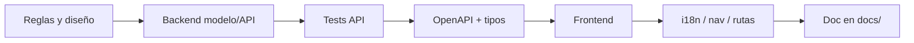

# Guía: implementar features y mejoras en eduCalc

**Audiencia:** desarrolladores y agentes de IA sin contexto previo de la conversación.  
**Objetivo:** un proceso repetible para añadir o mejorar funcionalidad de punta a punta (API + UI + contrato + tests + docs).  
**Última actualización:** Julio 2026

---

## 1. Contexto del monorepo (léelo primero)

| Ruta | Qué es |
|------|--------|
| `backend/` | Django 4.2 + DRF + SimpleJWT + django-filter + drf-spectacular. App principal: `core`. |
| `frontend/` | React 19 + Vite + MUI + TanStack Query + RHF/Zod + i18next. Alias `@/` → `src/`. |
| `docs/` | Especificaciones de módulos, seguridad RBAC, planes CSV, guías. |
| `backend/docs/openapi/schema.json` | **Contrato** entre API y frontend (fuente de tipos TypeScript). |

**Roles de usuario** (`UserProfile.role`): `ADMIN`, `COORDINATOR`, `TEACHER`, `PARENT`.

**Principio de seguridad:** el frontend filtra menús/rutas, pero **la API debe aplicar scope en el servidor** (`RoleScopeMixin` / mixins en `scope_mixins.py`). Ver [analisis-filtros-api-docente-seguridad.md](./analisis-filtros-api-docente-seguridad.md).

**Principio de contrato:** no tipar a mano respuestas/cuerpos que ya existen (o deben existir) en OpenAPI. Flujo: decorar backend → exportar schema → `bun run generate:api-types`.

---

## 2. Antes de escribir código

### 2.1 Aclarar el problema

Responde por escrito (issue, PR o doc corto en `docs/`):

1. **Quién** usa la feature (rol).
2. **Qué** datos toca (modelos existentes vs nuevos).
3. **Qué** acciones (listar, crear, editar, acción de negocio).
4. **Qué no** debe cambiar (p. ej. “no tocar `numerical_grade`”).
5. **Criterios de aceptación** verificables (tests o checklist manual).

### 2.2 Buscar precedentes

Antes de inventar patrones, localiza un módulo similar:

| Necesidad | Referencia típica |
|-----------|-------------------|
| CRUD listado + dialog | `GradesPage`, `DisciplinaryReportsPage` |
| Scope docente / filtros UI | `useTeacherScopeListDefaults`, `GradesPage` |
| Módulo con historial + acción | [modulo-recuperaciones.md](./modulo-recuperaciones.md) |
| Calificaciones por actividades | [modulo-gestion-calificaciones-por-actividades.md](./modulo-gestion-calificaciones-por-actividades.md) |
| Texto enriquecido | `RichTextEditor` + `normalizeRichText` / `isRichTextEmpty` |
| Persistencia de UI en URL | `useSearchParams` + `replace: true` (p. ej. `hide_recovered`, `scheme` en planeación) |
| RBAC API | `scope_mixins.py`, `permissions.py`, `tests_scope.py` |

Copia la estructura de archivos y el estilo de naming; no introduzcas un stack paralelo.

### 2.3 Arranque local (si hace falta)

```bash
# Backend
cd backend && pipenv run python manage.py runserver

# Frontend
cd frontend && bun run dev
```

API: `http://127.0.0.1:8000` · UI: Vite (proxy `/api`). Swagger: `/api/docs/`.

---

## 3. Flujo paso a paso (feature completa)

Usa este orden salvo que la mejora sea solo frontend o solo backend.



### Paso 1 — Diseño mínimo

- Diagrama de entidades (1 párrafo + lista de campos).
- Endpoints previstos (método, path, body, query params).
- Matriz de roles (quién lee / escribe).
- Si hay umbrales o fallbacks (p. ej. escala Baja → `2.99`), documentarlos explícitamente.

Opcional: crear `docs/modulo-<nombre>.md` **antes** o **junto** con el código (recomendado para features no triviales).

### Paso 2 — Backend: modelo

Archivo: `backend/core/models.py` (o migración solo si el modelo ya existe).

Convenciones:

- Heredar `TimeStampedModel` (UUID `id`, `created_at`, `updated_at`).
- FK con `related_name` claro; `unique_together` / constraints cuando aplique.
- Decimales de notas: `DecimalField(max_digits=4, decimal_places=2)` (igual que `Grade`).
- Campos de texto largo: `TextField` (pueden guardar HTML del editor rico).

```bash
cd backend
pipenv run python manage.py makemigrations core --name <nombre_corto>
pipenv run python manage.py migrate
```

Registrar en `admin.py` si el modelo es administrable.

### Paso 3 — Backend: serializers

Archivo: `backend/core/serializers.py` (o módulo dedicado si crece).

- `ModelSerializer` con campos denormalizados de solo lectura (`student_name`, `*_name`, etc.) — el frontend los usa en grillas.
- Serializers de escritura dedicados (`Serializer` + `@extend_schema_serializer(component_name="...")`) cuando el create no es un CRUD 1:1 del modelo.
- Evitar nombres de componente que terminen en `Request` si Spectacular añadirá otro `Request` (preferir `FooCreate` → `FooCreateRequest`).

### Paso 4 — Backend: scope y permisos

1. ¿Ya existe un mixin en `scope_mixins.py`? Reutilízalo.
2. Si no, añade uno siguiendo el patrón `RoleScopeMixin` + `ScopedQuerysetMixin`:
   - ADMIN → sin filtro
   - COORDINATOR → institución
   - TEACHER → vía `CourseAssignment` / grupos / estudiantes
   - PARENT → hijos vía `StudentGuardian` (si aplica)
3. `permission_classes`: al menos `IsAuthenticated`; restringe con `IsTeacher` / `IsCoordinator` / `IsAdminUser` según política.
4. En acciones custom (`@action`), **revalida** que el objeto esté en el queryset scoped (404 si no). No confíes solo en el body UUID.

Helpers útiles: `scope_utils.py` (`get_user_profile`, `teacher_can_access_*`, `user_can_access_student`).

### Paso 5 — Backend: ViewSet / URLs

- ViewSet en `views.py` (o módulo de vistas del dominio).
- Decorador `@schema_viewset([...])` para tags, search y filter fields.
- Acciones especiales: documentar con `@extend_schema` (o archivo `*_openapi.py` como `recovery_openapi.py` / `grading_openapi.py`).
- Registrar en `backend/urls.py` con `DefaultRouter`.

Filtros: `filterset_fields` + `search_fields`. Query params de negocio (booleanos, flags) parsearlos de forma explícita (`1`/`true`/`yes`/`si`).

### Paso 6 — Backend: tests

Añade tests en `backend/core/tests_*.py` (APITestCase + JWT/`force_authenticate`):

| Obligatorios | Ejemplo |
|--------------|---------|
| Scope docente | Solo ve/edita lo suyo |
| Happy path | Create/list correcto |
| Regla de negocio | 400 cuando no aplica |
| Fuera de scope | 404 |
| Fallback / edge | Si hay umbral documentado |

```bash
cd backend
pipenv run python manage.py test core.tests_<modulo> -v2
```

### Paso 7 — Contrato OpenAPI (obligatorio si cambia la API)

```bash
cd backend
bash scripts/export-openapi-schema.sh          # schema.json (lo consume el frontend)
# opcional:
bash scripts/export-openapi-schema.sh all      # json + yaml

cd ../frontend
bun run generate:api-types                     # → src/types/openapi.d.ts
```

Verifica en `openapi.d.ts` los `components.schemas.*` y `operations.*` nuevos.

Luego:

1. Alias en `frontend/src/types/schemas.ts` si la página los reutiliza.
2. Módulo API tipado (`features/.../<feature>Api.ts`) con `components` / `operations` de `@/types/openapi`.
3. **No** inventar tipos duplicados a mano.

### Paso 8 — Frontend: UI

Patrón habitual de página staff:

1. `PageHeader` + filtros (`Paper`) + `DataGrid` + `useInfiniteList` + `InfiniteDataGridFooter`.
2. Dialogs con RHF + Zod; mutaciones con `useMutation` + invalidación de `queryKeys`.
3. Cliente HTTP: `apiClient` (Bearer + refresh). Errores: `getErrorMessage`.
4. Textos de usuario: claves en `frontend/src/i18n/locales/es.json` (no hardcodear strings de UI).
5. Descripción rica: `RichTextEditor` + `isRichTextEmpty` / `normalizeRichText`.

**Navegación y acceso UI:**

| Archivo | Qué hacer |
|---------|-----------|
| `app/navConfig.ts` | Ítem de menú + `rolesAllowed` + icono |
| `app/routeAccess.ts` | Prefijo de ruta en `staffPrefixes` (o regla específica) |
| `routes/lazyPages.ts` | `lazy(() => import(...))` |
| `routes/AppRoutes.tsx` | `<Route path="..." element={...} />` |
| `api/queryKeys.ts` | Claves de React Query |

**Docente:** si la pantalla lista datos del docente, reutiliza `fetchMe` + `useTeacherCourseAssignments` + `useTeacherScopeListDefaults`.

**Estado en URL:** para checkboxes/filtros que deben sobrevivir refresh/compartir enlace, usa `useSearchParams` (`set` / `delete` + `{ replace: true }`) y envía el mismo nombre al API si el filtro es de servidor.

### Paso 9 — Documentar

Para features de módulo:

- Actualiza o crea `docs/modulo-<nombre>.md` (API, reglas, archivos, checklist, tests).
- Enlaza desde docs relacionadas si afecta seguridad o calificaciones.

Para mejoras pequeñas: al menos un párrafo en el doc del módulo existente o en el PR.

### Paso 10 — Verificación final

```bash
# API
cd backend && pipenv run python manage.py test core.tests_<modulo> -v1

# Tipos UI
cd frontend && bunx tsc --noEmit
```

Checklist manual rápido: login con el rol objetivo → menú visible → listado scoped → acción de negocio → refresh con query params de UI.

---

## 4. Mejoras (no features nuevas)

| Tipo | Enfoque |
|------|---------|
| Bugfix | Reproducir → test que falle → fix mínimo → test verde. No refactorizar de más. |
| UX / copy | i18n + componentes existentes; sin cambiar contrato API. |
| Performance | Medir; preferir filtros/paginación servidor (`limit`/`offset`) antes de caches complejos. |
| Refactor | Sin cambio de comportamiento; tests existentes verdes; no mezclar con features en el mismo PR si se puede evitar. |
| Solo OpenAPI/docs | Exportar schema + regenerar tipos si el shape expuesto cambió. |

---

## 5. Convenciones rápidas

### Naming

- API / DB / JSON: `snake_case`.
- React componentes: `PascalCase`. Archivos de página: `FooPage.tsx`.
- Hooks: `useFoo`. API helpers: `fooApi.ts`.
- Query keys: centralizar en `queryKeys.ts`.

### No hacer

- Filtrar datos sensibles **solo** en el frontend.
- Commitear `.env` o secretos.
- Tipar respuestas API “a ojo” sin pasar por OpenAPI cuando el endpoint es nuevo o cambió.
- Añadir dependencias UI/API sin necesidad (reutilizar MUI, TipTap ya integrado, axios, etc.).
- Documentar guidelines internas del agente en archivos del repo de producto (esta guía es la excepción: es proceso de equipo).

### Commits / PR

- Commits solo si el usuario lo pide (flujo del equipo).
- PR: resumen + plan de pruebas; incluir regeneración OpenAPI si aplica.

---

## 6. Checklist compacto (copiar en el PR)

- [ ] Reglas de negocio y roles definidos
- [ ] Modelo + migración (si aplica)
- [ ] Serializers + `extend_schema*`
- [ ] ViewSet con scope mixin + permisos
- [ ] URL registrada
- [ ] Tests de scope y reglas
- [ ] `export-openapi-schema.sh` + `generate:api-types`
- [ ] Cliente tipado + página/hooks
- [ ] `navConfig` / `routeAccess` / lazy route
- [ ] i18n (`es.json`)
- [ ] Doc en `docs/` actualizada
- [ ] `tsc --noEmit` y tests OK

---

## 7. Mapa de archivos “dónde tocar”

### Backend

| Área | Archivos |
|------|----------|
| Modelos | `core/models.py`, `core/migrations/` |
| Serializers | `core/serializers.py`, `core/grading_serializers.py`, … |
| Vistas | `core/views.py`, `core/grading_views.py`, … |
| Scope | `core/permissions.py`, `core/scope_mixins.py`, `core/scope_utils.py` |
| OpenAPI helpers | `core/*_openapi.py`, `core/openapi_utils.py` |
| Rutas | `backend/urls.py` |
| Tests | `core/tests_*.py` |
| Schema export | `scripts/export-openapi-schema.sh` → `docs/openapi/schema.json` |

### Frontend

| Área | Archivos |
|------|----------|
| Rutas / lazy | `routes/AppRoutes.tsx`, `routes/lazyPages.ts` |
| Menú / RBAC UI | `app/navConfig.ts`, `app/routeAccess.ts`, `app/roleMatrix.ts` |
| Features | `features/<dominio>/` |
| API tipada | `features/.../*Api.ts`, `api/client.ts`, `api/queryKeys.ts` |
| Tipos | `types/openapi.d.ts` (generado), `types/schemas.ts` (aliases) |
| i18n | `i18n/locales/es.json` |
| Editor rico | `components/RichTextEditor.tsx`, `components/richTextUtils.ts` |

---

## 8. Documentos de dominio (consulta según el tema)

| Documento | Tema |
|-----------|------|
| [analisis-filtros-api-docente-seguridad.md](./analisis-filtros-api-docente-seguridad.md) | RBAC y scope API |
| [api-documentacion.md](./api-documentacion.md) | Swagger / export schema |
| [modulo-recuperaciones.md](./modulo-recuperaciones.md) | Ejemplo feature reciente (historial + eligible + OpenAPI) |
| [modulo-gestion-calificaciones-por-actividades.md](./modulo-gestion-calificaciones-por-actividades.md) | Esquemas / actividades / sugerencia |
| [modulo-planeacion-actividades.md](./modulo-planeacion-actividades.md) | Planeación UI |
| [plan-implementacion-carga-masiva-csv.md](./plan-implementacion-carga-masiva-csv.md) | Bulk CSV |
| [../frontend/docs/ESTADO-IMPLEMENTACION.md](../frontend/docs/ESTADO-IMPLEMENTACION.md) | Estado del panel admin |
| [../README.md](../README.md) | Arranque del monorepo |
| [plan-conexion-mobile-backend.md](./plan-conexion-mobile-backend.md) | App docente `mobile/` ↔ API (fases 0–8 hechas) |

---

## 9. Ejemplo mínimo de “Definition of Done”

Una feature está lista cuando:

1. Un usuario con el rol correcto puede completar el flujo en la UI.
2. Un usuario con otro rol **no** obtiene datos ajenos vía API (probado con test).
3. `schema.json` y `openapi.d.ts` incluyen los endpoints/campos nuevos.
4. Existe o se actualizó documentación en `docs/` con reglas y archivos tocados.
5. Tests del módulo y `tsc` pasan.

Si algo de lo anterior no aplica (p. ej. solo cambio de copy), indícalo explícitamente en el PR.
