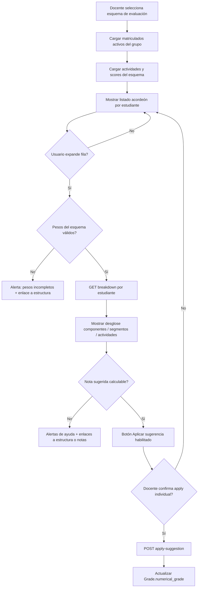
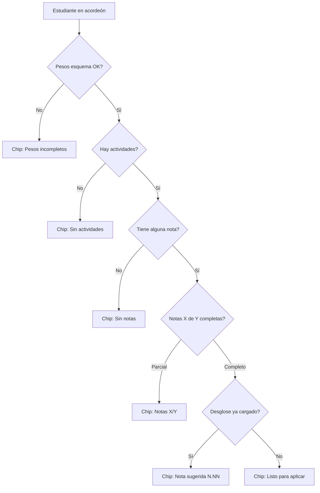
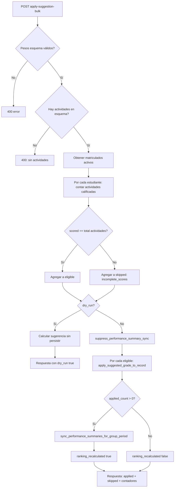
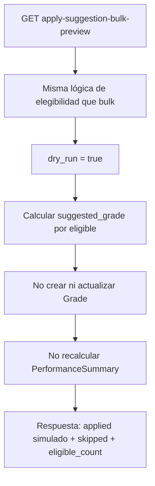
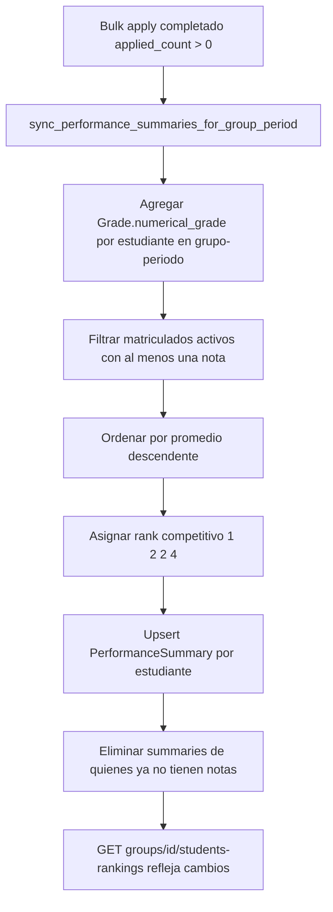
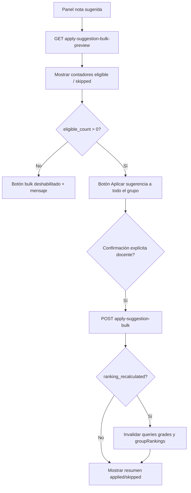

# Implementación: nota sugerida por acordeón y aplicación en lote al grupo

**Proyecto:** eduCalc  
**Fecha:** Junio 2026  
**Estado:** Implementado (backend + frontend acordeón)  
**Relacionado con:** [modulo-gestion-calificaciones-por-actividades.md](./modulo-gestion-calificaciones-por-actividades.md)

---

## Resumen ejecutivo

Se implementaron dos mejoras complementarias en el flujo de **nota sugerida**:

1. **Frontend — listado en acordeón:** todos los estudiantes matriculados del grupo se muestran en un acordeón; al expandir cada fila se carga el desglose ponderado y la opción de aplicar la sugerencia de forma individual.
2. **Backend — aplicación en lote:** nuevo endpoint que aplica la nota sugerida a todos los estudiantes elegibles del grupo (solo los que tienen **todas** las actividades calificadas) y recalcula el ranking del periodo una sola vez al finalizar.

La sugerencia sigue sin reemplazar automáticamente la calificación oficial: el docente confirma explícitamente (individual o en lote). No se modifica `Grade.definitive_grade`.

---

## Conclusiones de diseño

| Tema | Decisión |
|------|----------|
| Scope del grupo | Matriculados activos (`Enrollment.status = active`) del grupo y año del `course_assignment` del esquema |
| Elegibilidad bulk | **Todas** las `GradingActivity` del esquema deben tener `StudentActivityScore.score IS NOT NULL` |
| Criterio individual vs bulk | El apply individual permite renormalización parcial; el bulk es **más estricto** (100% actividades calificadas) |
| Ranking | Tras bulk apply exitoso: un solo `sync_performance_summaries_for_group_period(group, period)` |
| Señales Django | Durante el loop bulk se usa `suppress_performance_summary_sync()` para evitar N recálculos |
| Preview | `GET apply-suggestion-bulk-preview` permite simular sin persistir ni recalcular ranking |
| Carga del desglose UI | Bajo demanda al expandir acordeón (no N requests al cargar la página) |
| Enlaces de ayuda | Tabs del esquema vía `?tab=0` (estructura) y `?tab=1` (notas por actividad) |

---

## API — endpoints

### Aplicación individual (existente)

```
POST /api/grading-schemes/{id}/apply-suggestion/
Body: { "student": "<uuid>" }
```

### Vista previa bulk (nuevo)

```
GET /api/grading-schemes/{id}/apply-suggestion-bulk-preview/
```

Simula la operación. Respuesta con `dry_run: true`, `ranking_recalculated: false`.

### Aplicación en lote (nuevo)

```
POST /api/grading-schemes/{id}/apply-suggestion-bulk/
Body: { "dry_run": false }   // opcional
```

### Desglose por estudiante (existente)

```
GET /api/grading-schemes/{id}/breakdown/?student=<uuid>
```

### Respuesta bulk (campos principales)

| Campo | Descripción |
|-------|-------------|
| `enrolled_count` | Total matriculados activos |
| `eligible_count` | Con todas las actividades calificadas |
| `applied_count` | Sugerencias aplicadas (o simuladas en preview) |
| `skipped_count` | Omitidos con motivo en `skipped[]` |
| `ranking_recalculated` | `true` si se ejecutó sync de `PerformanceSummary` |
| `applied[]` | Detalle por estudiante aplicado |
| `skipped[]` | Detalle con `reason`: `incomplete_scores` o `suggestion_unavailable` |

---

## Archivos implementados

### Backend

| Archivo | Responsabilidad |
|---------|-----------------|
| `backend/core/grading_suggestion_service.py` | Elegibilidad, `bulk_apply_suggested_grades`, `apply_suggested_grade_to_record` |
| `backend/core/grading_views.py` | Acciones `apply-suggestion-bulk`, `apply-suggestion-bulk-preview` |
| `backend/core/grading_serializers.py` | Serializers OpenAPI request/response bulk |
| `backend/core/grading_openapi.py` | Documentación Swagger (`@extend_schema`) |
| `backend/core/tests.py` | Tests de bulk, preview, ranking y `definitive_grade` |
| `backend/docs/openapi/schema.json` | Schema regenerado |

### Frontend

| Archivo | Responsabilidad |
|---------|-----------------|
| `frontend/src/features/operations/GradingSchemeBreakdownPanel.tsx` | Acordeón por estudiante, chips de estado, ayuda con enlaces |
| `frontend/src/features/operations/GradingSchemeDetailPage.tsx` | Soporte `?tab=0\|1\|2` para deep links |
| `frontend/src/i18n/locales/es.json` | Cadenas de acordeón y mensajes de ayuda |

---

## Reglas de negocio

### Cálculo de nota sugerida

```
segment_score = promedio simple de actividades con score NOT NULL en el segmento
component_score = Σ (segment_score × peso_segmento / 100)   [renormaliza si faltan segmentos]
suggested_grade = Σ (component_score × peso_componente / 100)
```

### Elegibilidad para bulk apply

Un estudiante es elegible si:

1. Tiene matrícula activa en el grupo del esquema.
2. Para **cada** actividad del esquema existe un score no nulo.
3. Los pesos del esquema suman 100% (componentes y segmentos).

Si falta al menos una nota → `skipped.reason = incomplete_scores`.

### Persistencia en Grade

- Escribe `numerical_grade` y `performance_level` según escala institucional.
- Crea `Grade` si no existe; actualiza si ya existe.
- **No** modifica `definitive_grade`.

### Ranking (`PerformanceSummary`)

Tras bulk apply con `applied_count > 0`:

- `period_average` = promedio de `numerical_grade` de **todas las asignaturas** del estudiante en el grupo-periodo.
- `rank` = ranking competitivo (1, 2, 2, 4…) entre matriculados activos con al menos una nota.

---

## Diagramas de flujo

### 1. UI — Nota sugerida con acordeón (frontend)



### 2. Chips de estado en encabezado del acordeón



### 3. Backend — Aplicación en lote al grupo



### 4. Preview bulk (sin persistir)



### 5. Recálculo de ranking post-bulk



### 6. Integración frontend pendiente (siguiente etapa)



---

## Tests backend

| Test | Verifica |
|------|----------|
| `test_bulk_apply_suggestion_applies_eligible_only` | Solo aplica a quien tiene todas las notas |
| `test_bulk_apply_preview_does_not_persist_or_recalc_ranking` | Preview no crea Grade ni PerformanceSummary |
| `test_bulk_apply_no_activities_returns_400` | Error si esquema sin actividades |
| `test_bulk_apply_recalculates_ranking` | Rank 1 y 2 correctos tras bulk |
| `test_bulk_apply_preserves_definitive_grade` | `definitive_grade` intacta |
| `test_apply_suggestion_updates_numerical_not_definitive` | Apply individual sigue funcionando |

Ejecutar:

```bash
cd backend && pipenv run python manage.py test core.tests.ActivityGradingModuleTests.test_bulk_apply_suggestion_applies_eligible_only core.tests.ActivityGradingModuleTests.test_bulk_apply_preview_does_not_persist_or_recalc_ranking core.tests.ActivityGradingModuleTests.test_bulk_apply_no_activities_returns_400 core.tests.ActivityGradingModuleTests.test_bulk_apply_recalculates_ranking core.tests.ActivityGradingModuleTests.test_bulk_apply_preserves_definitive_grade
```

---

## OpenAPI / Swagger

Los endpoints bulk están documentados con `drf-spectacular`:

- Tag: **Grading Schemes**
- Schemas: `ApplySuggestionBulkRequest`, `ApplySuggestionBulkResponse`, `ApplySuggestionBulkAppliedItem`, `ApplySuggestionBulkSkippedItem`

Regenerar schema:

```bash
cd backend && bash scripts/export-openapi-schema.sh
```

Para tipos TypeScript en frontend, regenerar desde `backend/docs/openapi/schema.json` en la siguiente etapa de integración.

---

## Próximos pasos (frontend)

1. Botón **Aplicar sugerencia a todo el grupo** en `GradingSchemeBreakdownPanel`.
2. Llamar preview antes de confirmar; mostrar resumen `eligible_count` / `skipped_count`.
3. Diálogo de confirmación explícita.
4. Tras éxito: invalidar `['grades']` y `queryKeys.groupRankings(groupId)`.
5. Tipos en `gradingApi.ts` desde OpenAPI actualizado.

---

## Referencias cruzadas

| Recurso | Ubicación |
|---------|-----------|
| Servicio bulk | `backend/core/grading_suggestion_service.py` |
| Vista acordeón | `frontend/src/features/operations/GradingSchemeBreakdownPanel.tsx` |
| Sync ranking | `backend/core/performance_summary_service.py` |
| Rankings API | `GET /api/groups/{id}/students-rankings/` |
| Especificación módulo | [modulo-gestion-calificaciones-por-actividades.md](./modulo-gestion-calificaciones-por-actividades.md) |
