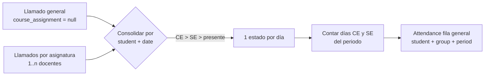
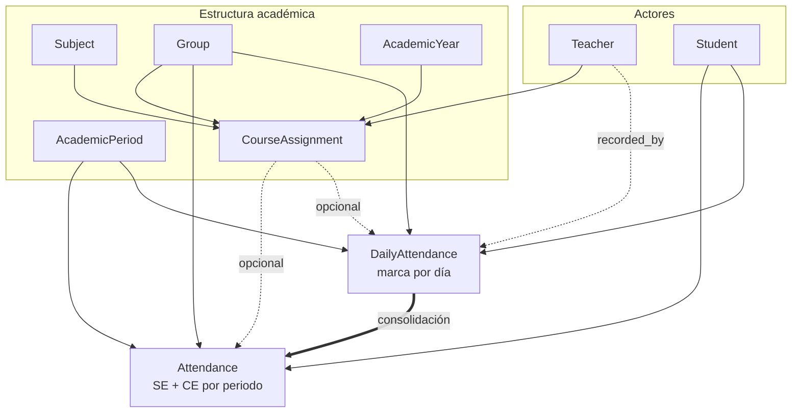
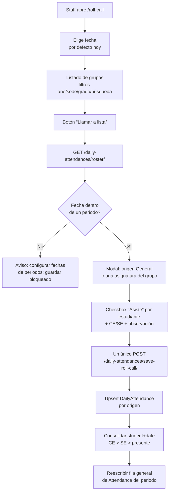
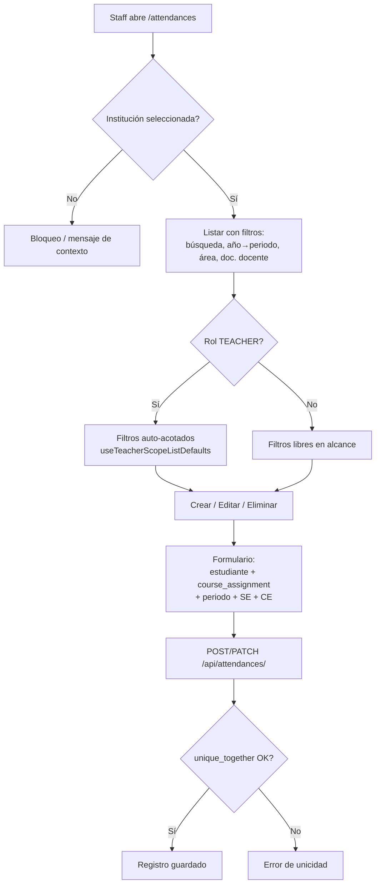
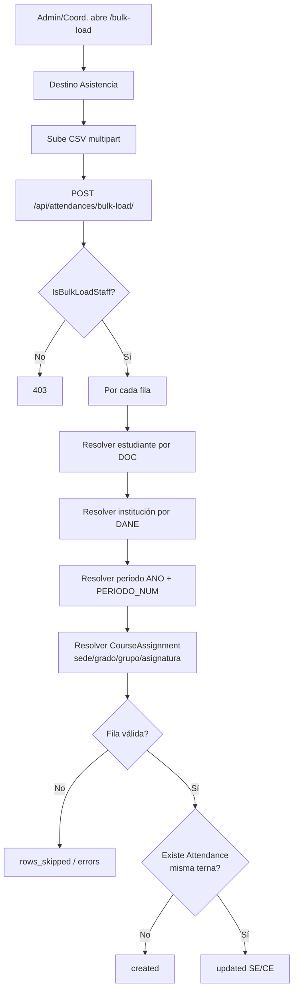
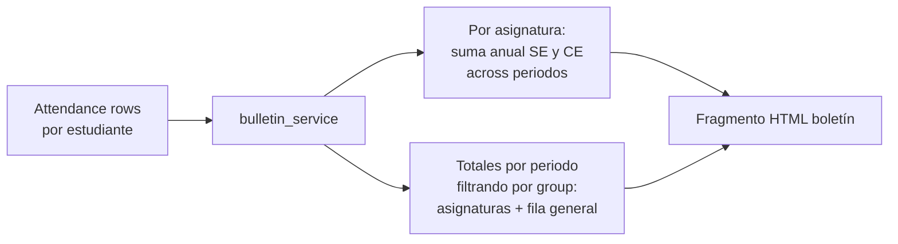
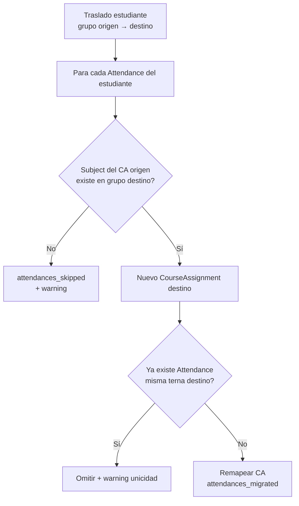
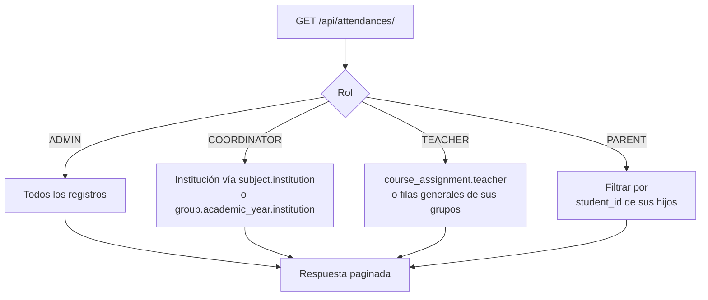

# Módulo de asistencia (llamado a lista diario + inasistencias por periodo)

**Proyecto:** eduCalc  
**Fecha:** Julio 2026  
**Estado:** Operativo — backend + UI staff + llamado a lista + bulk + boletín + traslados  
**Relacionado con:**
- [analisis-entidades-reporte-academico.md](./analisis-entidades-reporte-academico.md) (§2.16 Inasistencia)
- [plan-implementacion-carga-masiva-csv.md](./plan-implementacion-carga-masiva-csv.md)
- [estado-implementacion-traslados.md](./estado-implementacion-traslados.md)
- [analisis-filtros-api-docente-seguridad.md](./analisis-filtros-api-docente-seguridad.md)
- [guia-implementacion-features.md](./guia-implementacion-features.md)

---

## 1. Resumen ejecutivo

El módulo tiene dos capas que conviven:

1. **Llamado a lista diario** (`DailyAttendance`): una marca por estudiante y fecha, hecha de forma **general** para todo el grupo o **por asignatura**. Es acumulable: varios docentes pueden llamar el mismo día y cada origen conserva su fila.
2. **Acumulado por periodo** (`Attendance`): totales SE/CE que consumen el boletín, los KPIs y los traslados.

| Código UI | Campo modelo | Significado |
|-----------|--------------|-------------|
| **SE** | `unexcused_absences` | Inasistencias sin excusa |
| **CE** | `excused_absences` | Inasistencias con excusa |

`Attendance` tiene ahora dos tipos de fila:

| Tipo | `course_assignment` | `group` | Origen | Unicidad |
|------|---------------------|---------|--------|----------|
| Por asignatura | Obligatorio | Denormalizado desde la asignación | Manual (UI) o CSV | `(student, course_assignment, academic_period)` |
| General del grupo | Nulo | Obligatorio | **Derivado** del llamado a lista | `(student, group, academic_period)` |

La fila general guarda el **conteo de días consolidados** del periodo: por más llamados que haya en una fecha, esa fecha cuenta una sola vez.

| Área | Estado |
|------|--------|
| Modelo + migración | Completo |
| Admin Django | Completo |
| API REST CRUD + OpenAPI | Completo |
| Llamado a lista (API + servicio) | Completo |
| UI llamado a lista (`/roll-call`) | Completo |
| Carga masiva CSV | Completo |
| UI staff (`/attendances`) | Completo |
| Alcance docente (API + UI) | Mayormente completo |
| Consumo en boletín | Completo |
| Migración en traslados | Completo |
| KPI dashboard | Completo |
| Tests dedicados llamado a lista | Completo (`tests_daily_attendance.py`) |
| UI padres | Ausente |
| Restricción write padres en API | Gap (docs dicen R; API no bloquea por método) |
| Tests dedicados CRUD `Attendance` / bulk | Incompleto |
| Tardanzas | Fuera de alcance |

---

## 2. Conceptos y modelo

### 2.1 Entidad `Attendance`

**Archivo:** `backend/core/models.py`

| Atributo | Tipo | Descripción |
|----------|------|-------------|
| `id` | UUID | PK |
| `student` | FK → `Student` | Estudiante |
| `course_assignment` | FK → `CourseAssignment` | Asignatura + docente + grupo + año |
| `academic_period` | FK → `AcademicPeriod` | Periodo (P1, P2, …) |
| `unexcused_absences` | `PositiveInteger` (default 0) | SE |
| `excused_absences` | `PositiveInteger` (default 0) | CE |
| `created_at` / `updated_at` | DateTime | Auditoría |

**Constraints:**

- `uniq_attendance_student_ca_period` — `(student, course_assignment, academic_period)` cuando hay asignatura.
- `uniq_attendance_student_group_period` — `(student, group, academic_period)` cuando `course_assignment` es nulo.

`group` se rellena solo en `save()` a partir de `course_assignment.group`, así que **toda** fila responde a un filtro por grupo (es lo que usa el boletín para el total por periodo).

### 2.1.1 Entidad `DailyAttendance` (llamado a lista)

| Atributo | Tipo | Descripción |
|----------|------|-------------|
| `id` | UUID | PK |
| `student` | FK → `Student` | Estudiante |
| `group` | FK → `Group` | Grupo al que se llamó a lista |
| `academic_period` | FK → `AcademicPeriod` | Periodo resuelto por fecha (o explícito) |
| `date` | `DateField` | Fecha del llamado |
| `status` | `PRESENT` / `EXCUSED` / `UNEXCUSED` | Marca del estudiante |
| `course_assignment` | FK → `CourseAssignment`, nullable | Origen: nulo = llamado general del grupo |
| `recorded_by` | FK → `Teacher`, nullable | Quién llamó (auditoría) |
| `notes` | `TextField` | Motivo de la excusa u observación |

**Constraints:**

- `uniq_daily_attendance_subject_source` — `(student, date, course_assignment)` para llamados por asignatura.
- `uniq_daily_attendance_general_source` — `(student, date)` para el llamado general.

Volver a guardar el mismo origen **sobrescribe** las marcas anteriores; no duplica.

### 2.1.2 Regla de consolidación

Para un `(student, date)` con varias marcas, el estado único del día se resuelve por precedencia:

```
falta con excusa  >  falta sin excusa  >  presente
```

Es decir: cualquier falta registrada convierte el día en falta, y si algún docente dejó constancia de la excusa, el día queda justificado. Los días consolidados como falta se cuentan por periodo y se escriben en la fila general de `Attendance`:



Ese recálculo es **idempotente y destructivo sobre la fila general**: se reescribe entera en cada guardado, por lo que la fila general no debe editarse a mano (la UI la deja en solo lectura). Las filas por asignatura no se tocan nunca.

Solo se guarda fila general para los estudiantes que acumulan al menos una falta en el periodo: `Attendance` registra inasistencias, no días asistidos. Si un estudiante queda en cero (siempre presente, o se corrigió una falta), la fila se elimina en el recálculo.

### 2.2 Relación con otras entidades



### 2.3 Qué no es este módulo

- No hay estado de **tardanza**; solo presente / falta con excusa / falta sin excusa.
- No hay flujo de justificación con adjuntos (solo el texto libre `notes`).
- No hay penalización automática de notas por umbral de ausencias.
- No está ligado a calificaciones por actividad ni recuperaciones.
- El llamado a lista no genera horarios ni valida días hábiles o festivos: la única restricción de fecha es caer dentro de un periodo del año lectivo del grupo.

> **Nota documental:** `analisis-filtros-api-docente-seguridad.md` menciona un filtro `date` en `/api/attendances/`; ese filtro vive en `/api/daily-attendances/`, no en el acumulado.

---

## 3. Estado de implementación por capa

### 3.1 Backend

| Pieza | Ruta | Estado |
|-------|------|--------|
| Modelo `Attendance` | `backend/core/models.py` | Completo |
| Modelo `DailyAttendance` | `backend/core/models.py` | Completo |
| Migraciones | `0002_add_phase_2_to_5_models.py`, `0015_daily_attendance_roll_call.py` | Completo |
| Servicio de consolidación | `backend/core/daily_attendance_service.py` | Completo |
| Serializers acumulado | `backend/core/serializers.py` → `AttendanceSerializer` | Completo |
| Serializers llamado a lista | `backend/core/daily_attendance_serializers.py` | Completo |
| ViewSet acumulado | `backend/core/views.py` → `AttendanceViewSet` | Completo |
| ViewSet llamado a lista | `backend/core/daily_attendance_views.py` | Completo |
| Scope por rol | `AttendanceRoleScopeMixin`, `DailyAttendanceRoleScopeMixin` | Completo |
| Bulk CSV | `backend/core/bulk_load_extended.py` → `bulk_load_attendance` | Completo |
| Admin | `backend/core/admin.py` | Completo |
| Boletín | `backend/core/bulletin_service.py` + fragmento HTML | Completo |
| Traslados | `backend/core/student_transfer_service.py` | Completo |
| KPI | `backend/core/dashboard_kpis.py` | Completo |
| Tests | `backend/core/tests_daily_attendance.py` | Completo para llamado a lista |

**API acumulado:**

| Método | Ruta | Notas |
|--------|------|-------|
| GET/POST | `/api/attendances/` | List / create |
| GET/PUT/PATCH/DELETE | `/api/attendances/{id}/` | Retrieve / update / destroy |
| POST | `/api/attendances/bulk-load/` | CSV; `IsBulkLoadStaff` |

**Filtros:** `student`, `student__document_number`, `course_assignment`, `course_assignment__isnull` (aísla las filas generales), `course_assignment__subject__academic_area`, `course_assignment__teacher__document_number`, `group`, `academic_period`, `academic_period__number`.

**Campos de respuesta añadidos:** `group`, `group_name`, `subject_name`, `is_general`.

**API llamado a lista:**

| Método | Ruta | Notas |
|--------|------|-------|
| GET | `/api/daily-attendances/` | Historial paginado (solo lectura) |
| GET | `/api/daily-attendances/{id}/` | Detalle |
| GET | `/api/daily-attendances/roster/` | Estudiantes del grupo + lo ya marcado; `IsTeacher` |
| POST | `/api/daily-attendances/save-roll-call/` | Guarda el llamado completo y recalcula; `IsTeacher` |

`roster` recibe `group`, `date` y opcionalmente `course_assignment`. Devuelve por estudiante: `status` (lo que marcó **ese** origen), `consolidated_status` (el estado único del día) y `other_sources` (cuántos otros llamados ya registraron esa fecha).

`save-roll-call` recibe `group`, `date`, `entries[]` y opcionalmente `course_assignment` y `academic_period`. Códigos de error de negocio: `group_not_found`, `empty_roll_call`, `duplicated_student`, `period_not_found`, `period_not_in_year`, `assignment_not_found`, `assignment_not_in_group`, `student_not_enrolled`.

### 3.2 Frontend

| Pieza | Ruta | Estado |
|-------|------|--------|
| Página CRUD acumulado | `frontend/src/features/operations/AttendancesPage.tsx` | Completo |
| Página llamado a lista | `frontend/src/features/operations/rollCall/RollCallPage.tsx` | Completo |
| Modal llamado a lista | `frontend/src/features/operations/rollCall/RollCallDialog.tsx` | Completo |
| API tipada | `frontend/src/features/operations/rollCall/rollCallApi.ts` | Completo |
| Rutas | `/attendances`, `/roll-call` (`AppRoutes` + `lazyPages`) | Completo |
| Nav | “Convivencia y asistencia” (`navConfig`) | Completo |
| Acceso ruta | `STAFF_ROLES` (`routeAccess`) | Completo |
| Bulk hub | target `attendance` en carga masiva | Completo |
| i18n | claves `attendances.*` y `rollCall.*` en `es.json` | Completo |
| Vista padres | — | No implementada |

En `/attendances` las filas generales se distinguen con la columna **Origen** y tienen editar/eliminar deshabilitados, porque las recalcula el llamado a lista.

El filtro **Origen** (todos / por asignatura / llamado a lista) controla `course_assignment__isnull`. Los filtros por área y por documento del docente atraviesan `course_assignment`, así que solo se envían con origen “por asignatura”: aplicarlos sobre las filas generales las dejaría fuera del listado. Por lo mismo, el prefiltro automático del rol TEACHER en esta página solo fija el año lectivo; el recorte por docente ya lo hace el scope del backend.

### 3.3 Permisos por rol

| Rol | Scope API acumulado | Scope API llamado a lista | UI `/attendances` | UI `/roll-call` | Bulk load |
|-----|---------------------|---------------------------|-------------------|-----------------|-----------|
| ADMIN | Todo | Todo | Sí | Sí | Sí |
| COORDINATOR | Institución (asignatura o grupo) | Institución vía grupo | Sí | Sí | Sí |
| TEACHER | Sus `course_assignment` + filas generales de sus grupos | Grupos donde tiene asignación | Sí | Sí | No |
| PARENT | Hijos (`student_id` en scope) | Hijos | No | No | No |

El llamado a lista revalida el grupo con `user_can_access_group` en cada acción, así que un docente no puede llamar a lista en un grupo ajeno aunque envíe su UUID (404).

CRUD del acumulado usa `IsAuthenticated` (sin bloqueo de writes por rol). Los docs de dominio indican padre **solo lectura**; en API un padre autenticado cuyo hijo esté en scope podría en teoría crear/editar. Gap de seguridad/producto pendiente.

---

## 4. Flujos principales

### 4.0 Llamado a lista (UI `/roll-call`)



Detalles de la UI:

- El modal abre con **todos marcados como presentes**; solo se desmarca a quien falta.
- Casilla maestra “Marcar todos como presentes” y contadores en vivo de asisten / con excusa / sin excusa.
- Cambiar de origen (General ↔ asignatura) recarga el roster y muestra qué marcó ese origen y en qué quedó el día tras consolidar.
- Todo se envía en **una sola petición** al pulsar guardar.

### 4.1 Registro manual (UI staff)



### 4.2 Carga masiva CSV



Columnas relevantes (además del contexto académico compartido con notas):

- `INASISTENCIAS_SIN_JUSTIFICAR` → `unexcused_absences`
- `INASISTENCIAS_JUSTIFICADAS` → `excused_absences`

Muestra: `docs/bulk_load_attendance.csv`.

### 4.3 Consumo en boletín



La columna SE/CE por materia sigue leyendo solo filas con asignatura. El total por periodo pasó a filtrar por `group` en vez de `course_assignment__group`, que es lo que permite sumar la fila general del llamado a lista sin duplicar.

### 4.4 Migración en traslado de grupo



El llamado a lista se migra aparte (`migrate_roll_call_to_group`): las marcas generales solo cambian de grupo; las de asignatura siguen el mismo emparejamiento por `Subject` que las notas y se eliminan si la asignatura no existe en el destino o si ya había marca ese día. Después se recalculan las filas generales de `Attendance` en origen y destino. La respuesta del traslado añade `daily_attendances_migrated` y `daily_attendances_dropped`.

### 4.5 Alcance por rol (lectura de listado)



---

## 5. Casos de uso

### 5.1 Soportados

| Caso | Actor | Descripción |
|------|-------|-------------|
| Llamado a lista general | Coord. / Docente | Marcar en un solo envío la asistencia diaria de todo un grupo |
| Llamado a lista por asignatura | Docente | Marcar la asistencia de su clase sin duplicar la falta del día |
| Registro por periodo | Docente / Coord. | Crear o editar SE/CE de un estudiante en una asignatura y periodo |
| Carga masiva | Admin / Coord. | Importar/actualizar totales vía CSV (upsert) |
| Consulta filtrada | Staff | Listar por estudiante, periodo, área, docente, grupo o fecha |
| Impresión de boletín | Sistema | Mostrar SE/CE anuales por materia y totales por periodo |
| Traslado entre grupos | Admin / Coord. | Migrar asistencia y llamado a lista al grupo destino |
| KPI operativo | Staff | Contar registros de asistencia en el alcance del rol |

#### Ejemplo — el día cuenta una sola vez

1. Coordinación hace el llamado **general** de 601 el 10 de marzo: Ana queda `UNEXCUSED`.
2. El docente de Matemáticas llama a lista esa misma fecha y también marca `UNEXCUSED`.
3. El docente de Lengua trae la excusa y marca `EXCUSED`.
4. Quedan tres filas `DailyAttendance` (trazabilidad de quién marcó qué), pero el día consolida a `EXCUSED`.
5. La fila general de `Attendance` para Ana en ese periodo queda con **CE=1, SE=0**, no con tres faltas.

#### Ejemplo — docente registra periodo

1. Docente de Matemáticas abre **Asistencia**.
2. La UI acota área/documento a su alcance.
3. Crea: Ana → asignación “Matemáticas — 601” → Periodo 1 → SE=2, CE=0.
4. Queda una única fila para esa terna.

#### Ejemplo — coordinador carga CSV

Fila con `DOC_ESTUDIANTE`, `DANE_COD`, `ANO`, sede/grado/grupo/asignatura, `PERIODO_NUM`, `INASISTENCIAS_SIN_JUSTIFICAR=2`, `INASISTENCIAS_JUSTIFICADAS=0` → create o update.

#### Ejemplo — traslado

Estudiante pasa de 601 a 602. Si 602 tiene la misma `Subject`, la asistencia se remapea al nuevo `CourseAssignment`. Si no, el registro permanece en el CA origen y aparece en `warnings` / `attendances_skipped`.

### 5.2 No soportados

| Caso | Motivo |
|------|--------|
| Tardanza como estado propio | Solo hay presente / falta con excusa / falta sin excusa |
| Justificación con documento adjunto | Sin entidad de excusa; solo el texto `notes` |
| Portal padres para ver inasistencias | Ruta solo STAFF; sin página parental |
| Penalización automática de notas | Sin regla de negocio ni integración con `Grade` |
| Calendario escolar / días no lectivos | El llamado a lista no valida festivos ni horario |
| Carga masiva CSV del llamado a lista | El bulk existente carga acumulados, no marcas diarias |

---

## 6. Conclusiones

1. **Las dos granularidades conviven sin duplicar:** el llamado a lista es diario y acumulable por origen; el acumulado por periodo sigue siendo la fuente del boletín, y la fila general es el puente entre ambos.
2. **La regla “una fecha, una inasistencia” es explícita y probada:** vive en `daily_attendance_service.consolidate_statuses` con precedencia CE > SE > presente y está cubierta por `tests_daily_attendance.py`.
3. **La fila general es derivada:** se reescribe en cada guardado, por eso la UI la marca como no editable. Cualquier corrección se hace re-llamando a lista.
4. **El núcleo staff está listo para producción operativa:** llamado a lista, CRUD, bulk, alcance docente, boletín, traslados y KPI.
5. **El mayor vacío de producto sigue siendo el canal padres:** documentado como lectura, sin UI y con permisos de escritura API más permisivos que la matriz de roles.
6. **No confundir con “asistencia activa”** en CSV de actividades: eso es calificación por actividad, no este módulo.
7. **Evoluciones posibles (fuera del alcance actual):** portal padres read-only endurecido en API, tests dedicados del CRUD/bulk del acumulado, tardanzas y validación de calendario escolar.

---

## 7. Índice de archivos clave

| Área | Ruta |
|------|------|
| Modelos | `backend/core/models.py` (`Attendance`, `DailyAttendance`) |
| Migración llamado a lista | `backend/core/migrations/0015_daily_attendance_roll_call.py` |
| Servicio de consolidación | `backend/core/daily_attendance_service.py` |
| Serializers | `backend/core/serializers.py`, `backend/core/daily_attendance_serializers.py` |
| ViewSets | `backend/core/views.py`, `backend/core/daily_attendance_views.py` |
| Rutas | `backend/urls.py` |
| Scope | `backend/core/scope_mixins.py` |
| Permisos | `backend/core/permissions.py` |
| Bulk | `backend/core/bulk_load_extended.py` |
| Boletín | `backend/core/bulletin_service.py` |
| Traslado | `backend/core/student_transfer_service.py` |
| KPI | `backend/core/dashboard_kpis.py` |
| Admin | `backend/core/admin.py` |
| Tests | `backend/core/tests_daily_attendance.py` |
| UI acumulado | `frontend/src/features/operations/AttendancesPage.tsx` |
| UI llamado a lista | `frontend/src/features/operations/rollCall/` |
| CSV muestra | `docs/bulk_load_attendance.csv` |
