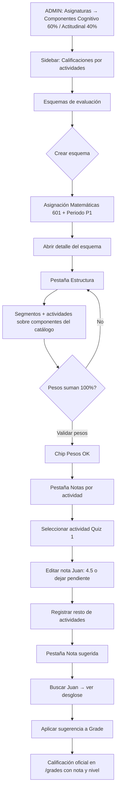

# Módulo de gestión de calificaciones por actividades

**Proyecto:** eduCalc  
**Documento:** Especificación de implementación (prompt refinado)  
**Referencia:** `backend/core/models.py`, Decreto 1290 de 2009 (Colombia)  
**Fecha:** Junio 2025 (backend) · actualizado Junio 2026 (frontend + refactor catálogo por asignatura + nivel de desempeño al aplicar sugerencia)  
**Estado:** Backend Fases 1–2 completadas · Frontend integrado · **Refactor componentes/segmentos/notas pendientes** — ver [Ajustes de arquitectura (Jun 2026)](#ajustes-de-arquitectura-jun-2026)

---

## Contexto del proyecto

Implementar en **eduCalc** (Django REST Framework) un módulo para registrar y gestionar la estructura de evaluación y las notas puntuales de estudiantes por asignatura y periodo.

**Referencias obligatorias:**

- Modelos existentes en `backend/core/models.py`
- Convenciones: `TimeStampedModel`, PK UUID, `created_at`/`updated_at`, campos API en `snake_case`
- Patrones de API: ViewSets, serializers con campos denormalizados de solo lectura (`*_name`), `filterset_fields`, `search_fields`, validación en `clean()`
- Escala numérica existente: `DecimalField(max_digits=4, decimal_places=2)` (igual que `Grade.numerical_grade`)

**Jerarquía académica existente (no modificar relaciones base):**

```
AcademicArea → Subject → CourseAssignment (teacher + group + academic_year)
Enrollment → Student
AcademicPeriod (por AcademicYear)
Grade (student + course_assignment + academic_period → numerical_grade / performance_level / definitive_grade)
```

---

## Objetivo del módulo

Permitir que el docente configure **segmentos y actividades** dentro de una estructura ponderada por curso y periodo, sobre un **catálogo de componentes** definido por asignatura (administrador). Registrar **notas por actividad** (incluidas pendientes) y obtener una **nota sugerida** calculada. Esa sugerencia **no reemplaza** la nota oficial: el docente sigue decidiendo `Grade.numerical_grade` y `Grade.definitive_grade`.

---

## Modelo de dominio propuesto

### 1. Estructura de evaluación (catálogo por asignatura y periodo)

```
Subject (existente)
  └── SubjectComponent (catálogo por asignatura — solo ADMIN)
GradingScheme (CourseAssignment + AcademicPeriod)
  └── ComponentSegment (flexible por docente, referencia SubjectComponent)
        └── Activity (definición de la actividad, sin nota de estudiante)
              └── StudentActivityScore (score nullable = pendiente)
```

**Alcance recomendado:** la estructura cuelga de `CourseAssignment` + `AcademicPeriod`, no solo de `Subject`, porque la misma asignatura puede evaluarse distinto por grupo/docente/año.

**Componentes (SubjectComponent):** catálogo institucional por `Subject`. Los pesos suman 100% a nivel de asignatura. Solo administradores pueden crear, editar o eliminar componentes.

**Segmentos (ComponentSegment):** cada docente configura segmentos dentro de su `GradingScheme`, referenciando un `SubjectComponent` del catálogo. Los pesos de segmentos suman 100% por componente dentro del esquema.

Entidad contenedora sugerida:

**`GradingScheme`** (o `SubjectGradingStructure`)

| Campo | Tipo | Notas |
|-------|------|-------|
| `course_assignment` | FK → `CourseAssignment` | |
| `academic_period` | FK → `AcademicPeriod` | |
| `is_active` | BooleanField (default=True) | |
| `unique_together` | `[course_assignment, academic_period]` | |

### 2. Entidades hijas

#### `SubjectComponent`

Dimensión de evaluación (cognitivo, social, aptitudinal, etc.) — **catálogo por asignatura**.

| Campo | Tipo | Notas |
|-------|------|-------|
| `subject` | FK → `Subject` | `related_name="grading_components"` |
| `name` | CharField(255) | |
| `description` | TextField(blank=True) | |
| `weight_percent` | DecimalField(5,2) | Peso respecto al total del periodo (0–100) |
| `sort_order` | PositiveSmallIntegerField | Orden de visualización |

> Solo usuarios con rol **ADMIN** pueden modificar componentes vía API.

#### `ComponentSegment`

Subdivisión del componente (evaluaciones, talleres, exposiciones) — **configurable por docente**.

| Campo | Tipo | Notas |
|-------|------|-------|
| `grading_scheme` | FK → `GradingScheme` | `related_name="segments"` |
| `subject_component` | FK → `SubjectComponent` | `related_name="segments"` |
| `name` | CharField(255) | |
| `description` | TextField(blank=True) | |
| `weight_percent` | DecimalField(5,2) | Peso respecto al componente padre (0–100) |
| `sort_order` | PositiveSmallIntegerField | |

#### `Activity`

Actividad puntual (plantilla, compartida por el grupo).

| Campo | Tipo | Notas |
|-------|------|-------|
| `segment` | FK → `ComponentSegment` | `related_name="activities"` |
| `name` | CharField(255) | |
| `description` | TextField(blank=True) | |
| `activity_date` | DateField | Renombrar `date` para evitar conflicto con tipos Python |
| `max_score` | DecimalField(4,2, default=5.00) | Escala máxima de la actividad |
| `sort_order` | PositiveSmallIntegerField | |

> **Importante:** no poner `grade` en `Activity`. Las notas son por estudiante.

### 3. Notas por estudiante

#### `StudentActivityScore` (o `ActivityGrade`)

| Campo | Tipo | Notas |
|-------|------|-------|
| `activity` | FK → `Activity` | `related_name="student_scores"` |
| `student` | FK → `Student` | `related_name="activity_scores"` |
| `score` | DecimalField(4,2, null=True) | Nota del estudiante; `null` = pendiente |
| `notes` | TextField(blank=True) | Observación opcional del docente |
| `unique_together` | `[activity, student]` | |

Validar en `clean()`:

- Si `score` no es null: `0 <= score <= activity.max_score`
- El estudiante debe estar matriculado (`Enrollment` activo) en el grupo del `course_assignment` del esquema

> **Nota pendiente:** las actividades pueden definirse antes de realizarse (planeación futura). Mientras no haya nota registrada (`score` null o sin registro), la actividad se excluye del cálculo de promedio.

---

## Reglas de negocio y validación

1. **Pesos de componentes:** la suma de `weight_percent` de los `SubjectComponent` de una `Subject` debe ser **100** (tolerancia ±0.01). Validado a nivel de asignatura.
2. **Pesos de segmentos:** la suma de `weight_percent` de los `ComponentSegment` de un `SubjectComponent` dentro de un `GradingScheme` debe ser **100** (tolerancia ±0.01).
3. **Cálculo de nota sugerida** (servicio `grading_suggestion_service.py`):

```
segment_score(student, segment) =
    promedio simple de StudentActivityScore.score
    de las actividades del segmento con nota registrada (score IS NOT NULL)

component_score(student, component) =
    Σ (segment_score × segment.weight_percent / 100)
    — pesos de segmentos renormalizados si alguno carece de notas

suggested_grade(student, grading_scheme) =
    Σ (component_score × subject_component.weight_percent / 100)
    — componentes tomados del catálogo Subject; pesos a nivel asignatura
```

4. Actividades o estudiantes **sin nota** (`score` null o sin registro) se excluyen del promedio del segmento; los segmentos sin datos se excluyen y sus pesos se renormalizan entre los restantes.
5. La nota sugerida **no persiste** en `Grade` automáticamente; se expone vía endpoint de consulta. Campo de solo lectura `score_pending` en `StudentActivityScore` cuando `score` es null.

---

## Integración con `Grade` existente

El modelo `Grade` ya tiene:

- `student` → FK `Student`
- `course_assignment` → FK `CourseAssignment`
- `academic_period` → FK `AcademicPeriod`
- `numerical_grade` → nota del periodo
- `performance_level` → FK a `GradingScale` (nivel de desempeño Decreto 1290: Superior, Alto, Básico, Bajo)
- `definitive_grade` → nota definitiva opcional

**Comportamiento esperado:**

- El módulo de actividades es **complementario** y sirve de autocompletado/sugerencia.
- Endpoint sugerido: `GET /api/grades/suggested/?student=&course_assignment=&academic_period=` → devuelve desglose (componentes, segmentos, actividades) + `suggested_grade`.
- El docente copia manualmente o mediante acción explícita (`POST .../apply-suggestion`) la sugerencia a `Grade.numerical_grade`; **nunca** sobrescribir `definitive_grade` sin acción explícita.
- Al aplicar la sugerencia, el sistema también asigna `Grade.performance_level` según la escala de calificación (`GradingScale`) de la institución de la asignatura, usando la misma lógica de rango `[min_score, max_score]` que en la edición manual de calificaciones (`GradesPage`, `GradesByGroupModal`).

---

## API REST a implementar

Seguir el patrón de `GradeViewSet` en `backend/core/views.py`.

| Recurso | Endpoints | Permisos |
|---------|-----------|----------|
| `GradingScheme` | CRUD + filtros por `course_assignment`, `academic_period` | `IsTeacher` (docente asignado) / `IsCoordinator` / `ADMIN` |
| `SubjectComponent` | CRUD filtrado por `subject` | Lectura: staff (`IsAdminUserOrReadOnlyStaff`) · Escritura: **solo `ADMIN`** |
| `ComponentSegment` | CRUD filtrado por `grading_scheme`, `subject_component`, `subject_component__subject` | `IsTeacher` (docente del esquema) / `IsCoordinator` / `ADMIN` |
| `GradingActivity` | CRUD filtrado por `segment`, `segment__grading_scheme` | Igual |
| `StudentActivityScore` | CRUD + bulk; `score` nullable | Igual |
| Cálculo | `GET .../grading-schemes/{id}/breakdown/?student=` | Igual |

**Campos calculados en `GradingScheme` (API):** `subject_component_weights_valid` (catálogo de la asignatura), `segment_weights_valid` (segmentos del esquema por componente).

**Filtros mínimos:** `course_assignment`, `course_assignment__group`, `academic_period`, `subject`, `grading_scheme`, `student`, `student__document_number`, `activity__segment__grading_scheme`.

**Serializers:** incluir campos denormalizados (`subject_name`, `group_name`, `period_name`, `student_name`, etc.) como en `GradeSerializer`.

---

## Alcance de implementación (fases)

### Fase 1 — Backend

- [x] Modelos + migración inicial (`0010_activity_grading_models`)
- [x] Refactor catálogo por asignatura + notas pendientes (`0011_subject_component_catalog`)
- [x] Validaciones de pesos en `clean()` / serializers / `validate_scheme_weights`
- [x] Servicio de cálculo de nota sugerida (`grading_suggestion_service.py`)
- [x] ViewSets + serializers + registro en `urls.py`
- [x] Permiso `IsAdminUserOrReadOnlyStaff` para `SubjectComponent`
- [x] Admin Django básico
- [x] Tests unitarios: validación de pesos, cálculo ponderado, exclusión de actividades sin nota

### Fase 2 — Integración (opcional en este evolutivo)

- [x] Endpoint de sugerencia vinculado a `Grade` (`GET /api/grades/suggested/`)
- [x] Acción `apply-suggestion` con confirmación explícita (`POST /api/grading-schemes/{id}/apply-suggestion/`) — escribe `numerical_grade` y `performance_level`
- [x] Bulk CSV (patrón `bulk_load` existente)

### Fase 3 — Frontend (panel de administración)

- [x] Sección dedicada en sidebar: **Calificaciones por actividades**
- [x] Layout de módulo con subnavegación (`ActivityGradingLayout`)
- [x] CRUD de esquemas + detalle con estructura, notas y sugerencia
- [x] Listado global de notas por actividad (`StudentActivityScore`)
- [x] Consulta y aplicación de nota sugerida
- [x] Capa API tipada (`gradingApi.ts`) + tipos OpenAPI regenerados
- [x] Carga masiva CSV en hub `/bulk-load` (estructura y notas por actividad)
- [x] i18n (`activityGrading.*`, `gradingSchemes.*`)
- [x] Redirección de rutas legacy `/grading-schemes` → `/activity-grading/schemes`
- [x] Catálogo de componentes por asignatura (`SubjectComponentsDialog` en **Asignaturas**, solo ADMIN)
- [x] Pestaña Estructura: componentes de solo lectura; segmentos y actividades editables por docente
- [x] Notas pendientes en cuadrícula (`score` null; celda vacía no borra el registro si ya existía)
- [x] UX de estructura: chips de validación por componente, ocultar «Agregar segmento» al 100%, límite de peso en modal
- [x] Aplicar sugerencia con nivel de desempeño (`performance_level`) y mensaje de confirmación con nombre del nivel

### Fuera de alcance

- Cambiar lógica de boletines (`bulletin_service.py`) o `PerformanceSummary`
- Auto-actualizar `Grade` al guardar una `StudentActivityScore`

---

## Decisiones de diseño ya resueltas

| Tema | Decisión |
|------|----------|
| `percental_weigth` | Renombrar a `weight_percent` |
| `Activity.grade` | Separar en `Activity` (definición) + `StudentActivityScore.score` |
| `date` en Activity | Renombrar a `activity_date` |
| Alcance temporal | Amarrar estructura a `AcademicPeriod` |
| Alcance grupal | Amarrar a `CourseAssignment` |
| **Componentes** | Catálogo por `Subject`; solo ADMIN modifica |
| **Segmentos** | Flexibles por docente en `GradingScheme` |
| **Nota pendiente** | `StudentActivityScore.score` nullable; excluida del cálculo |
| Nota oficial | `Grade.numerical_grade` / `definitive_grade` siguen siendo la fuente de verdad |
| Nivel al aplicar sugerencia | `apply-suggestion` escribe `numerical_grade` **y** `performance_level` (no toca `definitive_grade`) |
| Resolución de nivel | `indicator_utils.resolve_grading_scale_for_score` sobre escalas de la institución |
| Nombre del módulo | Evitar colisión con `Grade`; usar `grading` o `activity_grading` en rutas |

---

## Criterios de aceptación

1. Un **administrador** configura los componentes de evaluación (pesos al 100%) en el catálogo de cada **Asignatura**.
2. Un docente puede crear un esquema para su `CourseAssignment` en un periodo y definir **segmentos y actividades** sobre esos componentes.
3. Los pesos inválidos (componentes de asignatura ≠ 100% o segmentos de un componente en el esquema ≠ 100%) son rechazados con mensaje claro en español.
4. Puede registrar actividades y notas individuales por estudiante; la nota puede quedar **pendiente** (`score` null) hasta calificar.
5. El sistema calcula y expone la nota sugerida con desglose por componente y segmento (solo actividades con nota).
6. Guardar actividades o notas **no modifica** registros `Grade` existentes.
7. Un TEACHER solo ve/edita esquemas de sus `CourseAssignment`; COORDINATOR/ADMIN por institución. Solo ADMIN modifica `SubjectComponent`.
8. Al **aplicar sugerencia**, el registro `Grade` queda con `numerical_grade` y `performance_level` coherentes con la escala institucional; `definitive_grade` no cambia.

---

## Ejemplo de caso de uso

**Matemáticas — Periodo P1 — Grupo 601**

> Los componentes **Cognitivo** y **Actitudinal** están definidos en el catálogo de la asignatura Matemáticas (administrador). El docente solo configura segmentos y actividades en su esquema.

| Componente (catálogo) | Peso |
|------------|------|
| Cognitivo | 60% |
| Actitudinal | 40% |

**Cognitivo → Evaluaciones (40%)**

- Quiz 1: Juan 4.5, María 3.8
- Parcial: Juan 4.0, María 4.2

→ Promedio segmento Juan: 4.25

**Cognitivo → Talleres (60%)**

- Taller álgebra: Juan 5.0

→ Promedio segmento Juan: 5.0

**Componente Cognitivo Juan:** `4.25×0.40 + 5.0×0.60 = 4.70`

*(repetir para Actitudinal y aplicar pesos 60/40 del esquema)*

---

## Ajustes clave respecto al borrador original

1. **`grade` en `Activity`** → separar definición de actividad y nota por estudiante (`StudentActivityScore`).
2. **`percental_weigth`** → `weight_percent` con validación numérica.
3. **Alcance** → añadir `GradingScheme` ligado a `CourseAssignment` + `AcademicPeriod`.
4. **Relación con `Grade`** → explícita: sugerencia vs nota oficial.
5. **Convenciones del repo** → `TimeStampedModel`, UUID, DRF ViewSets, RBAC por rol, tests.
6. **Componentes por asignatura (Jun 2026)** → `SubjectComponent.subject` en lugar de `grading_scheme`; pesos institucionales compartidos.
7. **Segmentos por esquema (Jun 2026)** → `ComponentSegment` con `grading_scheme` + `subject_component`; el docente personaliza por grupo/periodo.
8. **Notas pendientes (Jun 2026)** → `StudentActivityScore.score` nullable; planeación de actividades prevista como evolutivo futuro.
9. **Nivel al aplicar sugerencia (Jun 2026)** → `apply-suggestion` persiste `Grade.performance_level` vía `resolve_grading_scale_for_score`; respuesta incluye `performance_level_name`.

---

## Ajustes de arquitectura (Jun 2026)

Refactor acordado para separar **política institucional** (componentes) de **autonomía docente** (segmentos y actividades).

### Modelo y migración

| Antes | Después |
|-------|---------|
| `SubjectComponent.grading_scheme` | `SubjectComponent.subject` (`related_name="grading_components"`) |
| `ComponentSegment.component` → `SubjectComponent` | `ComponentSegment.grading_scheme` + `ComponentSegment.subject_component` |
| `StudentActivityScore.score` obligatorio | `score` nullable (`null` = pendiente) |
| Validación de pesos de componentes en el esquema | Validación de pesos de componentes en la **asignatura**; segmentos en el **esquema** |

Migración de datos: `backend/core/migrations/0011_subject_component_catalog.py` (copia componentes a `subject` del curso y reubica segmentos bajo el esquema).

### Permisos

- **`SubjectComponentViewSet`:** `IsAdminUserOrReadOnlyStaff` — docentes/coordinadores **leen** el catálogo; solo **ADMIN** crea/edita/elimina.
- **`ComponentSegmentViewSet`**, **`GradingActivityViewSet`**, **`StudentActivityScoreViewSet`:** sin cambio de rol base (`IsTeacher` + alcance por docente asignado).

### Cálculo (`grading_suggestion_service.py`)

- Itera `subject.grading_components` (pesos del catálogo).
- Por cada componente, obtiene segmentos del esquema: `scheme.segments.filter(subject_component=…)`.
- Promedios de segmento ignoran registros con `score IS NULL`.

### Carga masiva CSV

- **Componentes:** se crean/resuelven por `Subject` (asignatura del curso), no por esquema.
- **Segmentos:** requieren esquema existente + componente de asignatura + `grading_scheme`.

### Frontend

| Área | Comportamiento |
|------|----------------|
| **Asignaturas** (`SubjectsPage`) | Icono «Componentes de evaluación» (solo ADMIN) → `SubjectComponentsDialog` |
| **Diálogo de componentes** | CRUD con validación visual de pesos al 100%; toast Snackbar al crear/editar/eliminar; formulario se limpia tras guardar (remount con `key`) |
| **Esquema → Estructura** | Componentes **solo lectura** (desde catálogo); docente agrega segmentos y actividades |
| **Esquema → Notas** | Celda vacía → `score: null` (pendiente); hint en UI |
| **Validar pesos** | Chip muestra «Pesos OK» cuando la API devuelve `message` vacío y `valid: true` |
| **Esquema → Estructura (UX)** | Chips por componente: «Segmentos OK», «Segmentos: X% / 100%», «Sin segmentos»; suma visible de segmentos; chips globales de catálogo y esquema |
| **Agregar segmento** | Oculto cuando los segmentos del componente ya suman 100% |
| **Modal de segmento** | Peso ≤ 100% y ≤ peso disponible restante; hint «Peso disponible: X%» |
| **Aplicar sugerencia** | Toast: «Nota X (Nivel) registrada…»; invalida caché de `/grades` |

Ruta de administración de componentes: **Estructura académica → Asignaturas** (no dentro del detalle del esquema).

### Aplicar sugerencia y nivel de desempeño

Acción `POST /api/grading-schemes/{id}/apply-suggestion/`:

1. Calcula `suggested_grade` con `grading_suggestion_service`.
2. Obtiene las escalas `GradingScale` de la institución (`course_assignment.subject.institution`).
3. Resuelve el nivel con `resolve_grading_scale_for_score` (`backend/core/indicator_utils.py`): rango `[min_score, max_score]`; si hay solapamiento, gana el rango más estrecho (igual que el frontend).
4. Crea o actualiza `Grade` con `numerical_grade` y `performance_level`.
5. **No** modifica `definitive_grade`.

**Respuesta API (`ApplySuggestionResponse`):**

| Campo | Tipo | Descripción |
|-------|------|-------------|
| `grade_id` | UUID | Registro `Grade` afectado |
| `numerical_grade` | decimal | Nota aplicada |
| `performance_level` | UUID \| null | FK a `GradingScale` |
| `performance_level_name` | string \| null | Nombre legible (p. ej. «Superior») |
| `definitive_grade` | decimal \| null | Sin cambios respecto al valor previo |
| `created` | boolean | `true` si se creó un nuevo `Grade` |

**Prerrequisito:** la institución debe tener escalas de calificación configuradas (`GradingScale`); si no hay escala que cubra la nota, `performance_level` queda `null` (la nota numérica sí se guarda).

---

## Estado de implementación — Backend

Resumen del backend Django REST. Para el panel web, ver [Estado de implementación — Frontend](#estado-de-implementación--frontend) y [Flujo de ejemplo](#flujo-de-ejemplo--cómo-funciona-el-feature-en-la-ui).

### Archivos creados / modificados

| Archivo | Descripción |
|---------|-------------|
| `backend/core/models.py` | Modelos `GradingScheme`, `SubjectComponent`, `ComponentSegment`, `GradingActivity`, `StudentActivityScore`; `Subject.component_weights_valid()` |
| `backend/core/migrations/0010_activity_grading_models.py` | Migración inicial del módulo |
| `backend/core/migrations/0011_subject_component_catalog.py` | Componentes por asignatura; segmentos por esquema; `score` nullable |
| `backend/core/permissions.py` | `IsAdminUserOrReadOnlyStaff` para catálogo de componentes |
| `backend/core/grading_suggestion_service.py` | Cálculo de nota sugerida y desglose (catálogo + segmentos del esquema) |
| `backend/core/indicator_utils.py` | `resolve_grading_scale_for_score` — nota → `GradingScale` al aplicar sugerencia |
| `backend/core/grading_serializers.py` | Serializers del módulo |
| `backend/core/grading_views.py` | ViewSets con `RoleScopeMixin` y RBAC por docente |
| `backend/core/views.py` | Acción `GET /api/grades/suggested/` en `GradeViewSet` |
| `backend/core/admin.py` | Registro en Django Admin |
| `backend/urls.py` | Rutas API |
| `backend/core/bulk_load_grading.py` | Carga masiva de estructura y notas por actividad |
| `docs/bulk_load_grading_structure.csv` | Ejemplo CSV de estructura de evaluación |
| `docs/bulk_load_student_activity_scores.csv` | Ejemplo CSV de notas por actividad |
| `backend/core/tests.py` | `ActivityGradingModuleTests` (15 tests; incluye `performance_level` en `apply-suggestion`) |

### Endpoints disponibles

| Método | Ruta | Descripción |
|--------|------|-------------|
| CRUD | `/api/grading-schemes/` | Esquemas de calificación por curso y periodo |
| GET | `/api/grading-schemes/{id}/breakdown/?student=` | Desglose y nota sugerida |
| GET | `/api/grading-schemes/{id}/validate-weights/` | Valida que pesos sumen 100% |
| POST | `/api/grading-schemes/{id}/apply-suggestion/` | Aplica sugerencia a `Grade.numerical_grade` y `Grade.performance_level` |
| CRUD | `/api/subject-components/?subject=` | Catálogo de componentes por asignatura (escritura ADMIN) |
| CRUD | `/api/component-segments/?grading_scheme=` | Segmentos del docente por esquema y componente |
| CRUD | `/api/grading-activities/?segment__grading_scheme=` | Actividades puntuales |
| CRUD | `/api/student-activity-scores/` | Notas por estudiante (`score` nullable) |
| GET | `/api/grades/suggested/?student=&course_assignment=&academic_period=` | Sugerencia desde `Grade` |
| POST | `/api/grading-schemes/bulk-load/` | Carga masiva de estructura (componentes, segmentos, actividades) |
| POST | `/api/student-activity-scores/bulk-load/` | Carga masiva de notas por estudiante y actividad |

### Notas de implementación

- La entidad de actividad se nombró **`GradingActivity`** en código para evitar ambigüedad con el modelo `Grade`.
- **Componentes** son compartidos por todos los docentes de la misma asignatura; **segmentos** son propios de cada `GradingScheme`.
- Los segmentos sin notas registradas se excluyen del cálculo y los pesos se renormalizan entre los segmentos con datos.
- `StudentActivityScore.score = null` representa nota **pendiente**; no entra al promedio. Borrar el registro también equivale a «sin nota» en la cuadrícula si nunca se guardó.
- `StudentActivityScore` no dispara actualización automática de `Grade` (cumple criterio de autocompletado manual).
- `apply-suggestion` sí escribe en `Grade`, pero solo bajo acción explícita del docente; asigna `numerical_grade` y `performance_level` en la misma operación.
- Permisos: `SubjectComponent` solo editable por ADMIN; resto del módulo con `IsTeacher` (incluye COORDINATOR y ADMIN) y `RoleScopeMixin`.
- Documentación OpenAPI: decoradores en `grading_openapi.py` y `extend_schema_serializer` en `grading_serializers.py`; schema en `backend/docs/openapi/schema.json` (regenerar con `backend/scripts/export-openapi-schema.sh`).

### Carga masiva CSV

**1. Estructura** — `POST /api/grading-schemes/bulk-load/`  
Archivo de referencia: `docs/bulk_load_grading_structure.csv`

Columnas principales: `DANE_COD`, `ANO`, `SEDE`, `GRADO`, `GRUPO`, `ASIGNATURA_NOMBRE`, `PERIODO_NUM`, `COMPONENTE_NOMBRE`, `COMPONENTE_PESO`, `SEGMENTO_NOMBRE`, `SEGMENTO_PESO`, `ACTIVIDAD_NOMBRE`, `ACTIVIDAD_FECHA`, `NOTA_MAXIMA` (opcional).

Crea el `GradingScheme` si no existe; **componentes** en la asignatura del curso; **segmentos y actividades** en el esquema. Requiere `CourseAssignment` previo.

**2. Notas por actividad** — `POST /api/student-activity-scores/bulk-load/`  
Archivo de referencia: `docs/bulk_load_student_activity_scores.csv`

Columnas principales: `DOC_ESTUDIANTE`, contexto de curso (igual que notas `Grade`), `PERIODO_NUM`, `COMPONENTE_NOMBRE`, `SEGMENTO_NOMBRE`, `ACTIVIDAD_NOMBRE`, `ACTIVIDAD_FECHA` (opcional), `NOTA`, `OBSERVACIONES` (opcional).

Requiere estructura cargada previamente. **No modifica** registros `Grade`.

---

## Estado de implementación — Frontend

### Navegación y rutas

El módulo vive bajo el prefijo **`/activity-grading`**, con una sección propia en el sidebar (separada de **Evaluación → Calificaciones** oficiales).

| Ruta | Pantalla | Descripción |
|------|----------|-------------|
| `/activity-grading/schemes` | `GradingSchemesPage` | Listado y CRUD de `GradingScheme` |
| `/activity-grading/schemes/:id` | `GradingSchemeDetailPage` | Detalle: estructura (segmentos/actividades), notas, sugerencia |
| **Estructura académica → Asignaturas** | `SubjectComponentsDialog` | Catálogo de componentes por asignatura (**solo ADMIN**) |
| `/activity-grading/activity-scores` | `StudentActivityScoresPage` | Listado y CRUD global de `StudentActivityScore` |
| `/activity-grading/suggested-grades` | `SuggestedGradesPage` | Selector de esquema + desglose y aplicar sugerencia |

**Redirecciones legacy:** `/grading-schemes` y `/grading-schemes/:id` redirigen a las rutas anteriores.

**Roles:** `STAFF_ROLES` (docente, coordinador, administrador). Docentes ven solo esquemas de sus `CourseAssignment` (alcance vía API + `useTeacherScopeListDefaults` en listados).

**Subnavegación del módulo:** tabs horizontales en `ActivityGradingLayout` (Esquemas · Notas por actividad · Nota sugerida), sincronizados con el sidebar.

### Mapa de archivos (frontend)

| Archivo | Responsabilidad |
|---------|-----------------|
| `frontend/src/features/operations/activityGrading/activityGradingNav.ts` | Configuración de rutas y ítems del módulo |
| `frontend/src/layouts/ActivityGradingLayout.tsx` | Shell del módulo (título, tabs, `<Outlet />`) |
| `frontend/src/features/operations/GradingSchemesPage.tsx` | Listado infinito + filtros + alta/edición de esquemas |
| `frontend/src/features/operations/GradingSchemeDetailPage.tsx` | Detalle: metadatos + pestañas |
| `frontend/src/features/academic-structure/SubjectsPage.tsx` | Listado de asignaturas; acceso al diálogo de componentes (ADMIN) |
| `frontend/src/features/academic-structure/SubjectComponentsDialog.tsx` | CRUD de componentes + toast + validación de pesos al 100% |
| `frontend/src/features/operations/GradingSchemeStructurePanel.tsx` | Segmentos y actividades por esquema (componentes de solo lectura) |
| `frontend/src/features/operations/GradingSchemeScoresPanel.tsx` | Cuadrícula editable de notas por actividad (matrícula del grupo) |
| `frontend/src/features/operations/GradingSchemeBreakdownPanel.tsx` | Desglose ponderado + botón «Aplicar sugerencia» |
| `frontend/src/features/operations/activityGrading/StudentActivityScoresPage.tsx` | CRUD global de notas con filtros por esquema/estudiante |
| `frontend/src/features/operations/activityGrading/SuggestedGradesPage.tsx` | Flujo de consulta/aplicación de sugerencia por esquema |
| `frontend/src/features/operations/gradingApi.ts` | Cliente HTTP tipado (CRUD + breakdown + validate + apply) |
| `frontend/src/api/queryKeys.ts` | Keys: `gradingSchemes`, `gradingSchemeStructure`, `studentActivityScores`, etc. |
| `frontend/src/types/schemas.ts` | Reexport de tipos OpenAPI del módulo |
| `frontend/src/app/navConfig.ts` | Sección `nav.activityGradingSection` |
| `frontend/src/routes/AppRoutes.tsx` | Rutas anidadas bajo `ActivityGradingLayout` |
| `frontend/src/features/bulk/bulkLoadTargets.ts` | Targets CSV: estructura y notas por actividad |
| `frontend/src/i18n/locales/es.json` | Claves `activityGrading.*` y `gradingSchemes.*` |

**Regenerar tipos:** `cd frontend && bun run generate:api-types` (fuente: `backend/docs/openapi/schema.json`).

### Patrones reutilizados

- TanStack Query + `useInfiniteList` para listados paginados (como `GradesPage`).
- MUI DataGrid con edición en celda para notas del grupo (como `GradesByGroupModal`).
- React Hook Form + Zod en diálogos de creación/edición.
- Filtros por institución activa (`uiStore.selectedInstitutionId`), año, periodo y asignación.
- Principio abierto/cerrado: `gradingApi.ts` concentra el contrato HTTP; paneles del detalle son extensibles sin modificar el listado.

### Pendiente / mejoras futuras

- Enlace desde `GradesPage` hacia el esquema de actividades del mismo curso/periodo.
- Mostrar `suggested_grade` en ficha del estudiante o en edición de `Grade`.
- **Planeación de actividades:** implementado en frontend — ver [modulo-planeacion-actividades.md](./modulo-planeacion-actividades.md) (calendario, estados derivados, planeador con plantillas; backend sin endpoints dedicados aún).
- Toast/notificaciones globales reutilizables (hoy Snackbar local en diálogo de componentes).
- Tests E2E o de componente para flujos críticos (pesos, apply-suggestion con nivel, permisos ADMIN vs docente).

---

## Flujo de ejemplo — cómo funciona el feature en la UI

Escenario: **Prof. García** registra evaluación por actividades en **Matemáticas**, **grupo 601**, **periodo P1** (año lectivo vigente). Objetivo: obtener la nota sugerida de **Juan Pérez** y volcarla a la calificación oficial.

### Prerrequisitos (fuera del módulo)

1. Institución, año lectivo, periodo P1, grupo 601 y asignatura Matemáticas ya existen.
2. **Administrador** configuró componentes de evaluación en **Asignaturas → Matemáticas** (p. ej. Cognitivo 60%, Actitudinal 40%).
3. Existe `CourseAssignment` (Matemáticas — 601 — Prof. García).
4. Estudiantes matriculados activamente en el grupo (incluido Juan).
5. Escalas de calificación (`GradingScale`) configuradas para la institución (Superior, Alto, Básico, Bajo), para que al aplicar la sugerencia se asigne el nivel de desempeño.

### Diagrama de flujo



### Paso a paso en la aplicación

#### 0. Configurar componentes de la asignatura (administrador)

1. Iniciar sesión como **ADMIN**.
2. Ir a **Estructura académica → Asignaturas**.
3. En la fila «Matemáticas», clic en el icono **Componentes de evaluación**.
4. Agregar «Cognitivo» **60%** y «Actitudinal» **40%** (chip «Pesos OK» cuando sumen 100%).
5. Toast de confirmación al guardar; el formulario se limpia para agregar otro componente si hiciera falta.

#### 1. Crear el esquema de evaluación

1. Iniciar sesión como docente (o coordinador/admin).
2. Seleccionar la institución en la barra superior.
3. Ir a **Calificaciones por actividades → Esquemas de evaluación** (`/activity-grading/schemes`).
4. Clic en **Nuevo esquema**.
5. Elegir año lectivo, **asignación** «Matemáticas — 601» y **periodo** «P1».
6. Guardar. El listado muestra chips de pesos (`subject_component_weights_valid` + `segment_weights_valid`); incompletos hasta configurar segmentos en el detalle.

#### 2. Configurar segmentos y actividades (docente)

1. Clic en **Gestionar esquema** → `/activity-grading/schemes/{id}`.
2. Pestaña **Estructura** (componentes del catálogo en solo lectura):
   - Cada componente muestra chips de estado de segmentos (OK, suma parcial o sin segmentos).
   - Dentro de **Cognitivo** → **Agregar segmento** «Evaluaciones» **40%** (hint de peso disponible en el modal).
   - Dentro de **Cognitivo** → **Agregar segmento** «Talleres» **60%** (el botón «Agregar segmento» desaparece cuando la suma llega a 100%).
   - En Evaluaciones → **Agregar actividad** «Quiz 1» (fecha, máx. 5.0).
   - En Evaluaciones → **Agregar actividad** «Parcial» (fecha, máx. 5.0).
   - En Talleres → **Agregar actividad** «Taller álgebra» (fecha, máx. 5.0).
3. Clic en **Validar pesos** → chip **Pesos OK** (componentes de asignatura + segmentos del esquema al 100%).

#### 3. Registrar notas por actividad

**Opción A — desde el detalle del esquema (recomendado por grupo):**

1. Pestaña **Notas por actividad**.
2. Seleccionar actividad «Quiz 1».
3. En la cuadrícula, doble clic en la fila de **Juan Pérez**, ingresar **4.5**; al salir de la celda se guarda vía `POST/PATCH /api/student-activity-scores/`. Dejar la celda vacía marca la nota como **pendiente** (`score: null`).
4. Repetir para María (3.8), Parcial (Juan 4.0, María 4.2), Taller álgebra (Juan 5.0).

**Opción B — listado global:**

1. **Calificaciones por actividades → Notas por actividad** (`/activity-grading/activity-scores`).
2. Filtrar por el esquema de Matemáticas 601 · P1.
3. **Nueva nota por actividad** o editar filas existentes.

**Opción C — carga masiva (coordinador):**

1. **Carga masiva CSV** → sección Evaluación → **Notas por actividad**.
2. Subir `docs/bulk_load_student_activity_scores.csv` (estructura previa cargada).

> Guardar una nota por actividad **no modifica** `/grades`; la calificación oficial sigue independiente.

#### 4. Consultar la nota sugerida

1. En el detalle del esquema, pestaña **Nota sugerida**, **o** en **Calificaciones por actividades → Nota sugerida**.
2. Buscar y seleccionar estudiante **Juan Pérez**.
3. El sistema llama `GET /api/grading-schemes/{id}/breakdown/?student=` y muestra:
   - **Cognitivo → Evaluaciones:** promedio 4.25 (Quiz 1 + Parcial).
   - **Cognitivo → Talleres:** promedio 5.0.
   - **Componente Cognitivo:** 4.70.
   - *(Actitudinal según notas registradas.)*
   - **Nota sugerida final** (p. ej. **4.55** si actitudinal está completo).

#### 5. Aplicar a la calificación oficial

1. Con el desglose visible, clic en **Aplicar sugerencia a calificación oficial**.
2. `POST /api/grading-schemes/{id}/apply-suggestion/` escribe `Grade.numerical_grade` y `Grade.performance_level` (crea `Grade` si no existe).
3. Mensaje de confirmación en UI: p. ej. «Nota 4.55 (Alto) registrada. Calificación actualizada».
4. **No** modifica `definitive_grade` salvo acción explícita en `/grades`.
5. Verificar en **Evaluación → Calificaciones** (`/grades`): Juan · Matemáticas · P1 con la nota y el nivel de desempeño aplicados.

### Resumen del recorrido por pantalla

| Paso | Pantalla UI | API principal |
|------|-------------|---------------|
| Componentes (catálogo) | **Asignaturas** → diálogo componentes | `POST /api/subject-components/` (ADMIN) |
| Esquema | `/activity-grading/schemes` | `POST /api/grading-schemes/` |
| Segmentos y actividades | Detalle → Estructura | `POST /api/component-segments/`, `POST /api/grading-activities/` |
| Validación | Detalle → Estructura | `GET .../validate-weights/` |
| Notas | Detalle → Notas / activity-scores | `POST/PATCH /api/student-activity-scores/` (`score` nullable) |
| Sugerencia | Detalle → Nota sugerida / suggested-grades | `GET .../breakdown/?student=` |
| Oficial | `/grades` | `POST .../apply-suggestion/` → `numerical_grade` + `performance_level` visibles en `GET /api/grades/` |

### Ejemplo numérico (Juan — solo componente Cognitivo)

| Actividad | Nota Juan |
|-----------|-----------|
| Quiz 1 | 4.5 |
| Parcial | 4.0 |
| Taller álgebra | 5.0 |

- Promedio segmento **Evaluaciones:** (4.5 + 4.0) / 2 = **4.25**
- Promedio segmento **Talleres:** **5.0**
- **Cognitivo:** 4.25×0.40 + 5.0×0.60 = **4.70**

La nota sugerida del periodo suma además el componente **Actitudinal** (40%) cuando tenga actividades calificadas; el desglose en UI muestra cada nivel antes del total.
