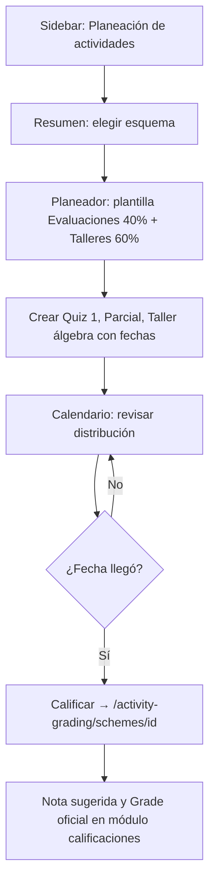

# Módulo de planeación de actividades

**Proyecto:** eduCalc  
**Documento:** Estado de implementación y guía técnica de extensión  
**Referencia:** [Módulo de calificaciones por actividades](./modulo-gestion-calificaciones-por-actividades.md), `backend/core/models.py`, `backend/docs/openapi/schema.json`  
**Fecha:** Junio 2026  
**Estado:** Frontend integrado · **Sin cambios de backend** (reutiliza API de calificaciones por actividades)

---

## Contexto y relación con calificaciones

El módulo de **planeación** es una abstracción de UX orientada al docente sobre el mismo dominio que **Calificaciones por actividades**. No introduce modelos ni tablas nuevas: opera sobre `GradingScheme`, `ComponentSegment`, `GradingActivity` y consulta `StudentActivityScore` + `Enrollment` solo para calcular estados de avance.

| Módulo | Prefijo | Propósito principal |
|--------|---------|---------------------|
| Planeación | `/activity-planning` | Planificar segmentos y actividades antes de calificar |
| Calificaciones por actividades | `/activity-grading` | Registrar notas, validar pesos y aplicar sugerencia a `Grade` |

**Principio de diseño:** la planeación **no escribe** en `Grade` ni en `StudentActivityScore` salvo cuando el docente navega explícitamente al módulo de calificaciones. Crear/editar segmentos y actividades sí persiste vía los mismos endpoints CRUD del módulo padre.

---

## Objetivo del módulo

Permitir que el docente:

1. Elija un **esquema de evaluación** (`GradingScheme`) por asignación y periodo.
2. Configure **segmentos** (evaluaciones, talleres, exposiciones) sobre el catálogo institucional de componentes.
3. Defina **actividades** con fecha, escala máxima y orden.
4. Visualice el **calendario** y el **avance** (planificada → pendiente calificar → calificada).
5. Salte al módulo de calificaciones cuando corresponda registrar notas.

---

## Estado de implementación

### Completado (frontend)

| Área | Estado | Notas |
|------|--------|-------|
| Sección sidebar | ✅ | `nav.activityPlanningSection` — Resumen, Calendario, Planeador |
| Layout con tabs | ✅ | `ActivityPlanningLayout` |
| Resumen (KPIs) | ✅ | Conteos por estado + progreso de estructura |
| Calendario mensual | ✅ | Grid custom MUI (sin `@mui/x-date-pickers`) |
| Planeador estructurado | ✅ | Acordeón por componente + plantillas de segmento |
| CRUD segmentos/actividades | ✅ | Vía API existente; diálogo `PlanningActivityDialog` |
| Estados derivados | ✅ | Client-side en `activityPlanningUtils.ts` |
| Selector de esquema persistente | ✅ | Query param `?scheme=<uuid>` |
| i18n español | ✅ | Claves `activityPlanning.*` |
| RBAC rutas | ✅ | `STAFF_ROLES` en `routeAccess.ts` |
| Build TypeScript | ✅ | `bun run build` |

### Backend

| Área | Estado | Notas |
|------|--------|-------|
| Modelos nuevos | ➖ No aplica | Reutiliza `GradingActivity`, etc. |
| Endpoints dedicados | ➖ No implementado | Ver [Endpoints recomendados](#endpoints-recomendados-futuro) |
| Campo `status` en actividad | ➖ No existe | Estado calculado en frontend |
| OpenAPI | ➖ Sin cambios | Misma schema que calificaciones |

### Pendiente / mejoras futuras

- Endpoint agregado `GET .../planning-summary/` (menos round-trips).
- Duplicar actividad a otra fecha.
- Filtros de actividades por rango de fechas en API.
- Enlace bidireccional desde `GradesPage` / detalle de esquema de calificaciones.
- Notificaciones o recordatorios de actividades vencidas sin calificar.
- Vista multi-esquema (todos los cursos del docente en un calendario).
- Plantillas de actividad (nombres sugeridos por tipo de segmento).
- Tests E2E del flujo planear → calificar → sugerencia.
- Internacionalización adicional (solo `es.json` hoy).

---

## Features implementadas

### 1. Resumen (`/activity-planning`)

- Selector de esquema activo (filtrado por institución seleccionada en UI).
- **Tarjetas KPI:** planificadas, por calificar, en proceso, calificadas, componentes con segmentos al 100%, total de actividades.
- Alerta si la estructura del esquema está incompleta (`segment_weights_valid` / catálogo).
- Lista de próximas actividades (planificadas, vencidas o en calificación parcial).
- Accesos rápidos: planeador, calendario, módulo de calificaciones.

### 2. Calendario (`/activity-planning/calendar`)

- Navegación mes anterior / siguiente.
- Grid de 7 columnas (Lun–Dom) con actividades como chips coloreados por estado.
- Panel de detalle del día seleccionado: editar actividad, ver progreso de calificación, enlace «Calificar».
- Comparte esquema seleccionado vía `?scheme=`.

### 3. Planeador (`/activity-planning/workspace` y `/workspace/:schemeId`)

- Sin `schemeId` en ruta: solo selector de esquema.
- Con `schemeId`: workspace completo por componente del catálogo (solo lectura a nivel componente).
- **Plantillas rápidas de segmento** (un clic):
  - Evaluaciones — 40%
  - Talleres — 35%
  - Exposiciones — 25%
- Segmento personalizado (nombre + peso) con validación de peso disponible.
- Lista de actividades por segmento con chips de estado, editar y eliminar.
- Enlace al detalle completo en `/activity-grading/schemes/:id`.

### 4. Estados de actividad (derivados)

No persisten en base de datos. Se calculan en `deriveActivityStatus()`:

| Estado | Clave i18n | Condición |
|--------|------------|-----------|
| `planned` | `activityPlanning.status.planned` | `activity_date > hoy` |
| `due` | `activityPlanning.status.due` | Fecha ≤ hoy y ningún `StudentActivityScore.score` no nulo |
| `grading` | `activityPlanning.status.grading` | Fecha ≤ hoy, hay al menos una nota, pero `gradedCount < enrollmentCount` |
| `completed` | `activityPlanning.status.completed` | Fecha ≤ hoy y `gradedCount >= enrollmentCount` (matrículas activas del grupo) |

**Matrícula de referencia:** `GET /api/enrollments/?academic_year=&group=&status=active` del `CourseAssignment` del esquema.

**Notas de referencia:** `GET /api/student-activity-scores/?activity__segment__grading_scheme=<schemeId>` (paginado, hasta 20 000 registros en cliente).

---

## Navegación y rutas

Prefijo base: **`/activity-planning`**

| Ruta | Componente | Descripción |
|------|------------|-------------|
| `/activity-planning` | `ActivityPlanningOverviewPage` | Resumen y KPIs |
| `/activity-planning/calendar` | `ActivityPlanningCalendarPage` | Calendario mensual |
| `/activity-planning/workspace` | `ActivityPlanningWorkspacePage` | Selector de esquema |
| `/activity-planning/workspace/:schemeId` | `ActivityPlanningWorkspacePage` | Planeador del esquema |

**Query param compartido:** `?scheme=<uuid>` (`planningSchemeQueryKey` en `activityPlanningNav.ts`).

**Roles:** `STAFF_ROLES` (docente, coordinador, administrador). Alcance de datos igual que calificaciones (API + `RoleScopeMixin` en backend).

**Subnavegación:** tabs en `ActivityPlanningLayout` sincronizados con entradas del sidebar (`activityPlanningNavItems`).

---

## Mapa de archivos (frontend)

| Archivo | Responsabilidad |
|---------|-----------------|
| `frontend/src/features/operations/activityPlanning/activityPlanningNav.ts` | Rutas base, ítems nav/tabs, `planningSchemeQueryKey` |
| `frontend/src/features/operations/activityPlanning/activityPlanningUtils.ts` | Estados, enriquecimiento, calendario, plantillas, helpers de pesos |
| `frontend/src/features/operations/activityPlanning/planningQueries.ts` | `usePlanningSchemeBundle`, selector de esquema, carga agregada |
| `frontend/src/features/operations/activityPlanning/PlanningSchemeSelector.tsx` | Autocomplete de esquemas activos |
| `frontend/src/features/operations/activityPlanning/PlanningKpiCards.tsx` | Tarjetas del resumen |
| `frontend/src/features/operations/activityPlanning/PlanningActivityStatusChip.tsx` | Chip visual por estado |
| `frontend/src/features/operations/activityPlanning/PlanningActivityDialog.tsx` | Alta/edición de `GradingActivity` |
| `frontend/src/features/operations/activityPlanning/PlanningSegmentQuickAdd.tsx` | Plantillas y segmento custom |
| `frontend/src/features/operations/activityPlanning/ActivityPlanningOverviewPage.tsx` | Pantalla resumen |
| `frontend/src/features/operations/activityPlanning/ActivityPlanningCalendarPage.tsx` | Pantalla calendario |
| `frontend/src/features/operations/activityPlanning/ActivityPlanningWorkspacePage.tsx` | Pantalla planeador |
| `frontend/src/layouts/ActivityPlanningLayout.tsx` | Shell del módulo |
| `frontend/src/features/operations/gradingApi.ts` | + `fetchStudentActivityScoresForScheme()` |
| `frontend/src/api/queryKeys.ts` | + `activityPlanningBundle(schemeId)` |
| `frontend/src/app/navConfig.ts` | Sección `nav.activityPlanningSection` |
| `frontend/src/app/routeAccess.ts` | Prefijo `/activity-planning` |
| `frontend/src/routes/AppRoutes.tsx` | Rutas anidadas |
| `frontend/src/routes/lazyPages.ts` | Lazy load de páginas |
| `frontend/src/i18n/locales/es.json` | Claves `activityPlanning.*` |

---

## Datos técnicos — carga agregada (`PlanningSchemeBundle`)

Hook principal: **`usePlanningSchemeBundle(schemeId)`** en `planningQueries.ts`.

TanStack Query key: **`queryKeys.activityPlanningBundle(schemeId)`**.

Secuencia de API al cargar un esquema:

```
1. GET /api/grading-schemes/{id}/
2. GET /api/course-assignments/{course_assignment}/
3. En paralelo:
   a. GET /api/subject-components/?subject=&ordering=sort_order
   b. GET /api/component-segments/?grading_scheme=&ordering=sort_order
   c. GET /api/grading-activities/?segment__grading_scheme=&ordering=sort_order
   d. GET /api/student-activity-scores/?activity__segment__grading_scheme=
   e. GET /api/enrollments/?academic_year=&group=&status=active  (paginado)
4. Cliente: enrichActivities() → EnrichedPlanningActivity[]
```

Tipo exportado:

```typescript
type PlanningSchemeBundle = {
  scheme: GradingScheme
  courseAssignment: CourseAssignment
  components: SubjectComponent[]
  segments: ComponentSegment[]
  activities: GradingActivity[]
  scores: StudentActivityScore[]
  enrollments: Enrollment[]
  enrichedActivities: EnrichedPlanningActivity[]
  statusCounts: Record<ActivityPlanningStatus, number>
  progress: {
    componentsReady: number
    componentsTotal: number
    activitiesCount: number
    structureComplete: boolean
  }
  enrollmentCount: number
  today: string  // ISO date local YYYY-MM-DD
}
```

**Invalidación de caché** tras mutaciones (segmento/actividad):

- `queryKeys.activityPlanningBundle(schemeId)`
- `queryKeys.gradingSchemeStructure(schemeId)`
- `queryKeys.gradingSchemeValidateWeights(schemeId)` (indirectamente vía estructura)

---

## API REST utilizada

| Operación | Método | Ruta | Uso en planeación |
|-----------|--------|------|-------------------|
| Listar esquemas | GET | `/api/grading-schemes/?is_active=true` | Selector |
| Detalle esquema | GET | `/api/grading-schemes/{id}/` | Bundle |
| Componentes asignatura | GET | `/api/subject-components/?subject=` | Acordeón planeador |
| Segmentos | GET/POST/PATCH/DELETE | `/api/component-segments/` | Plantillas y custom |
| Actividades | GET/POST/PATCH/DELETE | `/api/grading-activities/` | Diálogo y listados |
| Notas (lectura) | GET | `/api/student-activity-scores/?activity__segment__grading_scheme=` | Estados |
| Matrículas | GET | `/api/enrollments/?academic_year=&group=&status=active` | Conteo calificación |
| Asignación curso | GET | `/api/course-assignments/{id}/` | `subject`, `group`, año |

**No se usan en planeación:** `breakdown`, `validate-weights`, `apply-suggestion`, bulk-load (permanecen en módulo de calificaciones).

---

## Endpoints recomendados (futuro)

Para reducir latencia y habilitar UX avanzada:

### 1. `GET /api/grading-schemes/{id}/planning-summary/`

Respuesta sugerida:

```json
{
  "scheme": { "...": "GradingScheme" },
  "enrollment_count": 32,
  "components": [ "..." ],
  "segments": [ "..." ],
  "activities": [
    {
      "id": "uuid",
      "name": "Quiz 1",
      "activity_date": "2026-06-15",
      "segment_name": "Evaluaciones",
      "component_name": "Cognitivo",
      "status": "planned",
      "graded_count": 0,
      "pending_count": 32
    }
  ],
  "status_counts": { "planned": 5, "due": 2, "grading": 1, "completed": 3 },
  "progress": {
    "components_ready": 2,
    "components_total": 2,
    "structure_complete": true
  }
}
```

Beneficio: una sola petición en lugar de 5–6; lógica de estado centralizada y testeable en backend.

### 2. Filtros de fecha en actividades

`GET /api/grading-activities/?activity_date__gte=&activity_date__lte=&segment__grading_scheme=`

Beneficio: calendario institucional o multi-esquema sin cargar todas las actividades del periodo.

### 3. `POST /api/grading-activities/{id}/duplicate/`

Body: `{ "activity_date": "2026-07-01", "name": "Quiz 2 (copia)" }`

Beneficio: planificación repetitiva (semanal, unidad).

### 4. `POST /api/component-segments/apply-templates/`

Body: `{ "grading_scheme", "subject_component", "templates": [{ "name", "weight_percent" }] }`

Beneficio: crear Evaluaciones + Talleres + Exposiciones atómicamente con validación de pesos.

### 5. Campo opcional en modelo (evolutivo)

| Campo | Tipo | Uso |
|-------|------|-----|
| `planning_status` | enum o nullable | Override manual: cancelada, pospuesta |
| `completed_at` | DateTimeField null | Marcar realizada sin depender de notas |

Requiere migración + actualización OpenAPI + regenerar `frontend/src/types/openapi.d.ts`.

---

## Guía para extender funcionalidades

### Añadir una nueva pantalla al módulo

1. Crear página en `frontend/src/features/operations/activityPlanning/`.
2. Registrar ruta en `AppRoutes.tsx` bajo `ActivityPlanningLayout`.
3. Añadir ítem en `activityPlanningNavItems` y claves i18n.
4. Actualizar `activityPlanningTabValue()` si la ruta debe resaltar un tab.
5. Export lazy en `lazyPages.ts`.
6. Si aplica, ampliar `routeAccess.ts` (prefijo `/activity-planning` ya cubre subrutas).

### Añadir un nuevo estado de actividad

1. Extender union `ActivityPlanningStatus` en `activityPlanningUtils.ts`.
2. Ajustar `deriveActivityStatus()` y `planningStatusColor()`.
3. Añadir clave `activityPlanning.status.<nuevo>` en `es.json`.
4. Actualizar `PlanningActivityStatusChip` si requiere color distinto.

### Añadir plantilla de segmento

1. Añadir id en `SEGMENT_TEMPLATE_IDS`.
2. Extender `buildSegmentTemplates()` con nombre, peso default y hint i18n.
3. Claves en `activityPlanning.templates.*`.

### Consumir nuevo endpoint backend

1. Implementar ViewSet/acción en `backend/core/grading_views.py` + serializer.
2. Decoradores OpenAPI en `grading_openapi.py`.
3. Regenerar schema: `backend/scripts/export-openapi-schema.sh`.
4. Regenerar tipos frontend: `cd frontend && bun run generate:api-types`.
5. Añadir función en `gradingApi.ts` o `planningQueries.ts`.
6. Sustituir lógica client-side en `loadPlanningSchemeBundle()` si el endpoint agrega campos.

### Patrones reutilizados del repo

- TanStack Query + keys en `queryKeys.ts`.
- Institución activa: `useUiStore.selectedInstitutionId`.
- Formularios: React Hook Form + Zod (`PlanningActivityDialog`).
- Mutaciones: invalidar `activityPlanningBundle` + `gradingSchemeStructure`.
- Tipos: `components['schemas'][...]` desde `@/types/openapi`.

---

## Flujo de ejemplo en UI

**Prof. García — Matemáticas 601 — Periodo P1**



### Prerrequisitos

1. Catálogo de componentes configurado por ADMIN en **Asignaturas**.
2. `GradingScheme` creado (desde calificaciones o carga masiva).
3. Matrícula activa en el grupo del `CourseAssignment`.

---

## i18n — claves principales

Prefijo: **`activityPlanning.*`**

| Clave | Uso |
|-------|-----|
| `moduleTitle` / `moduleSubtitle` | Header del layout |
| `nav.overview` / `nav.calendar` / `nav.workspace` | Tabs y sidebar |
| `status.planned` / `due` / `grading` / `completed` | Chips de estado |
| `kpi.*` | Tarjetas del resumen |
| `templates.*` | Plantillas de segmento |
| `weekdays.*` | Encabezados del calendario |

Sidebar: **`nav.activityPlanningSection`** → «Planeación de actividades».

---

## Criterios de aceptación (módulo planeación)

1. Un docente puede planificar segmentos y actividades **sin registrar notas**.
2. Los estados visuales reflejan fecha, matrícula y notas existentes.
3. Las plantillas de segmento respetan validación de pesos (≤ 100% por componente).
4. El calendario muestra actividades del esquema seleccionado por fecha.
5. Existe enlace claro al módulo de calificaciones para registrar notas.
6. No se modifican registros `Grade` desde este módulo.
7. RBAC coherente con calificaciones por actividades.

---

## Referencias cruzadas

- Especificación completa del dominio: [modulo-gestion-calificaciones-por-actividades.md](./modulo-gestion-calificaciones-por-actividades.md)
- CSV carga masiva de estructura: [bulk_load_grading_structure.csv](./bulk_load_grading_structure.csv)
- OpenAPI: [backend/docs/openapi/schema.json](../backend/docs/openapi/schema.json)
