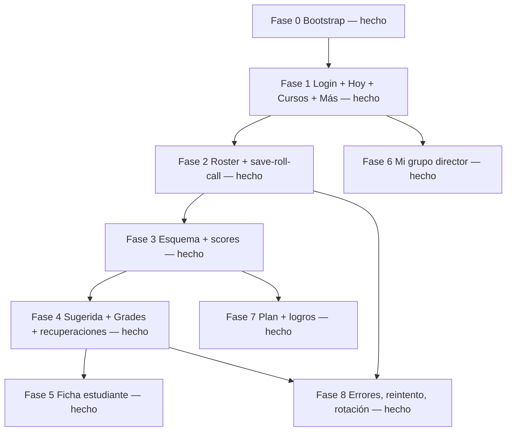

# Plan: conectar la maqueta docente (`mobile/`) al backend

**Audiencia:** desarrolladores y agentes de IA.  
**Producto:** eduCalc — app phone/tablet del rol `TEACHER`.  
**Fecha:** agosto 2026.  
**Última actualización:** 14 ago 2026.  
**Estado:** fases 0–8 hechas. Sin cambios de API.

Fuentes de verdad:

| Recurso | Uso |
|---------|-----|
| `mobile/` | App docente React + Vite + Tailwind. UI a conservar. |
| `docs/brief-ui-docente-mobile-first.md` | Flujos, IA, copy, prioridades P0–P3. |
| `docs/guia-implementacion-features.md` | Proceso: OpenAPI → tipos → cliente tipado → UI. |
| `backend/docs/openapi/schema.json` | Contrato de endpoints y schemas (API 1.0.0). |
| `frontend/` | Precedente de cliente HTTP, JWT, Query keys y módulos `*Api.ts`. **No** clonar MUI ni el menú staff. |

### Estado de implementación

| Fase | Alcance | Estado |
|------|---------|--------|
| **0** | HTTP (Axios + JWT + refresh), tipos OpenAPI, proxy `/api`, CORS `:8443`, QueryClient, Bun | **Hecho** |
| **1** | Login real, gate `TEACHER`, bootstrap (año, cursos, director, periodos, KPIs, escalas, ficha), Hoy / Cursos / Más | **Hecho** |
| **2** | Roster + `save-roll-call` | **Hecho** |
| **3** | Esquema + scores por actividad | **Hecho** |
| **4** | Sugerida + `Grade` + recuperaciones BJ | **Hecho** |
| **5** | Ficha de estudiante | **Hecho** |
| **6** | Mi grupo (director): ranking, convivencia, informes, PDF | **Hecho** |
| **7** | Plan de esquema, editor de logros | **Hecho** |
| **8** | Reintento, rotación, infinite lists | **Hecho** |

Gestor de paquetes: **Bun** (`packageManager: bun@1.2.22`), igual que `frontend/`. Arranque: `cd mobile && bun install && bun run dev`.

---

## 1. Problema y alcance

### Quién

Un usuario con `role === TEACHER` y `teacher_id` no nulo. Si el login no cumple eso, la app no entra (mensaje: esta app es solo para docentes).

### Qué

Sustituir los datos mock de `mobile/src/data.ts` por llamadas reales a la API, manteniendo el layout adaptativo (tabs phone / rail + split tablet) y las pantallas ya diseñadas.

### Qué no debe cambiar

- No clonar el backoffice `frontend/` (sidebar, DataGrid, CSV, usuarios).
- No inventar tardanzas, offline sync, push, chat ni carga CSV.
- No tratar `numerical_grade` y `definitive_grade` como el mismo campo.
- No editar a mano filas `Attendance` con `is_general: true`.
- No añadir endpoints salvo un hueco opcional (énfasis de asignatura, §7).
- No filtrar alcance **solo** en el cliente: el servidor ya aplica scope `TEACHER`.

### Criterios de aceptación globales

1. Un docente puede completar login → Hoy → llamado a lista → calificar actividad → aplicar nota del periodo → registrar una recuperación BJ.
2. Un usuario `ADMIN` / `COORDINATOR` / `PARENT` (o `TEACHER` sin `teacher_id`) no entra a la app.
3. Tipos de request/response salen de OpenAPI (`openapi-typescript`), no de interfaces inventadas.
4. Rotar o pasar de phone a tablet no pierde curso, periodo, estudiante ni marcas de lista no guardadas.
5. `tsc --noEmit` pasa en `mobile/`.

---

## 2. Estado actual de la app

`mobile/` ya no es solo prototipo: hay cliente HTTP, sesión JWT, bootstrap del docente, llamado a lista, calificar, cerrar nota del periodo / recuperaciones BJ, ficha, **Mi grupo** (ranking, bitácora, boletín PDF, informe, registro), **plan de esquema**, **editor de logros**, y dureza de producto (fase 8: navegación al rotar, reintento de escrituras, listas con “cargar más”).

| Área | Estado |
|------|--------|
| `src/api/`, `src/auth/`, `src/session/`, `src/features/auth|academic|courses|dashboard|people|attendance|grading|grades|recoveries|students|groups/` | Hecho (fases 0–8) |
| `src/session/navStore.ts` | Tab, curso, vista y grupo sobreviven al cruzar 768 px |
| `src/types/openapi.d.ts` | Copiado del schema; script `bun run generate:api-types` |
| `src/data.ts` | Sin mocks de negocio. Quedan tipos de UI (`Course`, `Period`, chips) |
| `LoginScreen` · `TodayScreen` · `CoursesScreen` · `MoreScreen` | Conectadas a API |
| `CourseDetailScreen` header + Asistencia + Actividades | Curso real; acumulado SE/CE; esquema/actividades del periodo |
| `RollCallScreen` | Roster + `save-roll-call` reales; origen asignatura/general |
| `GradeActivityScreen` | Esquema + enrollments + cola POST/PATCH de scores |
| `PeriodGradesScreen` | Preview + apply bulk; revisar oficiales; ajuste PATCH (no toca definitiva) |
| `RecoveriesScreen` | Elegibles BJ + POST recovery + historial |
| `StudentProfileScreen` | Encabezado + tabs Notas / Asistencia / Logros / Convivencia / Familia; 404 fuera de alcance |
| `GroupScreen` | Llamado + ranking real + CRUD convivencia + informes (PDF / indicadores / registro) |
| Tab “Mi grupo” | Visible solo si hay `GradeDirector` |
| Plan de esquema | Crear esquema, CRUD segmentos/actividades, calendario, `validate-weights` |
| Editor de logros | Catálogo área+grado+periodo, outcome, prefill, PATCH/POST |
| `package.json` | Bun + axios + TanStack Query + zustand |
| `vite.config.ts` | Proxy `/api` → `:8000`. Plugins Figma conservados |

Huecos de UI vs brief (fase 8 / opcionales):

| Flujo del brief | Estado |
|-----------------|--------|
| Plan de esquema (segmentos / pesos / calendario) | Hecho. Phone: tabs Estructura / Calendario. Tablet: split. |
| Editor de logros con catálogo | Hecho (ficha → editor; prev/next del grupo). |
| Visor PDF boletín | Hecho (iframe + descargar). Share nativo / pulido tablet = opcional. |
| Convivencia como bitácora | CRUD en Mi grupo; lectura en ficha. |
| Selector de curso/periodo | Chips de periodo en Hoy **sí cambian** el contexto (fase 1). Bottom sheet / CourseSwitcher: pendiente. |

---

## 3. Decisión de arquitectura

**Evolucionar `mobile/` in situ.** No portar las pantallas a `frontend/` (MUI) ni tratar la tablet como el backoffice.

```
mobile/src
  api/           cliente HTTP, paginación, errores, queryKeys
  types/         openapi.d.ts (generado) + aliases (me, session)
  auth/          store JWT + gate TEACHER
  session/       bootstrap del universo docente (año, periodo, cursos, director)
  features/      módulos *Api.ts + hooks por dominio
  screens.tsx    UI (se parte por archivo cuando crezca)
  components.tsx sistema visual
```

Reutilizar **patrones** del staff, no el código MUI:

| Staff (`frontend/`) | Mobile |
|---------------------|--------|
| `api/client.ts` Axios + Bearer + refresh 401 | Copia adaptada (redirect a login de esta app). |
| `stores/authStore.ts` Zustand persist | Igual; clave `educalc-teacher-auth`. |
| `bun run generate:api-types` | Script equivalente en `mobile/` apuntando al mismo `schema.json`. |
| `features/.../*Api.ts` tipado con `components` / `operations` | Mismos paths y shapes; archivos propios (no importar `@/` del staff). |
| `queryKeys.ts` | Espejo de las claves que esta app usa. |
| `getErrorMessage` | Copia (payloads DRF). |
| i18n `es.json` | Opcional en MVP: copy en español de Colombia puede vivir en las pantallas; extraer claves cuando se estabilice. |

No extraer un paquete compartido `packages/api` en este plan: `frontend/` y `mobile/` usan Bun. El contrato compartido es el OpenAPI.

**Navegación:** el estado local de `App.tsx` (tabs + stack phone / master-detail tablet) se mantiene. No hace falta React Router para el MVP. Si más adelante se quiere deep-link (`/cursos/:id/asistencia`), se añade en una fase aparte.

**Identificadores:** UUID en todos los recursos salvo `LoginUser.id` (entero Django). Los ids mock `CA001` / `S001` / `P2` desaparecen.

---

## 4. Fase 0 — Bootstrap técnico — **hecho**

Objetivo: la app puede hablar con el backend y tipar respuestas. Entregado: cliente Axios + refresh, tipos OpenAPI, proxy Vite, CORS en `.env.example`, `QueryClientProvider`, Bun.

### 4.1 Dependencias (`mobile/`)

```
axios
@tanstack/react-query
zustand
openapi-typescript          (dev)
```

Scripts:

```json
"generate:api-types": "openapi-typescript ../backend/docs/openapi/schema.json -o src/types/openapi.d.ts"
```

Regenerar tipos **solo** si el schema cambió (`docs/guia-implementacion-features.md` paso 7). Esta conexión no debería requerir exportar schema de nuevo.

### 4.2 Cliente HTTP

- `VITE_API_BASE_URL` vacío en dev = same-origin (proxy Vite). Si se setea, pega directo al API (hace falta CORS).
- Header `Authorization: Bearer <access>`.
- Interceptor 401 → `POST /api/auth/refresh/` con el refresh token → reintento. Si falla: limpiar sesión y volver a `LoginScreen`.
- Login y refresh van por un `rawClient` **sin** Bearer (como el staff).
- Listados paginados: `{ count, next, previous, results }` + `limit`/`offset`. Helper `fetchAllPages` (tope ~500/página, cortar a 20_000) para roster de grupo (~40 estudiantes) y scores de una actividad.

### 4.3 CORS y arranque local

El Vite de mobile corre en **8443**. `backend/.env.example` ya incluye esos orígenes (hay que copiarlos al `.env` local si se pega al API sin proxy):

```
CORS_ALLOWED_ORIGINS=http://localhost:5173,http://127.0.0.1:5173,http://localhost:8443,http://127.0.0.1:8443
```

Alternativa (o complemento): proxy Vite `server.proxy['/api'] → http://127.0.0.1:8000` y `VITE_API_BASE_URL=''` en dev, para evitar CORS en local.

Arranque:

```bash
# Backend
cd backend && pipenv run python manage.py runserver

# Mobile
cd mobile && bun install && bun run dev   # :8443
```

Swagger: `http://127.0.0.1:8000/api/docs/`.

### 4.4 Proveedores

En `main.tsx`: `QueryClientProvider`. El store de auth no necesita provider (Zustand).

---

## 5. Fase 1 — Sesión y universo del docente (P0) — **hecho**

### 5.1 Login

| UI | API |
|----|-----|
| `LoginScreen` usuario + contraseña | `POST /api/auth/login/` body `{ username, password }` → `{ access, refresh, user }` |

`user` trae `id`, `username`, `email`, `role`, `institution_id`. **No** trae `teacher_id`.

Errores: 401 → “Usuario o contraseña incorrectos.” Loading real (quitar el `setTimeout` de 900 ms).

### 5.2 Gate de rol

Tras login (y al rehidratar sesión):

```
GET /api/auth/me/
```

OpenAPI declara `additionalProperties: {}`. Tipar a mano **solo este** recurso, igual que `frontend/src/types/user.ts`:

```ts
type MeUser = {
  id: number
  username: string
  email: string
  role: string | null
  institution_id: string | null
  teacher_id: string | null
  parent_id: string | null
}
```

Si `role !== 'TEACHER'` o falta `teacher_id`: no montar `PhoneLayout`/`TabletLayout`; mensaje y logout.

### 5.3 Bootstrap en paralelo (brief §3)

Con `teacher_id` e `institution_id`:

| Orden | Endpoint | Para qué |
|-------|----------|----------|
| 1 | `GET /api/academic-years/?institution={institution_id}` | Elegir el año `is_active: true` (fallback: el de mayor `year`). |
| 2 | `GET /api/course-assignments/for-teacher/?teacher={teacher_id}&academic_year={año}` | Índice de “Mis cursos”. No pagina. Aviso si `truncated: true`. |
| 3 | `GET /api/grade-directors/?teacher={teacher_id}` | `showGrupo` si `results.length > 0`. Guardar `group` de cada fila. |
| 4 | `GET /api/academic-periods/?academic_year={año}` | Chips P1–P4. Periodo “vigente” = `start_date ≤ hoy ≤ end_date` (el schema **no** tiene `is_active` en periodo). |
| 5 | `GET /api/dashboard/kpis/?academic_period={periodo}` | Banner de pendientes: `grades_period.pending_slots` / `pending_students`. Ignorar `counts` de inventario. |
| 6 | `GET /api/grading-scales/?institution={institution_id}` | Colorear BJ/BS/AL/SP. **Prohibido** `inferLevel()` con umbrales fijos. |
| 7 | `GET /api/teachers/{teacher_id}/` | Nombre para saludo (“Buenos días, María”) y ficha en Más. |

Contexto persistente (header / store de sesión, no URL):

```
courseAssignmentId   // CourseAssignment.id
academicPeriodId     // AcademicPeriod.id
academicYearId
teacherId
institutionId
gradeDirectorGroupIds[]
```

Empty sin cursos (brief §4): “Aún no tienes cursos asignados. Pide a coordinación que te vincule a un grupo.”

### 5.4 Campos de curso a mostrar

De `CourseAssignment` (OpenAPI):

`id`, `subject`, `subject_name`, `subject_academic_area`, `group`, `group_name`, `group_grade_level_name`, `campus_name`, `academic_year`, `academic_year_year`.

El mock tenía `emphasis`. **No viene** en `CourseAssignment`; se omite en fase 1. Mejora opcional: `GET /api/subjects/{subject}/` o denormalizar `subject_emphasis` (§7).

`isDirectorGroup`: `assignment.group ∈ gradeDirectorGroupIds` (no es un campo de la API).

### 5.5 Pantallas de esta fase (entregadas)

- `LoginScreen` real (sin `setTimeout`).
- `TodayScreen`: nombre del docente, chip director, chips de periodo (`onSelectPeriod` cableado), banner `grades_period`, lista de cursos, atajos con `lastCourseAssignmentId`.
- `CoursesScreen`: `for-teacher` + aviso `truncated`.
- `MoreScreen`: ficha docente, año activo, periodos, escalas de la institución, logout.
- Gate no-docente, splash de bootstrap, empty sin cursos, error de sesión con reintento.

---

## 6. Fases de producto (flujos)

Cada fase: API tipada → hooks Query/Mutation → sustituir mock en la pantalla → estados de carga/error → invalidar keys relacionadas.

### Fase 2 — Llamado a lista (P0, flujo 1) — **hecho**

Entregado: `rollCallApi` + `attendancesApi` + `RollCallScreen` (archivo propio), Asistencia del curso con acumulado general, tab Llamado de Grupo (CTA general + resumen de hoy). Marcas no guardadas viven en `rollCallDraftStore` (sobreviven remount). Historial `GET /api/daily-attendances/` queda disponible en el cliente; la UI usa el roster del día.

**Pantallas:** `RollCallScreen`, sección Asistencia de `CourseDetailScreen`, tab Llamado de `GroupScreen`.

| Acción | Endpoint |
|--------|----------|
| Abrir roster | `GET /api/daily-attendances/roster/?group={uuid}&date={YYYY-MM-DD}&course_assignment={uuid?}` |
| Guardar grupo | `POST /api/daily-attendances/save-roll-call/` |
| Acumulado SE/CE | `GET /api/attendances/?group=&academic_period=` (y `course_assignment` si es por asignatura) |
| Historial (opcional) | `GET /api/daily-attendances/?group=&date=` |

Reglas de UI (ya diseñadas; hay que honrarlas con datos reales):

- Default: todos `PRESENT` si `status` del roster es `null`; si ya hay marca de este origen, usarla.
- `EXCUSED` exige `notes` en el body.
- Omitir `course_assignment` = llamado **general** (solo si es director de ese grupo). Por asignatura: enviar el UUID de la assignment.
- Si `academic_period` del roster es `null`: pedir periodo antes de guardar (campo opcional del POST).
- Badge si algún estudiante tiene `other_sources > 0`; mostrar `consolidated_status`.
- Reescribir el mismo origen sobrescribe (no duplica). Éxito: `created` / `updated` / `students_processed` de `RollCallSaveResponse`.
- 404 → grupo fuera de alcance. 400 → estudiante no activo u origen inválido.

`group` sale de `CourseAssignment.group`, no del id de la assignment.

Invalidar al guardar: `rollCallRoster`, `attendances`, `dailyAttendances`.

### Fase 3 — Calificar actividades (P0, flujo 2) — **hecho**

Entregado: `gradingApi` + `enrollmentsApi` + bundle por (assignment, periodo), sección Actividades agrupada por componente/segmento, `GradeActivityScreen` con cola POST/PATCH. Empty si no hay esquema. El atajo Hoy → Calificar abre el tab Actividades del curso. El CTA “Ver nota sugerida” navega a la pantalla de periodo (fase 4). **No** escribe `Grade` aquí.

**Pantallas:** sección Actividades de `CourseDetailScreen`, `GradeActivityScreen`.

Jerarquía (no aplanar):

```
GET /api/grading-schemes/?course_assignment=&academic_period=
GET /api/subject-components/?subject=          // solo lectura
GET /api/component-segments/?grading_scheme=
GET /api/grading-activities/?segment=  (o por esquema; paginar)
GET /api/student-activity-scores/?activity=
POST | PATCH /api/student-activity-scores/
```

Si no hay esquema para (assignment, periodo): CTA “Crear plan” abre el planificador (fase 7). Empty “Este periodo no tiene esquema de actividades”.

Estados de actividad (cliente; la API no tiene `status`):

| Estado | Regla |
|--------|--------|
| Planificada | `activity_date` > hoy y ningún score |
| Pendiente | `activity_date` ≤ hoy y hay `score === null` |
| Calificada | todos los matriculados activos del grupo tienen `score` no nulo |

Calificar:

- `score` vacío = pendiente. **Nunca** mostrar null como `0.00`.
- Rango `0`–`max_score` (decimal string en OpenAPI).
- No hay bulk docente: cola de `POST` (alta) / `PATCH` (ya existe fila) con barra “guardando n/m”.
- Al completar el grupo: CTA “Ver nota sugerida del periodo” → Fase 4. **No** escribir `Grade` aquí.

Estudiantes del grupo: `GET /api/enrollments/?group=&academic_year=&status=active` (paginar) + datos del estudiante denormalizados en enrollment, o `GET /api/students/` scoped. Preferir enrollments (estado de matrícula).

### Fase 4 — Nota del periodo y recuperaciones (P1, flujos 4–5) — **hecho**

Entregado: `gradesApi` + `gradeRecoveriesApi` + `PeriodGradesScreen` (preview/apply bulk, revisar oficiales, PATCH de `numerical_grade` + `performance_level`) + `RecoveriesScreen` (elegibles + historial). Pesos inválidos bloquean aplicar. Incompletos salen en `skipped` del preview. Recuperación solo escribe `definitive_grade`. El tab Notas del curso usa oficiales reales.

**Pantallas:** `PeriodGradesScreen`, `RecoveriesScreen`.

| Paso | Endpoint |
|------|----------|
| Validar pesos | `GET /api/grading-schemes/{id}/validate-weights/` → bloquear si `segment_weights_valid` o `subject_component_weights_valid` es false |
| Preview masivo | `GET /api/grading-schemes/{id}/apply-suggestion-bulk-preview/` |
| Aplicar al grupo | `POST /api/grading-schemes/{id}/apply-suggestion-bulk/` |
| Aplicar uno | `POST /api/grading-schemes/{id}/apply-suggestion/` `{ student }` |
| Sugerida suelta | `GET /api/grades/suggested/?student=&course_assignment=&academic_period=` |
| Revisar oficiales | `GET /api/grades/?course_assignment=&academic_period=` |
| Ajuste manual | `PATCH /api/grades/{id}/` (`numerical_grade`, `performance_level`) |
| Elegibles BJ | `GET /api/grade-recoveries/eligible/?course_assignment=` (y periodo si el filtro existe) |
| Registrar | `POST /api/grade-recoveries/` `{ grade, recovery_grade, description }` |
| Historial | `GET /api/grade-recoveries/?grade=` o por assignment |

Copy obligatorio:

- Aplicar sugerencia escribe `numerical_grade` + `performance_level`.
- **No** pisa `definitive_grade`.
- Incompletos no entran al bulk.
- Recuperación: “La definitiva pasará de X a Y. La nota del periodo (numérica) no cambia.”

Nivel de desempeño: FK a `GradingScale.id`, chip con `code` SP/AL/BS/BJ. Elegible BJ: escala `code === 'BJ'` o nombre “Bajo”; fallback `<= 2.99` solo si no hay escala (igual que el brief).

### Fase 5 — Ficha de estudiante (P0 consulta) — **hecho**

Entregado: `studentsApi` + guardians/padres + indicadores + reportes de convivencia (lectura) + `StudentProfileScreen`. Lista del curso y master tablet de “Mi grupo” filtran enrollments activos (nombre + documento). `grades-summary` no está bien tipado en OpenAPI (declara `Student`); el cliente usa el shape real `{ student, grades_by_period }`. Asistencia muestra CE/SE (la API no trae conteo de presentes). “Editar logro” abre el editor (fase 7). CRUD de convivencia/ranking/PDF = fase 6 (hecho).

**Pantallas:** `StudentProfileScreen`, sección Estudiantes de `CourseDetailScreen`, lista maestra tablet de Grupo.

| Tab maqueta | API |
|-------------|-----|
| Encabezado | `GET /api/students/{id}/` + `GET /api/enrollments/?student=&academic_year=` |
| Notas | `GET /api/students/{id}/grades-summary/` y `GET /api/grades/?student=` |
| Asistencia | `GET /api/attendances/?student=&academic_period=` |
| Logros | `GET /api/academic-indicators/?student=&academic_period=` |
| Familia | `GET /api/student-guardians/?student=` + `GET /api/parents/{id}/`. `tel:` / `mailto:` |
| Convivencia | `GET /api/disciplinary-reports/?student=&academic_period=` (solo lectura) |

No hay alta/baja/traslado. 404 → “fuera de tu alcance”.

### Fase 6 — Director de grupo (P1/P2) — **hecho**

Entregado: `GroupScreen` propio + ranking + CRUD convivencia + boletín PDF (visor iframe) + informe de indicadores (POST al crear) + registro escolar (get-or-create). Phone: stack a pantalla completa. Tablet: `GroupScreen` en la columna maestra; ficha/PDF/informe en el detalle.

`students-rankings` no está bien tipado en OpenAPI (declara `Group`); el cliente usa `{ group, rankings_by_period }`. El ViewSet de informes de indicadores **solo admite GET/POST** (`http_method_names`); no hay PATCH de `general_observations`. Si el informe ya existe, la UI lo muestra en solo lectura.

| Tab `GroupScreen` | API |
|-------------------|-----|
| Llamado general | Fase 2 con `course_assignment` omitido, `group` = `GradeDirector.group` |
| Ranking | `GET /api/groups/{id}/students-rankings/?period_id=` |
| Convivencia | CRUD `GET/POST/PATCH /api/disciplinary-reports/` — `report_text`, bitácora por estudiante+periodo |
| Informes | `GET /api/academic-indicators-reports/?student=&academic_period=`; `POST` si no existe |
| Boletín PDF | `GET /api/academic-grades/bulletin/?academic_year=` + `student` **xor** `group`; `responseType: 'blob'` |
| Registro escolar | `GET /api/school-records/{student_id}/{academic_year_id}/` |

Quien no es director no ve el tab ni la generación de informe.

### Fase 7 — Huecos del brief (P1 plan / logros / PDF) — **hecho**

Entregado: `SchemePlanScreen` (crear `GradingScheme`, CRUD segmentos y actividades, calendario mensual, `validate-weights` bloquea “listo”) + `IndicatorsEditorScreen` (catálogo área+grado+periodo, outcome desde la nota, prefill, POST/PATCH). CTA desde Actividades, header Plan del curso, notas del periodo (pesos inválidos) y ficha (Editar / Redactar logro). Componentes de asignatura: solo GET. Visor PDF de boletín: hecho en fase 6.

1. **Plan (flujo 3):** crear `GradingScheme` `{ course_assignment, academic_period, is_active: true }`; CRUD segmentos (`weight_percent` suma 100% por componente); CRUD actividades (`name`, `activity_date`, `max_score`, `sort_order`); `validate-weights` bloquea “listo”. Plantillas de segmento: Evaluaciones, Talleres, Exposiciones, Tareas. Phone: tabs Estructura / Calendario. Tablet: acordeón | calendario.
2. **Logros (flujo 6):** `GET /api/academic-indicator-catalogs/` (área + grado; periodo vacío = plantilla genérica). Prefill `description` según `outcome` (`below_basic` | `basic_or_above`). Si el docente edita el tono, se guarda sin `catalog` para que el backend no pise el texto. `POST/PATCH /api/academic-indicators/`. Prev/siguiente del grupo. Sin catálogo: textarea libre y `outcome` manual.
3. **PDF:** visor de boletín **hecho en fase 6**. Share nativo / visor de otros documentos = opcional.

### Fase 8 — Dureza de producto — **hecho**

- Reintento atómico en escrituras: mutaciones reintentan red/5xx; UI “Reintentar” en lista, aplicar sugerida, recuperaciones, logros, convivencia, informe. Un POST de roll-call, no filas sueltas.
- 403 → copy “Esta acción es de coordinación.” (`getErrorMessage`).
- Listas: `useInfiniteList` + “Cargar más” en estudiantes, bitácora y recuperaciones. Roster/scores/esquema siguen `fetchAllPages` (hace falta el conjunto).
- Homónimos: documento visible en listas y en el select de convivencia.
- `truncated: true` en for-teacher: aviso en Hoy y Mis cursos.
- Persistencia de marcas de lista: `rollCallDraftStore`. Pantalla activa al cruzar 768 px: `navStore` (tab, curso, sección, vista, tab de grupo).
- Split-screen ~640 px: `useBreakpoint()` 768 vuelve a phone; el detalle sobrevive en `navStore`.

---

## 7. Mapa pantalla → API (resumen)

| Pantalla / acción | Método y path | Notas |
|-------------------|---------------|--------|
| Login | `POST /api/auth/login/` | `username` + `password` |
| Refresh | `POST /api/auth/refresh/` | `{ refresh }` → `{ access }` |
| Perfil sesión | `GET /api/auth/me/` | Schema vacío en OpenAPI; tipar `MeUser` |
| Ficha docente | `GET /api/teachers/{id}/` | Nombre, email, institución |
| Año lectivo | `GET /api/academic-years/` | `is_active` |
| Periodos | `GET /api/academic-periods/?academic_year=` | Vigente por fechas |
| Escalas | `GET /api/grading-scales/?institution=` | Chips BJ/BS/AL/SP |
| Mis cursos | `GET /api/course-assignments/for-teacher/` | Query `teacher` + `academic_year` |
| ¿Director? | `GET /api/grade-directors/?teacher=` | Ocultar tab Grupo si vacío |
| Hoy KPIs | `GET /api/dashboard/kpis/?academic_period=` | Solo `grades_period` |
| Roster | `GET /api/daily-attendances/roster/` | `group`, `date`, `course_assignment?` |
| Guardar lista | `POST /api/daily-attendances/save-roll-call/` | `entries[]` |
| Acumulado SE/CE | `GET /api/attendances/` | General = `course_assignment` nulo, `is_general` |
| Matrículas grupo | `GET /api/enrollments/?group=&academic_year=` | `status=active` |
| Estudiantes | `GET /api/students/` · `GET /api/students/{id}/` | Scope servidor |
| Resumen notas | `GET /api/students/{id}/grades-summary/` | Ficha |
| Acudientes | `GET /api/student-guardians/?student=` | Solo ficha |
| Ranking | `GET /api/groups/{id}/students-rankings/` | Director |
| Componentes | `GET /api/subject-components/?subject=` | Read-only docente |
| Esquema | CRUD `/api/grading-schemes/` | Unique (assignment, periodo) |
| Pesos | `GET .../validate-weights/` | Bloquear cierre |
| Segmentos | CRUD `/api/component-segments/` | Suma 100% |
| Actividades | CRUD `/api/grading-activities/` | `max_score` default 5.00 |
| Scores | CRUD `/api/student-activity-scores/` | Sin bulk docente |
| Breakdown | `GET .../breakdown/?student=` | |
| Sugerida | `GET /api/grades/suggested/` | No persiste |
| Preview / apply bulk | `GET/POST .../apply-suggestion-bulk[-preview]/` | Solo completos |
| Apply uno | `POST .../apply-suggestion/` | |
| Notas oficiales | CRUD `/api/grades/` | |
| Elegibles BJ | `GET /api/grade-recoveries/eligible/` | |
| Recuperación | `POST /api/grade-recoveries/` | Pisa definitiva |
| Catálogo logros | `GET /api/academic-indicator-catalogs/` | |
| Indicadores | CRUD `/api/academic-indicators/` | |
| Convivencia | CRUD `/api/disciplinary-reports/` | |
| Desempeño | `GET /api/performance-summaries/` | Consulta |
| Boletín PDF | `GET /api/academic-grades/bulletin/` | blob |
| Informe indicadores | `GET /api/academic-indicators-reports/{student}/{period}/` | Director |
| Registro escolar | `GET /api/school-records/{student}/{year}/` | |

Fuera de la app (no llamar, o si 403 no ofrecer UI):

`*/bulk-load/`, `POST /api/students/{id}/transfer/`, `POST /api/performance-summaries/recalculate-by-*`, `GET /api/reports/grading-consolidated/`, `/api/users/`, escritura de instituciones/sedes/componentes de asignatura.

### Huecos de contrato (no bloquean)

| Hueco | Impacto | Acción |
|-------|---------|--------|
| `auth/me` y `for-teacher` son `additionalProperties: {}` en OpenAPI | Tipos a mano / assertion | Igual que el staff. Mejora futura: `@extend_schema` en backend. |
| `GET /students/{id}/grades-summary/` declara schema `Student` | El action devuelve `{ student, grades_by_period }` | Tipado a mano en `studentsApi.ts`. Mejora futura: schema propio. |
| `GET /groups/{id}/students-rankings/` declara schema `Group` | Devuelve `{ group, rankings_by_period }` | Tipado a mano en `groupRankingsApi.ts`. |
| `AcademicIndicatorsReport` ViewSet solo GET/POST | No se puede PATCH `general_observations` | Crear con POST; si ya existe, solo lectura. |
| `CourseAssignment` no expone `emphasis` | Chip de énfasis del mock | Omitir o GET subject. Opcional: campo read-only `subject_emphasis` en el serializer. |
| `AcademicPeriod` sin `is_active` | Chip “periodo vigente” | Calcular por `start_date`/`end_date`. |
| Sin bulk de `student-activity-scores` para docente | Calificar 40 alumnos | Cola de POST/PATCH (diseño del brief). **No** usar CSV bulk. |
| Login sin `teacher_id` | Gate | Siempre `GET /me/` después del login. |
| Decimales como `string` en OpenAPI | Keypad numérico | Parsear/formatear `toFixed(2)` al serializar. |

Si se toca el serializer de assignment o el schema de `/me/`: exportar OpenAPI y regenerar tipos en **frontend y mobile** (`guia` paso 7). Hasta entonces, **cero cambios de backend** salvo CORS.

---

## 8. Mapa de archivos

### Mobile — hecho (fases 0–8)

```
mobile/
  package.json                          # Bun + axios, Query, zustand, generate:api-types
  bun.lock
  vite.config.ts                        # proxy /api
  .env.example                          # VITE_API_BASE_URL
  src/main.tsx                          # QueryClientProvider
  src/App.tsx                           # gate, sesión, navStore (phone/tablet)
  src/data.ts                           # tipos de UI + chips
  src/screens.tsx                       # Login/Hoy/Cursos/Más/Asistencia; reexporta features
  src/api/config.ts, rawClient.ts, client.ts, list.ts, errors.ts, queryKeys.ts
  src/api/useInfiniteList.ts
  src/types/openapi.d.ts, user.ts, schemas.ts
  src/auth/authStore.ts
  src/session/useTeacherBootstrap.ts, TeacherSessionContext.tsx, sessionPrefsStore.ts
  src/session/navStore.ts
  src/session/courseUtils.ts, periodUtils.ts
  src/features/auth/loginApi.ts, meApi.ts
  src/features/courses/courseAssignmentsApi.ts
  src/features/academic/academicApi.ts
  src/features/people/teachersApi.ts
  src/features/dashboard/dashboardKpisApi.ts
  src/features/attendance/rollCallApi.ts, attendancesApi.ts, rollCallDraftStore.ts
  src/features/attendance/RollCallScreen.tsx
  src/features/students/enrollmentsApi.ts
  src/features/grading/gradingApi.ts, activityStatus.ts, planUtils.ts
  src/features/grading/ActivitiesSection.tsx, GradeActivityScreen.tsx, SchemePlanScreen.tsx
  src/features/grades/gradesApi.ts, scaleUtils.ts
  src/features/grades/PeriodGradesScreen.tsx, GradesSummarySection.tsx
  src/features/recoveries/gradeRecoveriesApi.ts, RecoveriesScreen.tsx
  src/features/students/studentsApi.ts, studentGuardiansApi.ts
  src/features/students/academicIndicatorsApi.ts, academicIndicatorCatalogsApi.ts
  src/features/students/disciplinaryReportsApi.ts, studentUtils.ts, indicatorUtils.ts
  src/features/students/StudentsSection.tsx, StudentProfileScreen.tsx, IndicatorsEditorScreen.tsx
  src/features/groups/groupRankingsApi.ts, gradesBulletinApi.ts
  src/features/groups/indicatorsReportsApi.ts, schoolRecordsApi.ts
  src/features/groups/GroupScreen.tsx, PdfViewerScreen.tsx
  src/features/groups/IndicatorsReportScreen.tsx, SchoolRecordScreen.tsx
```

Partir `screens.tsx` al cablear cada flujo (lista, calificar, notas, recuperaciones, ficha, grupo, plan y logros ya salieron a `features/`).

### Backend (mínimo)

```
backend/.env.example                    # CORS 8443
backend/.env                            # local del desarrollador
```

### Docs

```
docs/plan-conexion-mobile-backend.md    # este archivo
docs/brief-ui-docente-mobile-first.md   # no modificar salvo contradicción de API
```

Enlazado desde `docs/guia-implementacion-features.md` §8.

---

## 9. Orden de implementación recomendado

Alineado al brief §13 (MVP = ítems 1–5 en phone **y** tablet landscape).



Cada fase es un PR pequeño (guia §5). No mezclar plan de esquema con llamado a lista.

Definition of Done por fase (guia §9):

1. El docente completa el flujo en phone y en tablet ≥768 px.
2. Otro rol no ve datos ajenos (la API ya lo prueba; la UI no ofrece la acción).
3. Sin tipos inventados para schemas que existan en OpenAPI.
4. Empty/error cubiertos según brief §10.

---

## 10. Plan de pruebas

### Automáticas (cuando exista test runner en mobile)

Hoy `mobile/` no tiene Vitest. No es bloqueo del MVP. Si se añade:

- `inferLevel` / mapeo escala: dado `GradingScale[]` y `3.2` → `BS`.
- Construcción de `RollCallSaveRequest` (notes solo en `EXCUSED`).
- Gate: `role !== TEACHER` → logout.

Los tests de scope siguen viviendo en `backend/core/tests_*.py`. No reimplementarlos en la app.

### Manual (checklist de PR)

Login docente de seed → Hoy muestra cursos reales y periodo por fechas.

- [x] Login incorrecto muestra error de API, no el timeout fake. *(fase 1 — verificar en local)*
- [x] `ADMIN` no entra. *(fase 1)*
- [x] Sin asignaciones: empty state, no tabs rotos. *(fase 1)*
- [x] Tab “Mi grupo” solo si hay `GradeDirector`. *(fase 1; contenido aún mock)*
- [x] Logout limpia tokens. *(fase 1)*
- [x] Llamado por asignatura: 1 POST `save-roll-call`; reabrir roster conserva marcas. *(fase 2 — verificar en local)*
- [x] Llamado general desde Grupo / toggle director. *(fase 2)*
- [x] Fecha fuera de periodo: pide periodo. *(fase 2)*
- [x] Calificar: `—` para pendiente; cola de guardado; no crea `Grade`. *(fase 3 — verificar en local)*
- [x] Pesos ≠ 100%: no aplica sugerida. *(fase 4 — verificar en local)*
- [x] Aplicar sugerida: oficiales llenas, definitivas intactas; incompletos fuera. *(fase 4)*
- [x] Recuperación BJ: definitiva cambia, numérica no. *(fase 4)*
- [x] Ficha: documento, acudiente con `tel:` / `mailto:`. *(fase 5 — verificar en local)*
- [x] Ranking del grupo con puesto y promedio. *(fase 6 — verificar en local)*
- [x] Convivencia: alta y edición de `report_text`. *(fase 6)*
- [x] Boletín PDF grupo/estudiante en visor. *(fase 6)*
- [x] Plan: crear esquema, segmentos que suman 100%, actividades con fecha. *(fase 7 — verificar en local)*
- [x] Logro: catálogo prefill + edición de tono; sin catálogo, texto libre. *(fase 7)*
- [x] Tablet: lista + detalle; empty “Elige un curso”; rotar no pierde selección. *(fase 8 — navStore)*

Datos: usuario docente del `seed_data` / fixtures locales. Swagger para inspeccionar UUIDs.

---

## 11. Riesgos

| Riesgo | Mitigación |
|--------|------------|
| Prototipo asumía un solo grupo (`STUDENTS_8A`) | **Mitigado en fase 5:** lista y ficha usan enrollments/student UUID del curso o del grupo director. |
| `TodayScreen` atajos hardcodeados a `CA001` | **Mitigado en fase 1:** atajos usan `lastCourseAssignmentId` o el primer assignment. |
| Proxy Vite | `server.proxy['/api']` hacia el backend; `VITE_API_BASE_URL` vacío en dev. |
| Tokens en `localStorage` (Zustand persist) | Aceptable en MVP web; no guardar password. Misma superficie que el staff. |
| PDF + CORS `Content-Disposition` | Backend ya expone el header (`CORS_EXPOSE_HEADERS`). Verificar desde :8443. |
| Query `for-teacher` sin paginar | Máx. 2000; mostrar aviso `truncated`. |

---

## 12. Relación con la guía de features

Esta conexión es **solo frontend (app mobile)**. Del checklist de `docs/guia-implementacion-features.md` §6 aplican:

- [x] Reglas y roles definidos (este plan + brief)
- [x] Cliente tipado + hooks + pantallas de sesión, lista, calificar, periodo, ficha, grupo, plan, logros y dureza de producto (fases 0–8)
- [x] CORS documentado (`.env.example` + proxy Vite)
- [x] `tsc --noEmit` en `mobile/` (fase 0–8)
- [x] Doc actualizada (este archivo, 14 ago 2026)

No aplican: modelo, migración, serializers, ViewSet, tests de scope, `navConfig` del staff.

Si en implementación aparece un hueco real de API (p. ej. `/me/` sin `teacher_id` en algún entorno), entonces sí se sigue el flujo completo backend → tests → export OpenAPI → tipos en **ambas** UIs.
