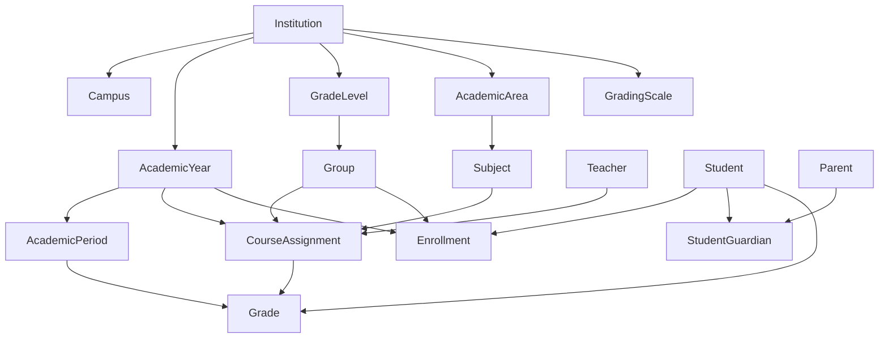

# Plan de implementación: carga masiva CSV (eduCalc)

**Última actualización:** 2026-03-29  
**Alcance:** Modelos definidos en `backend/core/models.py`, reutilizando el patrón de carga CSV ya existente para estudiantes.

Este documento está pensado para que **cualquier agente o desarrollador** pueda retomar el trabajo sin depender del historial de conversación: resume el estado del código, qué falta, formatos de archivo propuestos, orden lógico de implementación y referencias concretas a archivos.

---

## 1. Estado actual en el repositorio

### 1.1 Qué ya existe

| Componente | Ubicación | Rol |
|------------|-----------|-----|
| Lógica CSV estudiantes | `backend/core/bulk_load.py` → `bulk_load_students()` | `csv.DictReader`, UTF-8 con BOM (`utf-8-sig`), helpers `_parse_date`, `_parse_int`, `_clean_str`, `_row_col` (lectura case-insensitive de columnas) |
| Endpoint | `StudentViewSet.bulk_load` en `backend/core/views.py` | `POST` multipart, campo `file`, `parser_classes=[MultiPartParser]` |
| Serializer de entrada | `BulkLoadStudentsSerializer` en `backend/core/serializers.py` | `FileField` |
| Ejemplo / contrato columnas | `docs/bulk_load_students.csv` y docstring en `bulk_load.py` | Columnas: `ANO`, `INSTITUCION`, `SEDE`, `GRADO_COD`, `GRADO`, `GRUPO`, `FECHAINI`, `ESTRATO`, `SISBEN IV`, `DOC`, `TIPODOC`, `APELLIDO1`, `APELLIDO2`, `NOMBRE1`, `NOMBRE2`, `GENERO`, `FECHA_NACIMIENTO`, `BARRIO`, `EPS`, `TIPO DE SANGRE`, `DISCAPACIDAD`, `TELEFONO` |
| UI | `frontend/src/features/students/BulkLoadPage.tsx` | Ruta `/students/bulk-load` |

**Modelos ya cubiertos indirectamente por `bulk_load_students`:** creación/actualización de `Student`, `Enrollment`, y creación bajo demanda de `Institution`, `Campus`, `AcademicYear`, `GradeLevel`, `Group` (según filas del CSV).

### 1.2 Qué no tiene carga masiva aún

Entidades del dominio sin loader dedicado (además de las que solo aparecen como efecto secundario del CSV de estudiantes):

- `AcademicArea`, `GradingScale`
- `Teacher`, `Parent`
- `Subject`, `AcademicPeriod`
- `CourseAssignment`, `GradeDirector`
- `StudentGuardian`
- Evaluación: `Grade`, `Attendance`, `AcademicIndicator`, `PerformanceSummary`, `DisciplinaryReport`

### 1.3 Excluidos de la carga masiva CSV (por diseño)

| Modelo | Motivo |
|--------|--------|
| `SchoolRecord`, `AcademicIndicatorsReport` | Documentos generados por el sistema (`generated_at`, plantillas); no son datos maestros importables típicamente |
| `UserProfile` | RBAC y vínculo con `django.contrib.auth.User`; requiere flujo de usuarios/contraseñas o integración SSO, no un CSV genérico |
| `Institution` “puro” | Ya se crea en bulk de estudiantes; un CSV dedicado solo tiene sentido si se quiere **actualizar** `dane_code`, `nit`, etc., sin pasar por matrícula |

Si en el futuro se necesita importar instituciones con datos oficiales completos, puede añadirse un CSV pequeño y explícito (ver sección 4.1).

---

## 2. Convenciones a reutilizar (alineadas con `bulk_load.py`)

1. **Encoding:** `io.TextIOWrapper(csv_file, encoding="utf-8-sig")` para soportar Excel en español.
2. **Cabeceras:** normalizar con `strip()`; valores con `_row_col` para tolerar mayúsculas/minúsculas y variantes.
3. **Fechas:** mismos formatos que `_parse_date` (`DD/MM/YYYY`, `YYYY-MM-DD`, etc.).
4. **Decimales:** notas y rangos como string con coma o punto; parsear con `Decimal` donde aplique.
5. **Resolución de institución:** el CSV de estudiantes usa `INSTITUCION` (nombre). Para **nuevos** loaders se recomienda **`DANE_COD`** como clave principal (única en modelo `Institution`) y, opcionalmente, fallback por nombre para compatibilidad operativa.
6. **Respuesta HTTP:** diccionario con contadores (`*_created`, `*_updated`), `rows_processed`, `rows_skipped`, lista `errors` con `{ "row": n, "error": "..." }`.
7. **Refactor sugerido (no obligatorio en el primer PR):** extraer helpers comunes (`_parse_date`, `_row_col`, …) a `backend/core/bulk_load_utils.py` para no duplicarlos en cada función `bulk_load_*`.

---

## 3. Grafo de dependencias (orden lógico de implementación)

Para minimizar FK rotas y reutilizar datos:

**Orden recomendado de entrega:**

1. Catálogo por institución: `AcademicArea` + `GradingScale` (pueden ir en un solo CSV o dos endpoints).
2. `AcademicPeriod` (depende de `AcademicYear`; año identificado por `DANE_COD` + `ANO`).
3. `Teacher` (sin FK a institución en el modelo actual: son globales; ver nota en 4.3).
4. `Subject` (requiere `AcademicArea` + `Institution`).
5. `CourseAssignment` y `GradeDirector` (requieren `Subject`, `Teacher`, `Group`, `AcademicYear`).
6. `Parent` + `StudentGuardian` (acudientes y vínculos; `Student` debe existir).
7. Datos de evaluación: `Grade`, `Attendance`, opcionalmente `AcademicIndicator`, `PerformanceSummary`, `DisciplinaryReport`.

---

## 4. Especificación de formatos CSV propuestos

Convenciones globales en todas las tablas siguientes:

- Separador: coma (`,`). Si hay texto con comas, usar comillas estándar CSV.
- Clave de institución preferida: **`DANE_COD`** (campo `Institution.dane_code`).
- Clave de año: **`ANO`** (entero, alineado con `AcademicYear.year`).
- Identificación de estudiante: **`DOC_ESTUDIANTE`** + opcional **`TIPODOC_ESTUDIANTE`** (coherente con bulk actual).
- Identificación de docente: **`DOC_DOCENTE`** (+ `TIPODOC_DOCENTE` si se requiere).

### 4.1 (Opcional) Instituciones — `instituciones.csv`

Solo si se quiere carga explícita sin crear instituciones “BULK-…” desde matrícula.

| Columna | Obligatorio | Descripción |
|---------|-------------|-------------|
| `DANE_COD` | Sí | Código DANE único |
| `NOMBRE` | Sí | Razón social / nombre |
| `REFERENCIA_LEGAL` | No | |
| `NIT` | No | |

**Upsert sugerido:** por `dane_code`; actualizar nombre y campos opcionales si ya existe.

### 4.2 Áreas académicas — `areas_academicas.csv`

| Columna | Obligatorio | Descripción |
|---------|-------------|-------------|
| `DANE_COD` | Sí | Institución |
| `AREA_NOMBRE` | Sí | `AcademicArea.name` (unique con institución) |
| `AREA_COD` | No | `AcademicArea.code` |
| `DESCRIPCION` | No | |

### 4.3 Escalas de desempeño — `escalas_calificacion.csv`

| Columna | Obligatorio | Descripción |
|---------|-------------|-------------|
| `DANE_COD` | Sí | |
| `COD_NIVEL` | Sí | p. ej. SP, AL, BS, BJ (`GradingScale.code`) |
| `NOMBRE_NIVEL` | Sí | Superior, Alto, … |
| `NOTA_MIN` | Sí | Decimal |
| `NOTA_MAX` | Sí | Decimal |
| `DESCRIPCION` | No | |

**Nota:** `GradingScale` pertenece a `Institution`; no hay FK a año. Una fila define un nivel para toda la institución.

### 4.4 Períodos académicos — `periodos_academicos.csv`

| Columna | Obligatorio | Descripción |
|---------|-------------|-------------|
| `DANE_COD` | Sí | |
| `ANO` | Sí | |
| `PERIODO_NUM` | Sí | 1–4 → `AcademicPeriod.number` |
| `PERIODO_NOMBRE` | Sí | p. ej. P1, P2 (`AcademicPeriod.name`) |
| `FECHA_INI` | No | |
| `FECHA_FIN` | No | |

Unique esperado: `(academic_year, number)`.

### 4.5 Docentes — `docentes.csv`

El modelo `Teacher` **no** tiene `ForeignKey` a `Institution`. Opciones de implementación:

- **A)** CSV solo con datos de persona; institución no se guarda en `Teacher` (como hoy el modelo).
- **B)** Añadir en el futuro `institution` en `Teacher` si el negocio lo exige; entonces añadir columna `DANE_COD`.

| Columna | Obligatorio | Descripción |
|---------|-------------|-------------|
| `TIPODOC` | No | |
| `DOC` | Sí* | Clave natural para upsert; si vacío, generar placeholder como en estudiantes (no ideal) |
| `NOMBRE1` | Sí | |
| `NOMBRE2` | No | |
| `APELLIDO1` | Sí | |
| `APELLIDO2` | No | |
| `EMAIL` | No | |
| `TELEFONO` | No | |
| `ESPECIALIDAD` | No | |

`*` Recomendación: exigir `DOC` no vacío para idempotencia.

### 4.6 Asignaturas — `asignaturas.csv`

| Columna | Obligatorio | Descripción |
|---------|-------------|-------------|
| `DANE_COD` | Sí | |
| `AREA_NOMBRE` | Sí | Debe existir `AcademicArea` (misma institución) |
| `ASIGNATURA_NOMBRE` | Sí | `Subject.name` |
| `ENFASIS` | No | `Subject.emphasis` |
| `HORAS` | No | Entero opcional |

**Unicidad:** el modelo no impone `unique_together` en `Subject`; si se desea evitar duplicados, la lógica de importación puede usar `(institution, academic_area, name, emphasis)` como clave lógica.

### 4.7 Asignación docente (materia-grupo-año) — `asignaciones_curso.csv`

| Columna | Obligatorio | Descripción |
|---------|-------------|-------------|
| `DANE_COD` | Sí | |
| `ANO` | Sí | |
| `SEDE` | Sí | Nombre de campus (misma lógica `iexact` que estudiantes) |
| `GRADO` | Sí | Nombre de `GradeLevel` |
| `GRUPO` | Sí | Nombre de `Group` |
| `ASIGNATURA_NOMBRE` | Sí | |
| `ENFASIS` | No | Si se usa para desambiguar `Subject` |
| `DOC_DOCENTE` | Sí | Resolver `Teacher` |

Unique modelo: `(subject, group, academic_year)`.

### 4.8 Director de grupo — `directores_grupo.csv`

| Columna | Obligatorio | Descripción |
|---------|-------------|-------------|
| `DANE_COD` | Sí | |
| `ANO` | Sí | |
| `SEDE` | Sí | |
| `GRADO` | Sí | |
| `GRUPO` | Sí | |
| `DOC_DOCENTE` | Sí | |

Unique modelo: `(group, academic_year)`.

### 4.9 Acudientes y relación estudiante–acudiente — `acudientes.csv` + `vinculos_acudiente.csv`

**`acudientes.csv`**

| Columna | Obligatorio | Descripción |
|---------|-------------|-------------|
| `TIPODOC` | No | |
| `DOC` | Sí | |
| `NOMBRE1`, `NOMBRE2`, `APELLIDO1`, `APELLIDO2` | Ver negocio | `Parent` requiere `email` en modelo → columnas `EMAIL` obligatoria en Django actual |
| `EMAIL` | Sí | `Parent.email` no admite blank en el modelo |
| `TELEFONO` | No | |
| `PARENTESCO` | No | `kinship` |

**`vinculos_acudiente.csv`**

| Columna | Obligatorio | Descripción |
|---------|-------------|-------------|
| `DOC_ESTUDIANTE` | Sí | |
| `DOC_ACUDIENTE` | Sí | |
| `ES_PRIMARIO` | No | true/false, 1/0, S/N |

Si se prefiere un solo archivo, se puede combinar repitiendo datos del acudiente en cada fila (menos normalizado, más simple para usuarios).

**Nota de producto:** si muchos datos no tienen email, valorar migración futura `blank=True` en `Parent.email` o email sintético `sin-email+{doc}@institucion.local` (documentar riesgo).

### 4.10 Calificaciones (notas) — `notas.csv`

| Columna | Obligatorio | Descripción |
|---------|-------------|-------------|
| `DOC_ESTUDIANTE` | Sí | |
| `DANE_COD` | Sí | |
| `ANO` | Sí | |
| `SEDE`, `GRADO`, `GRUPO` | Sí | Localizar `Group` |
| `ASIGNATURA_NOMBRE` | Sí | |
| `ENFASIS` | No | |
| `PERIODO_NUM` | Sí | |
| `NOTA` | Sí | `numerical_grade` |
| `COD_NIVEL` | No | FK a `GradingScale` por `(institution, code)` |
| `NOTA_DEFINITIVA` | No | `definitive_grade` |

Unique modelo: `(student, course_assignment, academic_period)`.

### 4.11 Asistencia — `asistencia.csv`

Mismas claves de contexto que notas (estudiante, grupo, asignatura, período).

| Columna | Obligatorio | Descripción |
|---------|-------------|-------------|
| … (igual que `notas.csv` hasta `PERIODO_NUM`) | | |
| `INASISTENCIAS_SIN_JUSTIFICAR` | No | default 0 |
| `INASISTENCIAS_JUSTIFICADAS` | No | default 0 |

### 4.12 Indicadores académicos — `POST /api/academic-indicators/bulk-load/`

El mismo endpoint acepta **dos formatos** (detección automática por columnas).

#### A) Plantillas de logros (`AcademicIndicatorCatalog`) — p. ej. `bulk_academic_indicator.csv`

| Columna | Obligatorio | Descripción |
|---------|-------------|-------------|
| `DANE_COD` | Sí | Institución |
| `AREA_ACADEMICA` (o `AREA_NOMBRE`) | Sí | Nombre del área académica (coincidencia sin tildes, mayúsculas) |
| `GRADO` | Sí | Orden numérico del grado (`GradeLevel.level_order`) o nombre exacto |
| `LOGRO_POSITIVO` | Sí | Texto para desempeño Básico o superior |
| `LOGRO_NEGATIVO` | Sí | Texto para desempeño Bajo |

**Sin** columna `DOC_ESTUDIANTE`. Cada fila hace `update_or_create` por par único `(academic_area, grade_level)`; respuesta incluye contadores `created` y `updated`.

#### B) Indicadores por estudiante (legacy) — `bulk_load_academic_indicators.csv` (formato anterior)

| Columna | Obligatorio | Descripción |
|---------|-------------|-------------|
| `DOC_ESTUDIANTE` | Sí | Marca el formato legacy |
| Claves curso + período | Como en notas | |
| `DESCRIPCION` | Sí | Texto largo |
| `NOTA` | No | |
| `NIVEL_DESEMPENO_TEXTO` | No | |

**Nota (legacy):** el modelo `AcademicIndicator` no tiene `unique_together`; repetir la carga puede duplicar filas por estudiante.

### 4.13 Resumen de desempeño — `resumen_desempeno.csv`

| Columna | Obligatorio | Descripción |
|---------|-------------|-------------|
| `DOC_ESTUDIANTE` | Sí | |
| `DANE_COD`, `ANO`, `SEDE`, `GRADO`, `GRUPO` | Sí | `Group` |
| `PERIODO_NUM` | Sí | |
| `PROMEDIO_PERIODO` | Sí | |
| `PUESTO` | No | `rank` |
| `PROMEDIO_DEFINITIVO` | No | |

Unique: `(student, group, academic_period)`.

### 4.14 Reporte disciplinario — `disciplina.csv`

| Columna | Obligatorio | Descripción |
|---------|-------------|-------------|
| `DOC_ESTUDIANTE` | Sí | |
| `DANE_COD`, `ANO`, `PERIODO_NUM` | Sí | Resolver `AcademicPeriod` |
| `TEXTO` | No | |
| `DOC_DOCENTE_CREADOR` | No | `created_by` |

Unique: `(student, academic_period)`.

---

## 5. Implementación técnica sugerida (backend)

Para cada nuevo tipo de carga:

1. Añadir función `bulk_load_<entidad>(csv_file)` en `backend/core/bulk_load.py` **o** en `backend/core/bulk/<nombre>.py` si el archivo crece demasiado.
2. Serializer tipo `BulkLoadXSerializer` con `file = FileField()`.
3. `ModelViewSet` o `APIView` con `@action(detail=False, methods=["post"], url_path="bulk-load", parser_classes=[MultiPartParser])` en el recurso más natural (p. ej. `TeacherViewSet`, `SubjectViewSet`) **o** un endpoint admin agrupado bajo un prefijo `/api/admin/bulk/...` si se prefiere centralizar permisos.
4. Permisos: restringir a rol `ADMIN` / `COORDINATOR` según reglas de `UserProfile` (revisar cómo se valida hoy en otros endpoints).
5. **Transacciones:** valorar `transaction.atomic()` por archivo completo vs por fila; para archivos grandes, por fila + `errors[]` evita perder todo el lote (como el estudiante actual).
6. **Tests:** CSV mínimo en `backend/core/tests/` con fixtures de `Institution`, `AcademicYear`, `Group`, etc.

---

## 6. Frontend

- **Hub de carga:** `frontend/src/features/bulk/BulkLoadHubPage.tsx`, ruta `/bulk-load` (roles admin/coordinador). Selector de tipo → `FormData` + `POST` al endpoint correspondiente → JSON de estadísticas.
- Redirección desde `/students/bulk-load` hacia `/bulk-load` por compatibilidad de enlaces.
- Catálogo de destinos en `frontend/src/features/bulk/bulkLoadTargets.ts` (alinear con nuevos endpoints si se añaden).

---

## 7. Checklist para retomar el trabajo

Estado a **2026-03-29** (revisar al retomar el trabajo o tras cambios en modelos/API).

| # | Ítem | Estado | Notas |
|---|------|--------|--------|
| 1 | Leer `backend/core/models.py` y confirmar que no hubo cambios de FK o `unique_together` respecto a este plan. | **Pendiente (recurrente)** | Hacerlo cada vez que se toquen modelos o antes de ampliar loaders. La implementación actual coincide con el `models.py` vigente a la fecha del plan §9. |
| 2 | Releer `backend/core/bulk_load.py` (`bulk_load_students`) como plantilla. | **Hecho (referencia)** | Sigue siendo la referencia de negocio; la parte reutilizable vive también en `bulk_load_utils.py`. |
| 3 | Implementar fases en orden sección 3 (catálogo → períodos → docentes → asignaturas → asignaciones → acudientes → evaluación). | **Hecho** | Backend: `bulk_load_extended.py` + `views.py`. Frontend: hub §6 (`/bulk-load`). |
| 4 | Documentar cada nuevo CSV en este archivo (tabla de columnas) y añadir ejemplo en `docs/` (p. ej. `docs/bulk_load_teachers.csv`). | **Hecho** | Tablas en §4; en `docs/` hay `bulk_load_students.csv` y `bulk_load_<entidad>.csv` por cada carga extendida (ver §8). |
| 5 | Regenerar OpenAPI si el proyecto lo exige (`backend/docs/openapi/schema.json` / tipos frontend). | **Hecho** | `./scripts/export-openapi-schema.sh` **por defecto escribe solo `schema.json`** (el frontend lo consume). `yaml` o `all` como argumento. Usa `pipenv run python` si hay Pipfile. Tipos: `cd frontend && bun run generate:api-types`. Las acciones `bulk-load` usan `bulk_csv_load_schema` + `@extend_schema_serializer` en los serializers de subida. |
| 6 | Decidir política para `Parent.email` si los datos reales vienen sin correo. | **Hecho** | Implementado: si `EMAIL` viene vacío se usa `sin-correo-{DOC}@bulk.local` (`parent_synthetic_email` en `bulk_load_utils.py`). Valorar más adelante `blank=True` en el modelo si el negocio lo permite. |

**Resumen:** pendiente solo la **revalidación recurrente de modelos** (ítem 1) al cambiar el esquema; **tests automatizados** y **permisos por coordinador/institución** siguen siendo mejoras opcionales.

---

## 8. Referencias rápidas

| Recurso | Ruta |
|---------|------|
| Modelos | `backend/core/models.py` |
| Carga estudiantes | `backend/core/bulk_load.py` |
| Cargas extendidas | `backend/core/bulk_load_extended.py` |
| Utilidades CSV | `backend/core/bulk_load_utils.py` |
| Vistas bulk | `backend/core/views.py` (`_bulk_csv_response`, acciones `bulk_load`) |
| Serializer archivo | `backend/core/serializers.py` (`BulkLoadFileSerializer`) |
| Ejemplos CSV | `docs/bulk_load_students.csv`, `docs/bulk_load_academic_areas.csv`, `docs/bulk_load_grading_scales.csv`, `docs/bulk_load_academic_periods.csv`, `docs/bulk_load_teachers.csv`, `docs/bulk_load_subjects.csv`, `docs/bulk_load_course_assignments.csv`, `docs/bulk_load_grade_directors.csv`, `docs/bulk_load_parents.csv`, `docs/bulk_load_student_guardians.csv`, `docs/bulk_load_grades.csv`, `docs/bulk_load_attendance.csv`, `docs/bulk_load_academic_indicators.csv` (plantillas mínimas), `docs/bulk_academic_indicator.csv` (lote plantillas), `docs/bulk_load_academic_indicators_legacy.csv` (indicadores por estudiante), `docs/bulk_load_performance_summaries.csv`, `docs/bulk_load_disciplinary_reports.csv` |
| UI carga masiva | `frontend/src/features/bulk/BulkLoadHubPage.tsx`, ruta `/bulk-load` |
| Análisis de dominio | `docs/analisis-entidades-reporte-academico.md` |

---

## 9. Estado de implementación (actualizado 2026-03-29)

**Código:** Helpers compartidos en `backend/core/bulk_load_utils.py`. Cargas extendidas en `backend/core/bulk_load_extended.py`. Respuesta unificada multipart en `views._bulk_csv_response` con `BulkLoadFileSerializer`.

**Endpoints** (`POST`, `multipart/form-data`, campo `file`, UTF-8 CSV):

| Recurso | Ruta API |
|---------|----------|
| Estudiantes (existente) | `/api/students/bulk-load/` |
| Áreas académicas | `/api/academic-areas/bulk-load/` |
| Escalas de calificación | `/api/grading-scales/bulk-load/` |
| Períodos académicos | `/api/academic-periods/bulk-load/` |
| Docentes | `/api/teachers/bulk-load/` |
| Asignaturas | `/api/subjects/bulk-load/` |
| Asignaciones curso | `/api/course-assignments/bulk-load/` |
| Directores de grupo | `/api/grade-directors/bulk-load/` |
| Acudientes | `/api/parents/bulk-load/` |
| Vínculo estudiante–acudiente | `/api/student-guardians/bulk-load/` |
| Notas | `/api/grades/bulk-load/` |
| Asistencia | `/api/attendances/bulk-load/` |
| Indicadores académicos | `/api/academic-indicators/bulk-load/` |
| Resumen desempeño | `/api/performance-summaries/bulk-load/` |
| Disciplina | `/api/disciplinary-reports/bulk-load/` |

**Notas:** Las cargas que usan `DANE_COD` requieren que la institución exista con ese código (no el nombre solo). Tras matricular con el CSV de estudiantes, conviene actualizar `Institution.dane_code` real o crear la institución vía admin antes de usar estos endpoints. Acudientes sin `EMAIL` reciben `sin-correo-{DOC}@bulk.local`.

**Frontend:** ver §6. **OpenAPI / tipos:** regenerar con el script del checklist §7 ítem 5 cuando cambie la API.

**Pendiente sugerido:** tests automatizados de loaders; opcional `IsCoordinator` filtrando por institución del perfil.

---

*Fin del plan. Cualquier desviación de columnas o nombres debe reflejarse aquí y en los docstrings de `bulk_load*.py` para mantener una sola fuente de verdad operativa.*
