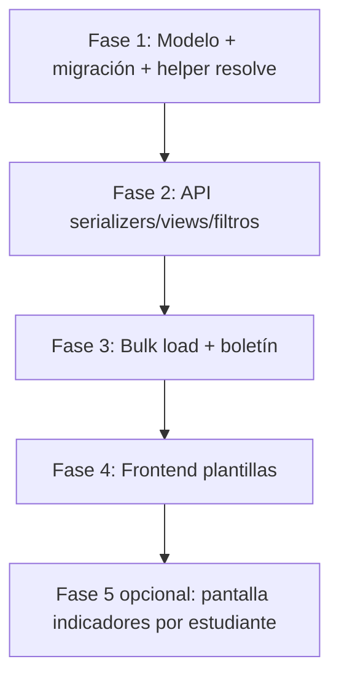

# Plan de implementación: indicadores académicos por periodo

Extender las **plantillas de indicadores** (`AcademicIndicatorCatalog`) para que cada periodo (P1–P4) pueda tener textos de logro distintos, manteniendo compatibilidad con las plantillas genéricas actuales.

---

## 1. Estado actual

El sistema tiene dos capas con granularidad distinta:

| Capa | Modelo | Clave actual | ¿Tiene periodo? |
|------|--------|--------------|-----------------|
| Plantilla | `AcademicIndicatorCatalog` | área + grado | **No** — una sola plantilla para P1–P4 |
| Registro estudiante | `AcademicIndicator` | estudiante + curso + periodo | **Sí** — ya tiene `academic_period` |

Modelo de plantilla (`backend/core/models.py`) — **desde fase 1**:

```python
class AcademicIndicatorCatalog(TimeStampedModel):
    academic_area = models.ForeignKey(...)
    grade_level = models.ForeignKey(...)
    period_number = models.PositiveSmallIntegerField(null=True, blank=True)  # 1–4; NULL = genérico
    achievement_below_basic = models.TextField()
    achievement_basic_or_above = models.TextField()

    class Meta:
        constraints = [
            UniqueConstraint(..., condition=Q(period_number__isnull=False)),  # área+grado+periodo
            UniqueConstraint(..., condition=Q(period_number__isnull=True)),    # área+grado genérico
        ]
```

### Puntos que ignoran el periodo hoy

1. **Boletín** (`bulletin_service.py`) — carga catálogo solo por área + grado; si hay varias filas, gana la última arbitrariamente.
2. **Carga masiva (plantillas)** — upsert por `(área, grado)` sin `PERIODO_NUM`.
3. **Carga masiva (estudiante)** — busca catálogo sin filtrar periodo.
4. **`AcademicIndicatorSerializer`** — valida área y grado del catálogo, no el periodo.
5. **Frontend** — formulario y grid solo muestran área + grado.

### Deuda en frontend

La ruta `/academic-indicators` renderiza la misma pantalla que `/academic-indicator-catalogs` (solo cambia el título). No existe aún UI para CRUD de indicadores por estudiante (`/api/academic-indicators/`).

### Bug relacionado en boletín

Los indicadores guardados se indexan por `course_assignment` solamente, no por `(curso, periodo)`, lo que mezcla periodos cuando el boletín incluye varios.

---

## 2. Objetivo funcional

Permitir textos distintos por periodo, por ejemplo:

- Matemáticas · 6° · **P1** → logro A / logro B
- Matemáticas · 6° · **P2** → logro C / logro D

La plantilla correcta debe elegirse según el periodo de la nota o del indicador del estudiante, sin duplicar manualmente el registro por estudiante.

---

## 3. Decisión de diseño

### Opción A — `period_number` en la plantilla (recomendada)

Agregar a `AcademicIndicatorCatalog`:

```python
period_number = models.PositiveSmallIntegerField(
    null=True,
    blank=True,
    help_text="1–4; null = plantilla genérica (fallback para todos los periodos)",
)
```

**Ventajas**

- Reutilizable cada año lectivo (P1 siempre es P1).
- Encaja con `PERIODO_NUM` que ya existe en CSV de estudiantes.
- UI simple: selector P1–P4 o “Todos los periodos”.
- No obliga a recrear plantillas cada año.

**Desventajas**

- No distingue P1 de 2025 vs P1 de 2026 si los textos cambian entre años (caso raro; extensible después con `academic_year`).

### Opción B — FK a `AcademicPeriod`

Plantilla atada a un periodo concreto de un año lectivo.

**Ventajas:** máxima precisión año a año.  
**Desventajas:** hay que duplicar o copiar plantillas cada año; bulk load y UI más pesados.

### Opción C — híbrido (futuro)

`period_number` + `academic_year` opcional. Resolución: año+periodo → periodo genérico → fallback global.

---

## 4. Regla de resolución del catálogo

Centralizar en un helper compartido, por ejemplo `resolve_indicator_catalog(area, grade_level, period_number)`:

```
1. Buscar (área, grado, period_number exacto)
2. Si no hay → buscar (área, grado, period_number IS NULL)  ← compatibilidad con datos actuales
3. Si no hay → None
```

Usar este helper en:

- `AcademicIndicatorSerializer.validate`
- `bulk_load_academic_indicators` (modo estudiante)
- `_bulk_load_indicator_catalog_row` (modo plantilla)
- `bulletin_service.build_bulletin_context`

---

## 5. Cambios en API (backend)

### 5.1 Modelo y migración

| Cambio | Detalle |
|--------|---------|
| Campo nuevo | `period_number` nullable en `AcademicIndicatorCatalog` |
| Unicidad | Reemplazar `unique_together` por constraints condicionales (PostgreSQL): |
| | • `(academic_area, grade_level, period_number)` cuando `period_number IS NOT NULL` |
| | • `(academic_area, grade_level)` cuando `period_number IS NULL` (máx. 1 fallback) |
| Migración datos | Filas existentes quedan con `period_number=NULL` (= comportamiento actual) |
| `clean()` | Validar `1 ≤ period_number ≤ 4`; coherencia institución área/grado |

### 5.2 Serializer `AcademicIndicatorCatalogSerializer`

Campos nuevos:

```python
period_number = serializers.IntegerField(required=False, allow_null=True)
period_label = serializers.SerializerMethodField()  # "P1" o "Todos"
```

Validaciones:

- No permitir duplicado según las constraints.
- Opcional: advertir si se crea plantilla específica sin fallback genérico.

### 5.3 Serializer `AcademicIndicatorSerializer`

Ampliar validación cuando hay `catalog` + `academic_period`:

```python
if catalog.period_number is not None:
    if catalog.period_number != academic_period.number:
        raise ValidationError("El catálogo no corresponde al periodo del indicador.")
```

Actualizar `catalog_label`:

```python
f"{area} / {grade} / P{period_number or '—'}"
```

### 5.4 ViewSet `AcademicIndicatorCatalogViewSet`

Nuevos filtros y orden:

```python
filterset_fields = [..., "period_number"]
ordering = [..., "period_number"]
```

### 5.5 Scope / permisos

`AcademicIndicatorCatalogRoleScopeMixin` no cambia en lógica; solo habrá más filas por área+grado.

### 5.6 Carga masiva CSV

#### Plantillas — columna opcional `PERIODO_NUM`

| Columna | Obligatorio | Comportamiento |
|---------|-------------|----------------|
| `PERIODO_NUM` | No | Si viene → plantilla específica; si no → fallback genérico (`NULL`) |
| Resto | Igual | `DANE_COD`, `AREA_ACADEMICA`, `GRADO`, `LOGRO_POSITIVO`, `LOGRO_NEGATIVO` |

Upsert key: `(academic_area, grade_level, period_number_or_null)`.

#### Estudiantes (legacy)

Al resolver catálogo, usar `PERIODO_NUM` de la fila:

```python
catalog = resolve_indicator_catalog(
    ca.subject.academic_area,
    ca.group.grade_level,
    ap.number,
)
```

### 5.7 Boletín (`bulletin_service.py`)

**a) Catálogo por periodo**

```python
# Antes: dict por area_id (una plantilla)
# Después: dict por (area_id, period_number) con fallback
catalog_by_area_period = build_catalog_lookup(grade_level_id, area_ids)
cat = resolve_from_lookup(catalog_by_area_period, area_id, target_period.number)
```

**b) Indicadores guardados por periodo**

```python
# Antes: ind_by_ca[ca_id]
# Después: ind_by_ca_period[(ca_id, period_id)]
```

El periodo objetivo debe ser el del contexto del boletín (periodo seleccionado o el más avanzado dentro de `period_order`), alineado con la nota usada en el fallback.

### 5.8 OpenAPI y tests

Regenerar schema OpenAPI.

Tests nuevos:

- CRUD catálogo con `period_number`
- Unicidad área+grado+periodo
- Fallback genérico cuando no hay plantilla específica
- Serializer rechaza catálogo de P1 para indicador de P2
- Bulk load plantilla con/sin `PERIODO_NUM`
- Boletín usa plantilla correcta por periodo
- Migración: datos legacy siguen funcionando

---

## 6. Cambios en frontend

### 6.1 Pantalla “Plantillas de indicadores” (`AcademicIndicatorCatalogsPage`)

| Elemento | Cambio |
|----------|--------|
| Filtros | Periodo (Todos / P1–P4) |
| Columna grid | `period_number` → “P1”, “P2”, … o “Todos” |
| Formulario create/edit | Select periodo (nullable = “Aplica a todos los periodos”) |
| Schema Zod | `period_number: z.number().int().min(1).max(4).nullable().optional()` |
| Query params | `period_number` en listado |
| Orden | área → grado → periodo |

Patrón existente a reutilizar: `useAcademicPeriodsForYear` de `operationsQueries.ts` para labels P1–P4.

### 6.2 Menú “Indicadores académicos”

| Ruta | Propósito |
|------|-----------|
| `/academic-indicator-catalogs` | CRUD plantillas (área + grado + periodo) |
| `/academic-indicators` | CRUD registros por estudiante (`/api/academic-indicators/`) — fase opcional |

La pantalla de indicadores por estudiante puede ser fase 5; el selector de catálogo en su formulario **debe** filtrar por periodo del indicador.

### 6.3 Carga masiva

Actualizar en `bulkLoadTargets.ts` y `es.json`:

- Plantillas: documentar columna `PERIODO_NUM` opcional.
- Estudiantes: aclarar que el catálogo se resuelve por área + grado + periodo de la fila.

### 6.4 Tipos

Tras regenerar OpenAPI, extender `AcademicIndicatorCatalog` con `period_number: number | null`.

---

## 7. Compatibilidad hacia atrás

| Escenario | Comportamiento |
|-----------|----------------|
| Plantillas existentes (`period_number=NULL`) | Siguen aplicando a **todos** los periodos |
| Nueva plantilla P2 sin fallback | Solo P2; P1/P3/P4 sin plantilla → sin texto automático |
| Indicadores ya guardados con `catalog` antiguo | Válidos; catálogo genérico no tiene `period_number` |
| CSV sin `PERIODO_NUM` en plantillas | Sigue creando/actualizando fallback genérico |

Migración **no destructiva**: no hace falta duplicar filas existentes; el fallback `NULL` cubre el comportamiento previo.

---

## 8. Plan de implementación por fases

| Fase | Alcance | Esfuerzo estimado | Estado |
|------|---------|-------------------|--------|
| **1** | Modelo, migración, `resolve_indicator_catalog()` | 0.5–1 d | ✅ Completada |
| **2** | Serializers, ViewSet, OpenAPI, tests unitarios API | 1 d | ✅ Completada |
| **3** | Bulk load + boletín (incl. fix `(ca, period)`) | 1 d | ✅ Completada |
| **4** | UI plantillas: filtro, columna, formulario | 0.5–1 d | ✅ Completada |
| **5** | Pantalla real `/academic-indicators` + limpieza nav duplicado | 1–2 d | ✅ Completada |

**Total orientativo:** 4–6 días de desarrollo + pruebas manuales.



---

## 9. Riesgos y mitigaciones

| Riesgo | Mitigación |
|--------|------------|
| Duplicados área+grado con distintos periodos en grid | Columna periodo + orden claro |
| Usuario crea solo P1–P3 y olvida P4 | Validación opcional en UI; reporte de cobertura futuro |
| Catálogo genérico + específico coexisten | Regla de resolución documentada; específico gana |
| Boletín multi-periodo sigue mezclando indicadores | Corregir índice `(ca_id, period_id)` en la misma entrega |
| Textos distintos cada año lectivo | Dejar extensión `academic_year` para fase posterior |

---

## 10. Preguntas abiertas

Antes de implementar, conviene definir:

1. **¿Plantilla genérica (“todos los periodos”) debe seguir permitida?**  
   Recomendación: sí, como fallback para migración y casos simples.

2. **¿Los textos cambian entre años lectivos?**  
   Si sí → planificar `academic_year` opcional en plantilla (fase posterior).

3. **¿Implementamos ya la pantalla de indicadores por estudiante?**  
   No es estrictamente necesaria para plantillas por periodo, pero evita confusión en el menú.

4. **¿Copiar plantillas entre periodos?**  
   Acción UX útil: “Duplicar P1 → P2, P3, P4” en el frontend (fase 4+).

---

## 11. Resumen ejecutivo

El cambio principal es **extender `AcademicIndicatorCatalog` con `period_number`**, no tocar la estructura de `AcademicIndicator` (ya tiene periodo). La lógica crítica es un **helper único de resolución** con fallback a plantillas genéricas, aplicado en API, bulk load y boletín. En frontend, la pantalla de plantillas necesita filtro/columna/campo de periodo; conviene corregir el menú duplicado y arreglar el boletín para que respete el periodo al elegir plantilla e indicador guardado.

---

## Referencias en el código

| Archivo | Rol |
|---------|-----|
| `backend/core/models.py` | `AcademicIndicatorCatalog`, `AcademicIndicator` |
| `backend/core/serializers.py` | Validación y auto-llenado de descripción |
| `backend/core/views.py` | ViewSets y bulk-load |
| `backend/core/bulk_load_extended.py` | CSV plantillas y estudiantes |
| `backend/core/bulletin_service.py` | Resolución en boletín |
| `backend/core/indicator_utils.py` | `resolve_indicator_outcome`, `resolve_indicator_catalog` |
| `backend/core/test_indicator_catalog_period.py` | Tests modelo y helper (fase 1) |
| `backend/core/test_indicator_catalog_api.py` | Tests API (fase 2) |
| `backend/core/test_indicator_catalog_phase3.py` | Tests bulk load y boletín (fase 3) |
| `frontend/src/features/operations/AcademicIndicatorCatalogsPage.tsx` | UI plantillas |
| `frontend/src/features/operations/AcademicIndicatorsPage.tsx` | Wrapper duplicado (deuda) |
| `docs/plan-implementacion-carga-masiva-csv.md` | Formato CSV actual de indicadores |

---

## 12. Fase 1 — implementación y conclusiones

**Fecha:** 2026-06-16  
**Estado:** ✅ Completada

### Entregables

| Artefacto | Descripción |
|-----------|-------------|
| `backend/core/models.py` | Campo `period_number` (nullable, 1–4), constraints condicionales, validación en `clean()` |
| `backend/core/migrations/0012_academic_indicator_catalog_period.py` | Migración no destructiva; filas existentes quedan con `period_number=NULL` |
| `backend/core/indicator_utils.py` | Helper `resolve_indicator_catalog(area, grade, period_number)` con fallback genérico |
| `backend/core/test_indicator_catalog_period.py` | 9 tests (resolución, unicidad, validación, coexistencia genérico+específico) |
| `backend/core/admin.py` | `period_number` en listado y filtros del admin Django |

### Regla de resolución implementada

```
resolve_indicator_catalog(area, grade, period_number):
  1. Si period_number dado → buscar plantilla (área, grado, period_number)
  2. Si no hay → buscar plantilla genérica (área, grado, period_number IS NULL)
  3. Si no hay → None
```

El helper acepta instancias de modelo o UUIDs/PKs de área y grado.

### Conclusiones

1. **Compatibilidad preservada:** las plantillas creadas antes de la migración siguen siendo genéricas (`period_number=NULL`) y aplican a todos los periodos hasta que se definan plantillas específicas por P1–P4.

2. **Unicidad correcta en PostgreSQL:** dos constraints condicionales evitan duplicar `(área, grado)` genérico o `(área, grado, periodo)` específico, pero permiten coexistir una fila genérica y varias por periodo.

3. **Sin impacto funcional aún en producción (actualizado en fase 2):** la API ya expone `period_number` en plantillas y valida coherencia periodo catálogo ↔ indicador. Bulk load, boletín y frontend **aún no consumen** estos cambios (fases 3–4).

4. **Próximo paso crítico (fase 2):** ~~exponer `period_number` en serializers y ViewSet~~ → completado (ver sección 13).

5. **Próximo paso crítico (fase 3):** reemplazar lookups directos en `bulk_load_extended.py` y `bulletin_service.py` por `resolve_indicator_catalog()`, y corregir el índice de indicadores guardados por `(course_assignment, period)`.

### Comandos de verificación

```bash
cd backend
python manage.py migrate core 0012
python manage.py test core.test_indicator_catalog_period
```

---

## 13. Fase 2 — implementación y conclusiones

**Fecha:** 2026-06-16  
**Estado:** ✅ Completada

### Entregables

| Artefacto | Descripción |
|-----------|-------------|
| `backend/core/serializers.py` | `AcademicIndicatorCatalogSerializer`: `period_number`, `period_label`, validación de rango y duplicados |
| `backend/core/serializers.py` | `AcademicIndicatorSerializer`: `description` con `allow_blank`, validación catálogo ↔ periodo, `catalog_label` con periodo |
| `backend/core/views.py` | Filtro `period_number`, orden por defecto y `ordering_fields` en `AcademicIndicatorCatalogViewSet` |
| `backend/core/test_indicator_catalog_api.py` | 10 tests API (CRUD plantillas, filtros, validación indicadores) |
| `backend/docs/openapi/schema.json` | Schema regenerado con nuevos campos |
| `frontend/src/types/openapi.d.ts` | Tipos TypeScript regenerados |

### Comportamiento API nuevo

**Plantillas (`/api/academic-indicator-catalogs/`)**

- Campos de respuesta: `period_number` (nullable), `period_label` (`"P1"` … `"P4"` o `"Todos"`).
- Filtro: `?period_number=1` (combinar con `academic_area__institution` y `grade_level__institution`).
- Orden: `?ordering=period_number` o `?ordering=-period_number`.
- Validación POST/PATCH: periodo 1–4; rechaza duplicados `(área, grado, periodo)`.

**Indicadores (`/api/academic-indicators/`)**

- Si el catálogo tiene `period_number` definido, debe coincidir con `academic_period.number`.
- Plantillas genéricas (`period_number=null`) siguen válidas para cualquier periodo.
- `description` puede enviarse vacía cuando hay catálogo + nota/nivel (se auto-llena).

### Conclusiones

1. **La API ya distingue periodos en plantillas**, pero el frontend aún no muestra ni envía `period_number` (fase 4).

2. **Validación en capa serializer evita 500 por IntegrityError** al detectar duplicados antes de persistir.

3. **OpenAPI y tipos TS están alineados**; la fase 4 puede consumir los campos sin cambios adicionales en backend.

4. **Próximo paso (fase 3):** ~~conectar `resolve_indicator_catalog()` en bulk load y boletín~~ → completado (ver sección 14).

### Comandos de verificación

```bash
cd backend
python manage.py test core.test_indicator_catalog_api core.test_indicator_catalog_period
./scripts/export-openapi-schema.sh
cd ../frontend && bun run generate:api-types
```

---

## 14. Fase 3 — implementación y conclusiones

**Fecha:** 2026-06-16  
**Estado:** ✅ Completada

### Entregables

| Artefacto | Descripción |
|-----------|-------------|
| `backend/core/bulk_load_extended.py` | `_upsert_indicator_catalog()`; plantillas CSV con `PERIODO_NUM` opcional; estudiantes usan `resolve_indicator_catalog()` |
| `backend/core/bulletin_service.py` | Indicadores indexados por `(course_assignment, period)`; catálogo resuelto por periodo del boletín |
| `backend/core/views.py` | Descripción OpenAPI del bulk-load actualizada |
| `backend/core/test_indicator_catalog_phase3.py` | 5 tests (CSV plantillas, CSV estudiantes, boletín catálogo e indicadores guardados) |

### Comportamiento nuevo

**Carga masiva — plantillas**

- Columna opcional `PERIODO_NUM` (1–4). Sin ella → plantilla genérica (`period_number=NULL`).
- Upsert por `(área, grado, periodo)`; actualiza textos si la fila ya existe.

**Carga masiva — estudiantes**

- Al importar con `NOTA`, el catálogo se resuelve con `resolve_indicator_catalog(área, grado, PERIODO_NUM)` (específico → fallback genérico).

**Boletín PDF**

- Indicadores guardados: clave `(curso, periodo)` en lugar de solo `curso`.
- Periodo de referencia: último periodo del boletín con indicador guardado, o con nota, o el único periodo seleccionado.
- Fallback catálogo: `resolve_indicator_catalog()` con el número del periodo de referencia (no el catálogo genérico arbitrario por área).

### Conclusiones

1. **Importación CSV y boletín ya respetan periodos**; el cambio es visible al cargar plantillas por P1–P4 y al generar boletines de un periodo concreto.

2. **Compatibilidad CSV preservada:** filas de plantilla sin `PERIODO_NUM` siguen creando/actualizando el fallback genérico.

3. **Bug de mezcla de periodos en boletín corregido:** un boletín de P1 ya no muestra el indicador de P2 aunque exista para el mismo curso.

4. **Próximo paso (fase 4):** ~~UI de plantillas — filtro, columna y campo `period_number`~~ → completado (ver sección 15).

### Comandos de verificación

```bash
cd backend
python manage.py test core.test_indicator_catalog_phase3
python manage.py test core.test_indicator_catalog_period core.test_indicator_catalog_api core.test_indicator_catalog_phase3
```

---

## 15. Fase 4 — implementación frontend y conclusiones

**Fecha:** 2026-06-16  
**Estado:** ✅ Completada

### Entregables

| Artefacto | Descripción |
|-----------|-------------|
| `frontend/src/features/operations/AcademicIndicatorCatalogsPage.tsx` | Filtro por periodo, columna `period_label`, selector en formulario create/edit |
| `frontend/src/i18n/locales/es.json` | Claves `period`, `allPeriods`; subtítulos actualizados |
| `frontend/src/features/bulk/bulkLoadTargets.ts` | Descripción CSV plantillas con `PERIODO_NUM` opcional |

### Comportamiento UI

- **Listado:** columna «Periodo» (`period_label` del API: P1–P4 o «Todos»).
- **Filtro:** selector P1–P4 o «Todos los periodos» → query `period_number`.
- **Formulario:** periodo opcional al crear/editar; vacío = plantilla genérica (`period_number: null`).
- **Eliminar:** el diálogo muestra área / grado / periodo.

La ruta `/academic-indicators` tenía la misma pantalla (resuelto en fase 5).

### Conclusiones

1. **El flujo de plantillas por periodo está operativo** en modelo → API → CSV → boletín → UI de plantillas.

2. **La plantilla genérica se elige explícitamente** con «Todos los periodos» en el formulario, alineado con el fallback del backend.

3. **Fase 5 completada:** pantalla de indicadores por estudiante en `/academic-indicators` (ver sección 16).

### Verificación

```bash
cd frontend && bun run build
```

---

## 16. Fase 5 — indicadores por estudiante, migración P1 y conclusiones

**Fecha:** 2026-06-16  
**Estado:** ✅ Completada

### Entregables

| Artefacto | Descripción |
|-----------|-------------|
| `backend/core/migrations/0013_migrate_indicator_catalogs_to_p1.py` | Migración de datos legacy (plantillas genéricas → P1). **RunPython deshabilitado** por defecto (ver notas abajo) |
| `backend/core/test_indicator_catalog_migration.py` | Tests de la migración de datos |
| `frontend/src/features/operations/AcademicIndicatorsPage.tsx` | CRUD de indicadores por estudiante (`/api/academic-indicators/`) |
| `frontend/src/api/queryKeys.ts` | `academicIndicators` query key |
| `frontend/src/i18n/locales/es.json` | Copy completo para la pantalla de indicadores |

### Pantalla `/academic-indicators`

- Listado con filtros: búsqueda, año, periodo, área, docente.
- Alta/edición: estudiante, año, asignación, periodo, plantilla (filtrada por área+grado+periodo), nota, nivel, descripción.
- `/academic-indicator-catalogs` = solo plantillas; menú sin duplicación de pantalla.
- Al elegir año, **P1 se preselecciona** en filtros y en el formulario de alta.
- Filtros de listado: institución, año lectivo y periodo académico (UUID).
- Si no hay registros por estudiante, la UI aclara que las **plantillas P1** están en «Plantillas de indicadores» y que aquí van los logros por estudiante (CSV o alta manual).

### Migración de plantillas existentes (`0013`)

La migración incluye la función `migrate_generic_catalogs_to_period_1`, que convierte plantillas genéricas (`period_number = NULL`) a **`period_number = 1`** (P1). Si ya existía P1 para el mismo área+grado:

1. Los `AcademicIndicator` que apuntaban a la genérica se reasignan a la P1 existente.
2. Se elimina la fila genérica duplicada.

#### Nota: RunPython deshabilitado en entornos frescos

El `RunPython` de `0013` está **comentado intencionalmente** para que un ambiente nuevo no normalice plantillas al migrar:

- En un entorno fresco, `python manage.py migrate` aplica `0013` **sin alterar datos**.
- Las plantillas pueden crearse ya con periodo (UI/CSV) o permanecer **genéricas** (`period_number = NULL`).
- El fallback genérico de `resolve_indicator_catalog()` sigue operativo.

**Para migrar un entorno existente** con plantillas legacy sin periodo, descomenta en `0013_migrate_indicator_catalogs_to_p1.py`:

```python
operations = [
    migrations.RunPython(
        migrate_generic_catalogs_to_period_1,
        migrations.RunPython.noop,
    ),
]
```

**Alternativa manual** (sin descomentar la migración):

```bash
cd backend
python manage.py shell
```

```python
from django.apps import apps
from core.migrations.0013_migrate_indicator_catalogs_to_p1 import (
    migrate_generic_catalogs_to_period_1,
)
migrate_generic_catalogs_to_period_1(apps, None)
```

Los tests en `core.test_indicator_catalog_migration` siguen validando la función aunque el `RunPython` esté comentado.

### Conclusiones

1. **Feature completa:** plantillas por periodo + indicadores por estudiante + CSV + boletín + UI.

2. **Plantillas genéricas nuevas** siguen permitidas desde la UI («Todos los periodos»). La normalización automática a P1 **solo aplica** si se ejecuta la migración de datos (descomentada o manual) en entornos con plantillas legacy.

3. **Boletín y CSV** usan `resolve_indicator_catalog()` con fallback genérico; no dependen de que `0013` haya corrido en entornos frescos.

### Verificación

```bash
cd backend
python manage.py migrate
python manage.py test core.test_indicator_catalog_migration

cd ../frontend && bun run build
```
