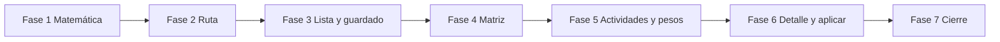

# Plan: malla de calificación de actividades (app docente)

**Proyecto:** eduCalc  
**Documento:** Plan de implementación por fases (solo `mobile/`)  
**Fecha:** Septiembre 2026  
**Estado:** Fase 7 pendiente  
**Relacionado con:** [plan-malla-calificacion-actividades.md](./plan-malla-calificacion-actividades.md), [brief-ui-docente-mobile-first.md](./brief-ui-docente-mobile-first.md), [convenciones-rutas-mobile.md](./convenciones-rutas-mobile.md), [modulo-gestion-calificaciones-por-actividades.md](./modulo-gestion-calificaciones-por-actividades.md)

Misma tarea que la malla del admin: el docente califica a todo el grupo de un esquema, ve el promedio del periodo y lo aplica sin tocar la definitiva. La interfaz nace en el teléfono y se recompone en tablet. No es un port de AG Grid.

No hay modelos ni endpoints nuevos. Backend, tests de API y OpenAPI no aplican.

---

## Cómo retomar

Quien continúe el trabajo (persona o agente) empieza por este documento, no por el chat anterior.

1. Mira el [tablero](#1-tablero). La fase activa es la primera que no está **Hecha**. Si hay una **En curso**, esa es.
2. Lee la última entrada de la [bitácora](#5-bitácora). Ahí está lo que quedó a medias y cualquier decisión que no esté en el plan.
3. Lee el [contrato](#2-contrato) antes de codear. Si una fase parece contradecirlo, manda el contrato.
4. Lee **solo** la sección de la fase activa y los archivos que esa fase lista en «Leer antes».
5. Implementa esa fase. No adelantes archivos ni botones de las siguientes.
6. Al cerrar, en el mismo cambio: marca el tablero, tilda el criterio de hecho de la fase y añade una entrada a la bitácora. Actualiza **Estado** en la cabecera (`Fase N pendiente` o `Fase N en curso`).

Si hay que parar a la mitad, el tablero queda **En curso** y la bitácora dice qué pasos faltan. La fase siguiente no empieza con la anterior a medias.



---

## 1. Tablero

| Fase | Entrega | Estado |
|---|---|---|
| 1 | `gradeGridMath.ts`: `def`, fila completa, malla completa | Hecha |
| 2 | Ruta `/courses/:courseId/grade-grid`, página y botón de entrada | Hecha |
| 3 | Lista estrecha, teclado, guardado de celda y `def` visible | Hecha |
| 4 | Matriz cuando el detalle mide ≥ 560 px | Hecha |
| 5 | Alta y edición de actividades, reparto de pesos | Hecha |
| 6 | Detalle del estudiante, aplicar fila y aplicar grupo | Hecha |
| 7 | `tsc` y checklist en 390, 768 y 1194 px | Pendiente |

---

## 2. Contrato

Estas reglas valen en todas las fases. No se reabren al implementar.

### Quién y qué datos

Solo `TEACHER`. El servidor ya filtra sus asignaciones. No hay modelo nuevo.

| Dato | Entidad | En esta pantalla |
|---|---|---|
| Componente y su % | `SubjectComponent` | Solo lectura. El docente no hace `PATCH`. |
| Segmento y su % | `ComponentSegment` | El docente lo reparte. Suma 100 % por componente. |
| Actividad | `GradingActivity` | Columna o fila de nota. Promedio simple dentro del segmento. Sin peso propio. |
| Celda | `StudentActivityScore.score` | `null` es pendiente, no cero. |
| `def` | Cálculo de `grading_suggestion_service.py` | No se persiste. |
| Filas | Matrículas activas del grupo y año | Orden `student_name` con locale `es`. |

Jerarquía: `GradingScheme` (asignación + periodo de sesión) → componente → segmento → actividad → nota.

### Qué no cambia

- `Grade.definitive_grade`. Aplicar escribe `numerical_grade` y `performance_level`.
- La fórmula del servidor. La malla solo decide **cuándo** mostrar el promedio.
- No se eliminan actividades ni segmentos. No se pegan rangos. No se usa el teclado del sistema: la nota entra por `ScoreKeypad`.
- Siguen igual `GradeActivityScreen`, `SchemePlanScreen` y `PeriodGradesScreen`, salvo el extract de `ActivityFormFields` en la fase 5.
- No se instala `ag-grid-community` ni otra grilla. `frontend/` no se toca.
- El periodo no va en la URL. Vive en `sessionPrefsStore`.

### Regla de `def`

| Condición | Texto `def` | Confirmar la fila |
|---|---|---|
| No hay actividades, falta una nota de ese estudiante, o los pesos no suman 100 % | `0` | Apagado |
| Todas las actividades de ese estudiante tienen nota y los pesos son válidos | El mismo número que `suggested_grade` | Aplica esa fila |

El `0` no se guarda. El botón de grupo solo se habilita cuando **cada** matrícula está completa y los pesos son válidos. El endpoint bulk ya omite incompletos; la interfaz no lo ofrece mientras haya a quién omitir.

La cifra, cuando la fila está completa, sale de la función pura de la fase 1 (promedio simple del segmento, ponderado con renormalización, half-up a 2 decimales). Con la fila incompleta no se muestra el promedio parcial del API. Al abrir el detalle de un estudiante completo, si `GET .../breakdown/` difiere, se corrige la función pura. No se cambia el servicio.

### URL

| Estado | Dónde |
|---|---|
| Curso | Path `/courses/:courseId/grade-grid` |
| Periodo | `sessionPrefsStore.selectedPeriodId` |
| Estudiante enfocado | Query `student`, omitido si no hay |
| Actividad con teclado abierto | Query `activity`, omitido si no hay |
| Borrador del teclado | Estado local. Al recargar sale de la nota guardada |

`student` y `activity` no son otra pantalla: eligen la celda. Se escriben con `replace`. Un id que no está en el bundle se ignora. Un curso fuera de la sesión muestra vacío con atrás y no redirige a `/today`. El padre canónico es `/courses/:courseId?section=activities`. `phoneShowsTabBar` ya oculta la tab bar en rutas anidadas: no añadir esta ruta.

### Umbrales

| Regla | Valor |
|---|---|
| Suma de pesos | 100 %, tolerancia `0.01` |
| Barra de segmentos | 2 o más segmentos y restante `≤ 0.01` |
| Salto y mínimo | 5 % y 5 % |
| Un solo segmento al 100 % | Campo de peso, sin divisor |
| Nota | `0` ≤ nota ≤ `max_score`, 2 decimales. Vacío = pendiente |
| Máximo al crear actividad | `5.00` |
| Toque | Alto mínimo 44 px |
| Matriz | Solo si el contenedor de la pantalla mide ≥ 560 px |

El corte de 560 px es un container query de la pantalla, no `useBreakpoint`. `useBreakpoint` (`≥ 768 px`) solo elige el shell. En tablet el outlet es el detalle: rail 72 px + master 360 px. A 768 px de ventana el detalle mide ~336 px y usa la lista. A 1024 px mide ~592 px y entra la matriz.

### Copiar, no reinventar

| Necesidad | Dónde está |
|---|---|
| Rutas y atrás | `mobile/src/navigation/routes.ts`, `pages.tsx`, `parentOf.ts`, `routeTree.tsx` |
| Bundle del curso y periodo | `useCourseActivitiesBundle` |
| Cola de guardado y `null` | `GradeActivityScreen.tsx`, `serializeScore` |
| Teclado | `ScoreKeypad` en `components.tsx` |
| Formulario de actividad | `ActivityFormFields` dentro de `SchemePlanScreen.tsx` hasta la fase 5 |
| Pesos | `planUtils.ts`, `SegmentWeightRange.tsx` |
| Aplicar y el aviso | `applyGradingSchemeSuggestion`, `applyGradingSchemeSuggestionBulk`, aviso de `PeriodGradesScreen.tsx` |
| Textos | Español de Colombia en el componente. Sin i18next |
| Pages | `routeTree.tsx` importa desde `pages.tsx`. `navigation/index.ts` no exporta pages: no tocarlo |

---

## 3. Referencia de pantalla

Las fases 3 a 6 construyen partes de esta pantalla. La ruta y el botón de entrada son la fase 2.

Entrada: en Actividades del curso, **Calificar el grupo**, junto a «Editar plan» / «Crear plan». Las tarjetas de una actividad siguen abriendo `GradeActivityScreen`. Drill-down con `go`.

### Lista (fase 3) — ancho &lt; 560 px

1. Encabezado: atrás, nombre del periodo. El botón de grupo llega en la fase 6.
2. Filas: iniciales, nombre, documento, progreso `3/12`, `def`. Toque → `?student=`.
3. Ficha: sustituye la lista. Atrás de la ficha limpia `student` y `activity` y se queda en la malla. Grupos componente → segmento → actividad (nota o `—`). Toque en la actividad → `?activity=` y `ScoreKeypad` abajo.
4. **Aceptar** guarda esa celda y pasa a la siguiente actividad del estudiante. Al terminar, al primer pendiente del siguiente. Flechas anterior / siguiente fuera de `ScoreKeypad`.
5. `def` sticky sobre el teclado. El check de la fila llega en la fase 6; hasta entonces `def` es solo texto.

Color de segmento (azul, ámbar, verde, violeta, ciclo): borde o chip.

### Matriz (fase 4) — contenedor ≥ 560 px

Misma URL y el mismo teclado. Nombres fijos a la izquierda (documento en segunda línea). Actividades en scroll horizontal, encabezado de dos pisos (componente, segmento). `def` fijo a la derecha. Fila ≥ 44 px, columna de actividad ≥ 72 px. Sin resize. Toque en la celda abre el teclado anclado abajo. **Aceptar** avanza a la derecha y, al final de la fila, a la primera actividad del siguiente estudiante. El check de la fila y el icono de detalle llegan en la fase 6. `+` y el botón de pesos llegan en la fase 5.

### Sheets (fases 5 y 6)

No son rutas. Bottom sheet en la lista; panel anclado en la matriz.

| Sheet | Fase | Contenido |
|---|---|---|
| Actividad | 5 | `+`: segmento fijo, fecha de hoy, máximo `5.00`, nombre vacío. Toque en el nombre: edición. Sin borrar. |
| Pesos | 5 | Nombre y % del componente, sin edición. Barra, campo único o alta según el contrato. |
| Detalle | 6 | Árbol de un estudiante. Número grande = regla de `def`. Actividades con nota o `—`. Sin check de aplicar adentro. |

### Vacío y errores

- Curso fuera de la sesión: vacío con atrás (fase 2).
- Sin periodo: el aviso que ya usan las pantallas del curso (fase 2).
- Sin esquema: vacío de `ActivitiesSection` y CTA al plan (fase 2).
- Sin matrículas: vacío de la lista (fase 3).
- Sin segmentos: filas y botón de pesos para crear el primero (fase 5). Hasta entonces, lista de nombres con `def` en `0`.
- Segmento sin actividades: el `+` crea la primera (fase 5).
- Pesos inválidos: alerta, `def` en `0`, applies apagados (alerta en fase 3; applies en fase 6).
- Error al guardar: `getErrorMessage`, el resto de la malla sigue (fase 3 en adelante).

---

## 4. Fases

### Fase 1 — Matemática de `def`

**Estado:** Hecha  
**Objetivo:** una función pura que devuelva el texto de `def` y diga si la fila y la malla están completas, sin UI y sin red.  
**Empieza cuando:** el tablero marca esta fase como la activa.  
**Al terminar:** no hay cambio visible. La fase 3 puede importar el módulo y fiarse de los casos de abajo.

**Leer antes**

- Contrato, sección «Regla de `def`».
- `backend/core/grading_suggestion_service.py`: `_quantize`, `_segment_average`, `_weighted_average`, `compute_suggested_grade`.
- `mobile/src/features/grading/planUtils.ts`: `parseWeightPercent`, `WEIGHT_SUM_TOLERANCE`. No dupliques esas constantes; impórtalas si el módulo de math de la malla las necesita.

**API del módulo** `mobile/src/features/grading/gradeGridMath.ts`

```ts
export type GradeGridStructure = {
  weightsValid: boolean
  components: Array<{ id: string; weightPercent: string | null; sortOrder: number }>
  segments: Array<{
    id: string
    componentId: string
    weightPercent: string | null
    sortOrder: number
  }>
  activities: Array<{ id: string; segmentId: string; sortOrder: number }>
}

/** activityId → score decimal o null si está pendiente. */
export function isRowComplete(
  activityIds: readonly string[],
  scores: ReadonlyMap<string, string | null>,
): boolean

export function isGridComplete(
  activityIds: readonly string[],
  rows: ReadonlyArray<ReadonlyMap<string, string | null>>,
  weightsValid: boolean,
): boolean

/** "0" o un decimal de 2 cifras. Nunca null. */
export function displayDef(
  structure: GradeGridStructure,
  scores: ReadonlyMap<string, string | null>,
): string
```

Reglas de esas funciones:

- `isRowComplete` es falso si `activityIds` está vacío o si alguna actividad no tiene score no nulo.
- `isGridComplete` es falso si no hay filas, si `weightsValid` es falso o si alguna fila no está completa.
- `displayDef` devuelve `"0"` si los pesos no son válidos o la fila no está completa. Si no, el promedio: segmentos con promedio simple de sus notas, componentes con ponderado de sus segmentos, esquema con ponderado de sus componentes. Cuantizar cada promedio a centésimas con half-up (enteros de centavos, no `Math.round` sobre un float intermedio). Ordenar por `sortOrder` como el servicio ordena por `sort_order`.
- Con la fila completa la renormalización no cambia el resultado. Igual hay que copiarla, porque es la fórmula del servidor.

**Casos que deben cumplirse antes de dar la fase por hecha**

| Caso | `displayDef` | Completa |
|---|---|---|
| Sin actividades | `0` | fila no |
| Falta una nota | `0` | fila no |
| `weightsValid: false` con todas las notas | `0` | malla no |
| Un segmento al 100 %, notas 4 y 5, un componente al 100 % | `4.50` | fila sí |
| Dos componentes 60 y 40, cada uno con un segmento al 100 % y una nota 5.00 y 3.00 | `4.20` | fila sí |
| Promedio 1/3 → 0.333… | `0.33` | — |
| Promedio que cae en .xx5 exacto (p. ej. 1.005 en decimal) | half-up, no bankers | — |

**No hacer**

- No crear la pantalla, la ruta ni llamadas HTTP.
- No mostrar el `suggested_grade` parcial del API como `def`.
- No cambiar `grading_suggestion_service.py`.

**Archivos:** crear solo `gradeGridMath.ts`.

**Criterio de hecho**

- [x] El módulo exporta las tres funciones con los tipos de arriba.
- [x] Los casos de la tabla salen bien (comprobados en un snippet local que no se commitea, o leyendo el resultado en la consola).
- [x] `cd mobile && bunx tsc --noEmit` pasa.

**Deja listo:** importar `displayDef`, `isRowComplete` e `isGridComplete`. La fase 3 arma `GradeGridStructure` desde el bundle.

---

### Fase 2 — Ruta, página y entrada

**Estado:** Hecha  
**Objetivo:** el docente abre la malla desde Actividades, recarga en el mismo sitio y vuelve atrás al curso.  
**Empieza cuando:** la fase 1 está Hecha.  
**Al terminar:** la ruta existe. La pantalla muestra carga, error, curso desconocido, sin periodo o sin esquema. Todavía no se califica.

**Leer antes**

- [convenciones-rutas-mobile.md](./convenciones-rutas-mobile.md), secciones 1, 4 y 8.
- `mobile/src/navigation/routes.ts` (`schemePlan`, `parsePlanView`).
- `mobile/src/navigation/pages.tsx` (`SchemePlanPage`).
- `mobile/src/navigation/parentOf.ts` y `routeTree.tsx` (el bloque `courses/:courseId/plan`).
- `mobile/src/screens.tsx`: `CourseDetailScreen` y cómo pasa `onGoToPlan` a `ActivitiesSection`.
- `ActivitiesSection.tsx`: el botón «Editar plan» / «Crear plan» y el vacío sin esquema.

**Hacer**

1. `routes.gradeGrid(courseId, { student?, activity? })`. Omite el query cuando el valor falta. Parsers que descartan un valor vacío; un uuid mal formado cuenta como sin foco.
2. Ruta `courses/:courseId/grade-grid` en `routeTree.tsx`.
3. `GradeGridPage` en `pages.tsx`: lee `courseId` y el query, pasa props, `replace` al cambiar foco, `back` para atrás, `go(routes.schemePlan(courseId))` para el CTA sin esquema. La pantalla no importa el router.
4. `parentOf`: esta ruta cae en el curso con `section=activities`, **antes** del match genérico `/courses/:courseId`.
5. `CourseDetailScreen` recibe `onGoToGradeGrid` y `ActivitiesSection` muestra **Calificar el grupo** solo si hay esquema. `CourseDetailPage` navega con `go(routes.gradeGrid(courseId))`.
6. `GradeGridScreen` presentacional, con los vacíos del contrato (curso, periodo, esquema, error de red, carga). Si hay esquema, un texto de que la lista llega en la fase siguiente basta. No pintes filas editables todavía.

**No hacer**

- No añadir la ruta a `phoneShowsTabBar`.
- No poner el periodo en la URL.
- No tocar `navigation/index.ts`, `GradeActivityScreen`, `PeriodGradesScreen` ni el shell.
- No instalar una grilla. No mostrar teclado ni `def` calculado: eso es la fase 3.

**Archivos**

| Acción | Archivo |
|---|---|
| Crear | `mobile/src/features/grading/GradeGridScreen.tsx` |
| Tocar | `routes.ts`, `pages.tsx`, `routeTree.tsx`, `parentOf.ts`, `screens.tsx`, `ActivitiesSection.tsx` |

**Criterio de hecho**

- [x] Desde Actividades, con esquema, se abre `/courses/:id/grade-grid`.
- [x] Atrás vuelve a `/courses/:id?section=activities`. Tras recargar, atrás sigue yendo ahí (`parentOf`).
- [x] Recargar conserva el path. `?student=` y `?activity=` sobreviven aunque la lista aún no los use.
- [x] Sin esquema no aparece el botón; el vacío de la ruta ofrece ir al plan.
- [x] En el teléfono la tab bar no se ve. En tablet la pantalla ocupa el detalle, no una ventana nueva.
- [x] Curso desconocido: vacío con atrás, sin ir a Hoy.
- [x] `bunx tsc --noEmit` pasa.

**Deja listo:** `GradeGridScreen` montada con `courseId`, periodo de sesión, `studentId`, `activityId` y callbacks `onFocus`, `onBack`, `onGoToPlan`. La fase 3 rellena el cuerpo.

---

### Fase 3 — Lista, teclado y guardado

**Estado:** Hecha  
**Objetivo:** en ancho menor a 560 px el docente recorre estudiantes, escribe notas y ve `def`.  
**Empieza cuando:** la fase 2 está Hecha.  
**Al terminar:** se puede calificar el grupo en el teléfono. No hay matriz, ni alta de actividades, ni aplicar.

**Leer antes**

- Referencia de pantalla, bloque «Lista».
- `GradeActivityScreen.tsx`: cola `SaveJob`, `createStudentActivityScore`, `patchStudentActivityScore`, fusión de drafts con el bundle.
- `activityStatus.ts`: `serializeScore`, `isScoreFilled`, `formatScoreDisplay`.
- `gradeGridMath.ts` de la fase 1.
- `useCourseActivitiesBundle` y `schemeWeightsValid` en `gradingApi.ts`.

**Hacer**

1. Cargar el bundle como `GradeActivityScreen` (asignación, periodo de sesión, grupo, año, asignatura). Ordenar matrículas con locale `es`.
2. Armar `GradeGridStructure` desde componentes, segmentos y actividades. `weightsValid` sale de `schemeWeightsValid`.
3. Lista de estudiantes con progreso y `displayDef`. Toque hace `onFocus({ student })` y la página hace `replace`.
4. Ficha del estudiante con actividades agrupadas por `sort_order`. Toque abre el teclado (`activity` en el query).
5. Reutilizar `ScoreKeypad` sin cambiar sus props. Flechas anterior / siguiente al lado, en la pantalla. **Aceptar** encola un solo POST o PATCH.
6. Vaciar el teclado: si había nota, `score: null`. Si no había, no crear registro. No guardar un cero por vacío.
7. Al aceptar, avanzar a la siguiente actividad de ese estudiante; al final, al primer pendiente del siguiente, y actualizar el query.
8. Cerrar el teclado (quitar `activity`) no dispara otro guardado.
9. Alerta visible si los pesos no son válidos. `def` queda en `0`.
10. Container: la lista es el layout por defecto. No hace falta el query de 560 px hasta la fase 4; en cualquier ancho, esta fase pinta la lista.

**No hacer**

- No llamar a `apply-suggestion` ni al breakdown.
- No mostrar el botón de grupo ni el check de la fila.
- No poner `+` ni el botón de pesos (fase 5). Si un segmento no tiene actividades, la ficha lo dice en texto, sin alta.
- No modificar `ScoreKeypad` ni la cola de `GradeActivityScreen`. Copia el patrón; no lo extraigas todavía.
- No uses el `suggested_grade` del preview bulk como `def`.

**Archivos:** solo `GradeGridScreen.tsx`, y `pages.tsx` si los callbacks de foco aún no cubren estudiante y actividad.

**Criterio de hecho**

- [x] Escribir y aceptar guarda. Recargar muestra la nota.
- [x] Vaciar una nota guardada la deja pendiente. No aparece `0.00` en la celda.
- [x] Por encima de `max_score` el teclado no agrega el dígito. No abre el teclado del sistema.
- [x] Con una nota faltante, `def` es `0`. Con la fila completa y pesos válidos, `def` coincide con un cálculo manual de la fase 1.
- [x] El query `student` y `activity` sobrevive a recargar, y el teclado reabre esa celda.
- [x] Un id de estudiante que no está en el bundle deja la lista sin ficha.
- [x] Error de red al guardar muestra `getErrorMessage` y el resto de las filas sigue.
- [x] `bunx tsc --noEmit` pasa.

**Deja listo:** el estado de foco y la cola de guardado sirven igual para la matriz. La fase 4 añade el otro layout, no otra forma de guardar.

---

### Fase 4 — Matriz ancha

**Estado:** Hecha  
**Objetivo:** con el detalle a 560 px o más, la misma malla se ve como matriz táctil.  
**Empieza cuando:** la fase 3 está Hecha.  
**Al terminar:** rotar (o ensanchar) no cambia la URL ni la celda abierta. Por debajo de 560 px sigue la lista de la fase 3.

**Leer antes**

- Referencia de pantalla, bloque «Matriz».
- Contrato, párrafo del corte de 560 px.
- `AppShell.tsx`: el detalle es `flex-1`, no la ventana.

**Hacer**

1. `@container` en la raíz de `GradeGridScreen`. A `min-width: 560px`, pintar la matriz. Por debajo, la lista ya hecha.
2. Columna de nombre fija, actividades con scroll horizontal, `def` fijo a la derecha. Encabezados de componente y segmento sticky. Nombre de actividad recortado, con el nombre completo en el título accesible.
3. Toque en la celda: el mismo teclado anclado abajo (no overlay a pantalla completa, no `<input>` nativo). **Aceptar** avanza hacia la derecha y luego al siguiente estudiante. Reutiliza la cola de la fase 3.
4. Orden de columnas: `sortOrder` de componente, segmento y actividad.
5. Alto de fila ≥ 44 px. Ancho mínimo de actividad 72 px. Sin arrastrar bordes.

**No hacer**

- No instalar AG Grid ni fijar columnas con otra librería.
- No usar `useBreakpoint` para elegir lista o matriz.
- No duplicar la cola de guardado ni la fórmula de `def`.
- No añadir `+`, pesos, detalle ni apply: la matriz muestra `def` en texto, igual que la lista.
- No cambiar el master de cursos del shell.

**Archivos:** `GradeGridScreen.tsx` y, si hace falta, un `GradeGridMatrix.tsx` al lado. Nada de navegación.

**Criterio de hecho**

- [x] A ~390 px y con la ventana a 768 px (detalle ~336 px) se ve la lista.
- [x] Con la ventana a ~1194 px (detalle ~762 px) se ve la matriz: al hacer scroll horizontal, nombre y `def` no se mueven.
- [x] Tocar una celda, aceptar y recargar deja la nota y, si el query sigue, el teclado en esa celda.
- [x] Pasar de estrecho a ancho con `?student=&activity=` no pierde el foco.
- [x] `bunx tsc --noEmit` pasa.

**Deja listo:** los dos layouts leen el mismo foco. La fase 5 engancha acciones en los encabezados de ambos.

---

### Fase 5 — Actividades y pesos

**Estado:** Hecha  
**Objetivo:** desde la malla se crea o edita una actividad y se reparten los pesos de un componente.  
**Empieza cuando:** la fase 4 está Hecha.  
**Al terminar:** un segmento nuevo o una actividad nueva aparecen en la lista y en la matriz sin salir de la ruta. El plan del curso se ve y guarda igual que antes.

**Leer antes**

- Referencia de pantalla, sheet de actividad y sheet de pesos.
- `SchemePlanScreen.tsx`: `ActivityFormFields`, alta de segmento, `SegmentWeightRange`, plantillas de `planUtils.ts`.
- `createGradingActivity`, `patchGradingActivity`, `createComponentSegment`, `patchComponentSegment` en `gradingApi.ts`.
- Contrato, filas de umbrales de pesos.

**Hacer**

1. Extraer `ActivityFormFields` a `mobile/src/features/grading/ActivityFormFields.tsx`. `SchemePlanScreen` lo importa. Misma UI del plan: nombre, fecha, máximo. Sin botón de borrar.
2. Sheet de actividad. `+` del segmento: segmento fijo, fecha de hoy, máximo `5.00`, nombre vacío. Toque en el nombre de la columna o de la fila: edición. Al guardar, invalidar `queryKeys.courseActivitiesBundle` una vez.
3. Sheet de pesos por componente. El % de catálogo es texto. Reutilizar `SegmentWeightRange` y la matemática de `planUtils.ts`.
   - 2+ segmentos y suma ≈ 100 %: la barra. PATCH solo de los segmentos que cambiaron, en paralelo, al soltar.
   - 1 segmento al 100 %: campo para bajarlo, sin divisor.
   - Restante `> 0.01`: alta con las plantillas y el restante del plan.
   - Con la suma en 100 %, el alta sigue apagada hasta liberar al menos 5 %. El segmento nuevo usa ese resto.
4. Los dos layouts muestran `+` y el botón del componente. En la lista van en la ficha del estudiante (el grupo es de la estructura, no de la persona). En la matriz van en el encabezado.
5. Esquema sin segmentos: la pantalla deja crear el primero desde el sheet de pesos.

**No hacer**

- No reescribir `boundariesFromWeights` ni las constantes de paso y mínimo.
- No permitir editar el % del componente.
- No añadir borrar actividad o segmento.
- No cambiar el comportamiento visible del plan, fuera del import del formulario.
- No aplicar sugeridas en esta fase.

**Archivos**

| Acción | Archivo |
|---|---|
| Crear | `ActivityFormFields.tsx`, `GradeGridSheets.tsx` (actividad y pesos; el detalle se añade en la fase 6) |
| Tocar | `SchemePlanScreen.tsx`, `GradeGridScreen.tsx` |

**Criterio de hecho**

- [x] `+` crea la actividad en ese segmento, con fecha de hoy y máximo `5.00`, y pasa a ser columna o fila de nota.
- [x] El nombre abre la edición. No hay forma de borrar.
- [x] Soltar un divisor deja la suma en 100 % y el valor sigue tras recargar.
- [x] Con la suma en 100 % no se crea segmento hasta liberar 5 %. Después, el alta usa el resto.
- [x] El plan (`/courses/:id/plan`) sigue creando actividades y moviendo pesos como antes.
- [x] `bunx tsc --noEmit` pasa.

**Deja listo:** la estructura se puede completar desde la malla. La fase 6 solo añade lectura del desglose y los dos apply.

---

### Fase 6 — Detalle y aplicar

**Estado:** Hecha  
**Objetivo:** el docente ve el desglose de una fila y aplica la sugerida de esa fila o de todo el grupo.  
**Empieza cuando:** la fase 5 está Hecha.  
**Al terminar:** confirmar una fila completa escribe la nota del periodo y no toca la definitiva. El grupo solo se puede aplicar con la malla completa.

**Leer antes**

- Contrato, regla de `def` y el párrafo del breakdown.
- `PeriodGradesScreen.tsx`: mutación bulk, invalidaciones y el aviso de aplicados / omitidos.
- `applyGradingSchemeSuggestion` y `applyGradingSchemeSuggestionBulk` en `gradingApi.ts`.
- Tipo `GradeBreakdown` en `mobile/src/types/schemas.ts`. El path ya está en OpenAPI: `GET /api/grading-schemes/{id}/breakdown/?student=`.
- `queryKeys.ts`: seguir el estilo de `gradingSchemeBulkPreview`.

**Hacer**

1. `fetchGradingSchemeBreakdown(schemeId, studentId)` y `queryKeys.gradingSchemeBreakdown(schemeId, studentId)`. No regenerar OpenAPI.
2. Sheet de detalle de un estudiante. Árbol componente → segmento → actividad (nota o `—`). El número grande usa `displayDef`, no el `suggested_grade` parcial. Si la fila está completa y el API trae otro `suggested_grade`, anótalo en la bitácora y corrige `gradeGridMath.ts` en esta misma fase. No cambies el backend.
3. Check de la fila, en la ficha y en la columna `def` de la matriz. Llama a `applyGradingSchemeSuggestion`. Apagado cuando `displayDef` es `0`. No lo dupliques dentro del sheet de detalle.
4. Botón **Aplicar al grupo** en el encabezado de los dos layouts. Habilitado solo si `isGridComplete`. Luego el bulk y el mismo aviso que `PeriodGradesScreen`.
5. Tras aplicar, `def` sigue mostrando el promedio. Invalidar el bundle, el preview bulk, `['grades']` y los KPI del dashboard, igual que el periodo.

**No hacer**

- No escribir `definitive_grade`.
- No ofrecer el bulk mientras una celda siga vacía, aunque el endpoint omita incompletos.
- No cargar el breakdown de todos los estudiantes al abrir la malla. Solo al abrir el detalle.
- No cambiar `PeriodGradesScreen`, salvo leerlo.

**Archivos:** `gradingApi.ts`, `queryKeys.ts`, `GradeGridSheets.tsx`, `GradeGridScreen.tsx`. `gradeGridMath.ts` solo si el breakdown completo no coincide.

**Criterio de hecho**

- [x] Fila incompleta: `def` es `0`, el check está apagado, el detalle muestra `0` y las pendientes como `—`.
- [x] Fila completa: `def` es igual a `suggested_grade` del breakdown. El check escribe `numerical_grade` y `performance_level`. `definitive_grade` queda igual.
- [x] Falta una sola celda de cualquier estudiante: el botón de grupo sigue apagado. Con la malla completa, aplica y muestra el aviso bulk.
- [x] Pesos inválidos: alerta, `def` en `0`, los dos apply apagados.
- [x] `bunx tsc --noEmit` pasa.

**Deja listo:** la funcionalidad está. La fase 7 solo verifica anchos y regresiones, y cierra el checklist de la guía.

---

### Fase 7 — Cierre

**Estado:** Pendiente  
**Objetivo:** confirmar los tres anchos y que las pantallas vecinas siguen igual.  
**Empieza cuando:** la fase 6 está Hecha.  
**Al terminar:** el tablero está en Hecha, la cabecera dice `Cerrado` y la definición de hecho de abajo se cumple.

**Leer antes:** el contrato y los criterios de hecho de las fases 2 a 6. No reimplementes. Si un ítem falla, el arreglo pertenece a la fase dueña: anótalo en la bitácora y corrige ahí, sin abrir alcance nuevo.

**Verificación**

```bash
cd mobile && bunx tsc --noEmit
```

No hay runner de tests de la app docente. Probar con un `TEACHER` del curso, en ~390 px, ~768 px y ~1194 px.

- [ ] «Calificar el grupo» aparece en Actividades cuando hay esquema. Atrás vuelve a Actividades. Recargar conserva el path. La tab bar del teléfono no se muestra.
- [ ] El periodo es el de la sesión y no está en la URL. Cambiarlo muestra el esquema de ese periodo.
- [ ] En 390 px y en el detalle de 768 px la pantalla es lista. En detalle ≥ 560 px es matriz con nombres y `def` fijos.
- [ ] Rotar con `student` y `activity` en el query deja el teclado en la misma celda.
- [ ] Aceptar guarda y avanza. Vaciar una celda vuelve a pendiente y no guarda cero.
- [ ] Una nota por encima de `max_score` no entra. No se usa el teclado del sistema.
- [ ] Con notas incompletas, `def` es `0` y el check de la fila está apagado.
- [ ] Con la fila completa y pesos válidos, `def` es igual a `suggested_grade` de `GET .../breakdown/?student=`.
- [ ] El check escribe `numerical_grade` y `performance_level`, y deja `definitive_grade` como estaba.
- [ ] El botón de grupo sigue apagado si falta una celda. Con la malla completa, aplica y muestra el resultado bulk.
- [ ] El `+` crea una actividad con fecha de hoy y máximo `5.00`. El nombre edita. No se puede borrar.
- [ ] El reparto persiste al soltar y no cambia el % del componente. Sin 5 % libres no se crea segmento.
- [ ] El detalle de una fila incompleta muestra `0` y las pendientes como tales.
- [ ] Con pesos que no suman 100 % hay alerta, `def` en `0` y los dos apply apagados.
- [ ] Calificar una actividad, el plan y las notas del periodo siguen abriendo y guardando como antes.
- [ ] Id de curso inválido muestra el vacío con atrás y no redirige a Hoy.

**Checklist de la guía**

- [x] Reglas de negocio y roles (este documento)
- [x] Modelo, serializers, ViewSet, tests de API, OpenAPI — no aplican
- [ ] Cliente y pantalla en `mobile/` (fases 1–6)
- [ ] Ruta, page wrapper, `parentOf` y query de la celda (fase 2)
- [ ] Textos en español en los componentes (fases 2–6)
- [x] Doc de plan en `docs/`
- [ ] `tsc --noEmit` y checklist de anchos (esta fase)

**Definición de hecho:** en el teléfono el docente completa las actividades de un estudiante, ve el mismo promedio que el desglose del API y lo aplica sin tocar la definitiva; en la tablet ancha hace lo mismo sobre la matriz; un estudiante incompleto no puede aplicar ni ver otro promedio.

---

## 5. Bitácora

La fase que se cierra escribe aquí. La más reciente va arriba. No borres entradas anteriores.

Formato:

```
### YYYY-MM-DD — Fase N — Hecha | En curso
- Hecho:
- Pendiente dentro de la fase:
- Decisiones que no estaban en el plan:
- Siguiente:
```

### 2026-09-30 — Fase 6 — Hecha
- Hecho: `fetchGradingSchemeBreakdown` y `queryKeys.gradingSchemeBreakdown`. El detalle se pide solo al abrirlo. El número grande es `displayDef`. El check de la fila llama a `applyGradingSchemeSuggestion` y queda apagado si `def` es `0`. «Aplicar al grupo» usa `isGridComplete` y el aviso dice aplicados y omitidos. Tras aplicar se invalidan el bundle, el preview bulk, `grades`, el dashboard y las recuperaciones. `bunx tsc --noEmit` pasa.
- Pendiente dentro de la fase: no hubo un breakdown real en esta sesión para comparar `suggested_grade` con `displayDef`. El sheet avisa por consola si, con la fila completa, el API trae otro número. La matemática no se tocó.
- Decisiones que no estaban en el plan: el aviso de la fila nombra la nota y el nivel, y dice que la definitiva no cambia. El del grupo resume aplicados y omitidos, en la línea de «Sugerida aplicada al grupo» de las notas del periodo. En la ficha, el nombre sigue abriendo la edición y «Detalle» abre el desglose. En la matriz, «Ver» abre el detalle y el check está en la columna `def`.
- Siguiente: Fase 7, `tsc` y el checklist de anchos.

### 2026-09-30 — Fase 5 — Hecha
- Hecho: `ActivityFormFields` vive en su archivo y el plan lo importa con la misma UI. La malla abre un sheet de actividad (`+` con fecha de hoy y máximo `5.00`, el nombre edita, sin borrar) y un sheet de pesos (catálogo solo lectura, barra si hay 2+ segmentos al 100 %, campo sin divisor si hay uno solo al 100 %, plantillas con el restante). En la lista los botones están en la ficha; en la matriz, en el encabezado. `bunx tsc --noEmit` pasa.
- Pendiente dentro de la fase: soltar el divisor contra el API queda en la fase 7. Las mutaciones que ya existían invalidan `['grading']`, que cubre `courseActivitiesBundle`, así que no se añadió una segunda invalidación.
- Decisiones que no estaban en el plan: con 2+ segmentos al 100 % la barra no libera peso, así que el sheet tiene «Liberar peso» para bajar un segmento al menos 5 %. El segmento creado justo después usa todo el restante. Si el componente todavía se está armando, la plantilla usa su peso por defecto, igual que el plan. En el teléfono el sheet es absoluto abajo, con velo; desde 560 px queda anclado en la columna, sin velo. El nombre de la actividad abre la edición y la nota abre el teclado.
- Siguiente: Fase 6, detalle del estudiante y aplicar fila o grupo.

### 2026-09-30 — Fase 4 — Hecha
- Hecho: la raíz de la malla es un container query. Por debajo de 560 px sigue la lista. Desde 560 px se ve `GradeGridMatrix`: nombre fijo a la izquierda, actividades con scroll horizontal, `def` fijo a la derecha, encabezados de componente y segmento. El toque abre el mismo teclado. Aceptar en la matriz, al final de la fila, pasa a la primera actividad del siguiente estudiante. El foco sigue en el query. `bunx tsc --noEmit` pasa.
- Pendiente dentro de la fase: el scroll con un grupo real queda en la fase 7. El corte se comprobó por el CSS (`@container (min-width: 560px)`), no con `useBreakpoint`.
- Decisiones que no estaban en el plan: el avance al aceptar depende del ancho del contenedor. En la lista sigue yendo al primer pendiente del siguiente; en la matriz, a la primera actividad. Un `ResizeObserver` sobre el mismo contenedor elige esa regla, para que coincida con el CSS. El nombre de la actividad es una tercera fila del encabezado, recortada, con el nombre completo en `title`.
- Siguiente: Fase 5, alta y edición de actividades y reparto de pesos.

### 2026-09-30 — Fase 3 — Hecha
- Hecho: en cualquier ancho la malla es lista. Toque abre la ficha (`?student=`). Toque en la actividad abre `ScoreKeypad` (`?activity=`). Aceptar encola un POST o PATCH y avanza; al final de la fila salta al primer pendiente del siguiente. Vacío con nota previa manda `score: null`; vacío sin registro no crea nada. `def` sale de `displayDef`. Pesos inválidos muestran alerta y dejan `def` en `0`. Un estudiante que no está en el bundle deja la lista. `bunx tsc --noEmit` pasa.
- Pendiente dentro de la fase: el guardado contra el API con un docente logueado queda en la fase 7. La cola copia el patrón de `GradeActivityScreen` (no se extrajo).
- Decisiones que no estaban en el plan: atrás de la ficha hace `replace` sin query y se queda en la malla; `onBack` solo sale desde la lista, porque si hay historial `back()` abandonaría la ruta. Cerrar el teclado es volver a tocar la actividad abierta, sin guardar. Las flechas cambian de celda sin guardar. El borrador es local por celda y se descarta al guardar bien. `def` y el progreso usan la nota ya aceptada, con actualización optimista, no el borrador a medias. Si no queda un pendiente después, el teclado se cierra y la ficha sigue.
- Siguiente: Fase 4, matriz cuando el contenedor mide 560 px o más.

### 2026-09-30 — Fase 2 — Hecha
- Hecho: `routes.gradeGrid` omite `student` y `activity` vacíos o que no son UUID. `GradeGridPage` lee el query, hace `replace` en `onFocus` y `back` para atrás. `parentOf` de `/courses/:id/grade-grid` es `/courses/:id?section=activities`, antes del match genérico del curso. «Calificar el grupo» solo si hay esquema. La pantalla cubre curso desconocido, sin periodo («No hay periodos para este año»), error de red, sin esquema con «Ir al plan», y un texto de espera si el esquema existe. `phoneShowsTabBar` sigue en falso en esta ruta. `bunx tsc --noEmit` pasa.
- Pendiente dentro de la fase: nada. El recorrido con un docente logueado queda para la fase 7; el padre, el parser y la tab bar se comprobaron con un script local.
- Decisiones que no estaban en el plan: el aviso sin periodo reutiliza el texto de Más («No hay periodos para este año»). Un UUID se acepta con el patrón 8-4-4-4-12, sin exigir versión. `GradeGridScreen` se reexporta desde `screens.tsx`, igual que `GradeActivityScreen`, para que `pages.tsx` no importe la feature directo.
- Siguiente: Fase 3, lista estrecha, teclado y guardado de celda.

### 2026-09-30 — Fase 1 — Hecha
- Hecho: `gradeGridMath.ts` exporta `displayDef`, `isRowComplete` e `isGridComplete`. Casos: sin actividades y nota faltante → `0` y fila incompleta; `weightsValid: false` → `0` y malla incompleta; 4 y 5 → `4.50`; 60/40 con 5.00 y 3.00 → `4.20`; 1/3 → `0.33`; 1.00 y 1.01 (promedio 1.005) → `1.01` (half-up, no bankers). `bunx tsc --noEmit` pasa.
- Pendiente dentro de la fase: nada.
- Decisiones que no estaban en el plan: la cuantización usa enteros a escala 8, el mismo criterio que `frontend/.../gradeGridMath.ts`, para copiar `ROUND_HALF_UP` sin `Math.round` sobre un float. `weightsValid` llega ya armado, así que no se importó `WEIGHT_SUM_TOLERANCE`. Un score ausente o en blanco cuenta como pendiente; `"0"` y `"0.00"` cuentan como nota.
- Siguiente: Fase 2, ruta `/courses/:courseId/grade-grid`, página y botón «Calificar el grupo».
