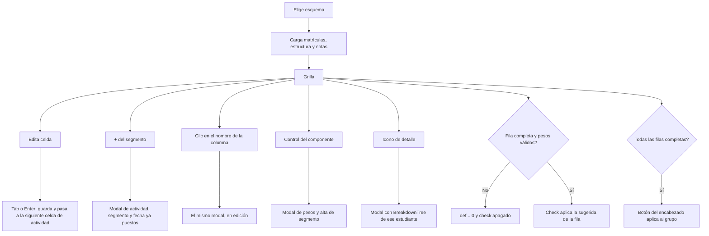
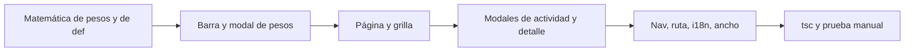

# Plan: malla de calificación de actividades

**Proyecto:** eduCalc  
**Documento:** Plan de implementación (solo frontend)  
**Fecha:** Septiembre 2026  
**Estado:** Por implementar  
**Relacionado con:** [modulo-gestion-calificaciones-por-actividades.md](./modulo-gestion-calificaciones-por-actividades.md), [implementacion-nota-sugerida-grupo-y-acordeon.md](./implementacion-nota-sugerida-grupo-y-acordeon.md), [implementacion-selector-pesos-segmentos.md](./implementacion-selector-pesos-segmentos.md), [guia-implementacion-features.md](./guia-implementacion-features.md)

Pantalla nueva para que el docente califique a todo el grupo de un esquema en una sola grilla: componentes, segmentos y actividades en el encabezado, una fila por estudiante y la nota del periodo a la derecha.

Este plan sigue [guia-implementacion-features.md](./guia-implementacion-features.md). La feature no crea modelos ni endpoints. Los pasos de backend, tests de API y OpenAPI **no aplican**; quedan marcados así para no reabrirlos durante la implementación.

---

## 1. Problema

### Quién

Personal de staff: `ADMIN`, `COORDINATOR` y `TEACHER` (`STAFF_ROLES`). El docente solo ve esquemas que la API ya le deja ver. El acudiente no entra a esta ruta.

### Qué datos toca

Solo entidades que ya existen. No hay modelo nuevo.

| Dato en la malla | Entidad | Quién lo define |
|---|---|---|
| Componente y su % | `SubjectComponent` | Administrador, por asignatura. En esta pantalla es solo lectura. |
| Segmento y su % | `ComponentSegment` | Docente, dentro del `GradingScheme`. Los pesos de un componente suman 100 %. |
| Columna de actividad | `GradingActivity` | Docente. El promedio dentro del segmento es simple: la actividad no tiene peso. |
| Celda | `StudentActivityScore.score` | Docente. `null` es nota pendiente, no cero. |
| Columna `def` | Cálculo de `grading_suggestion_service.py` | No se persiste. Al confirmar, el endpoint actual escribe `Grade.numerical_grade` y `performance_level`. |
| Filas | Matrículas activas del grupo y año del `CourseAssignment` | — |

### Qué acciones

1. Elegir el esquema (curso + periodo) y calificar en las celdas.
2. Crear y editar actividades de un segmento. Cada actividad nueva es una columna.
3. Abrir el reparto de pesos de los segmentos de un componente, y desde ahí crear un segmento.
4. Ver el detalle de un estudiante.
5. Aplicar la nota sugerida de una fila, o de todo el grupo cuando la malla está completa.

### Qué no debe cambiar

- `Grade.definitive_grade`. Aplicar la sugerida sigue el contrato actual: escribe `numerical_grade` y `performance_level`, y crea `Grade` si no existe.
- La fórmula del servidor y la renormalización de pesos cuando faltan notas. La malla solo cambia **cuándo se muestra** el promedio.
- Los pesos de `SubjectComponent`. El docente no hace `PATCH` de componentes.
- No se eliminan actividades ni segmentos desde esta pantalla.
- No se pegan bloques desde Excel.
- Las pantallas actuales del módulo siguen: esquemas, notas por actividad y nota sugerida.
- No se añade `@mui/x-data-grid-pro` ni AG Grid Enterprise. Esta pantalla usa AG Grid Community (MIT). El resto del admin sigue en `@mui/x-data-grid`.
- Mobile no entra en este plan.

### Regla de la columna def

`def` es el promedio del periodo (actividades → segmento → componente), el mismo que hoy calcula el servidor. Todavía no es la nota oficial: pasa a serlo cuando el docente pulsa el check, igual que `POST .../apply-suggestion/`.

| Condición | Celda `def` | Check de la fila |
|---|---|---|
| Falta alguna actividad del esquema, o los pesos no suman 100 % | `0` | Deshabilitado |
| Todas las actividades de ese estudiante tienen nota y los pesos son válidos | El `suggested_grade` del servidor | Aplica la sugerida de ese estudiante |

El `0` es el texto que se muestra. No se guarda un cero en `StudentActivityScore` ni en `Grade`.

El botón de grupo, en el encabezado de la página, usa `POST .../apply-suggestion-bulk/`. Solo se habilita cuando **cada** estudiante matriculado tiene **todas** las actividades con nota y los pesos son válidos. Mientras falte una celda, permanece deshabilitado. El endpoint ya omite incompletos; la interfaz no lo ofrece hasta que no haya a quién omitir.

---

## 2. Precedentes

Copiar estos patrones. No añadir otra librería de tablas, otro cliente HTTP ni otro formulario.

| Necesidad | Dónde está |
|---|---|
| Módulo, tabs y sidebar | `activityGradingNav.ts`, `ActivityGradingLayout.tsx`, `navConfig.ts` |
| Selector de esquema | `SuggestedGradesPage.tsx` |
| Celda editable, validación y nota vacía = `null` | `activityPlanning/ActivityScoresGrid.tsx` |
| Crear y editar actividad | `PlanningActivityDialog.tsx` (`segmentId`, `defaultDate`, `editing`) |
| Crear segmento | `PlanningSegmentQuickAdd.tsx`, `createComponentSegment` |
| Detalle por estudiante | `BreakdownTree` en `GradingSchemeBreakdownPanel.tsx` y `fetchGradingSchemeBreakdown` |
| Aplicar sugerida | `applyGradingSchemeSuggestion`, `applyGradingSchemeSuggestionBulk` |
| Barra de pesos | `mobile/src/features/grading/planUtils.ts` y `SegmentWeightRange.tsx`. Port descrito en [implementacion-selector-pesos-segmentos.md](./implementacion-selector-pesos-segmentos.md) |
| API ya tipada | `frontend/src/features/operations/gradingApi.ts` |
| Textos | `frontend/src/i18n/locales/es.json`, claves `activityGrading.*` |
| Esquema en la URL | `useSearchParams` + `{ replace: true }` |

---

## 3. Diseño

### Entidades

Sin cambios. La jerarquía de la grilla es la que ya cuelga del esquema:

```
GradingScheme (CourseAssignment + AcademicPeriod)
  └── SubjectComponent          peso de catálogo, solo lectura
        └── ComponentSegment    peso del docente, suma 100 % por componente
              └── GradingActivity
                    └── StudentActivityScore
```

### Endpoints

Ninguno nuevo. No hay migración, serializer, vista ni export de OpenAPI.

| Acción de la malla | Llamada que ya existe |
|---|---|
| Listar esquemas activos | `GET /api/grading-schemes/?is_active=true` |
| Estructura | componentes, segmentos y actividades del esquema (`gradingApi.ts`) |
| Notas del grupo | `fetchStudentActivityScoresForScheme` |
| Matrículas | activas, por grupo y año de la asignación |
| Guardar celda | `POST` o `PATCH /api/student-activity-scores/`. Vacío con nota previa → `score: null` |
| Crear o editar actividad | `PlanningActivityDialog` → `createGradingActivity` / `patchGradingActivity` |
| Repartir pesos | `PATCH /api/component-segments/{id}/` con `weight_percent` en string de 2 decimales. Un PATCH por segmento que cambió, en paralelo. Luego una sola invalidación |
| Crear segmento | `POST /api/component-segments/` |
| Validar pesos | flags `subject_component_weights_valid` y `segment_weights_valid` del esquema, más `validate-weights` si hace falta refrescar |
| Detalle | `GET /api/grading-schemes/{id}/breakdown/?student=` |
| Aplicar fila | `POST /api/grading-schemes/{id}/apply-suggestion/` |
| Aplicar grupo | `POST /api/grading-schemes/{id}/apply-suggestion-bulk/` |

### Roles

| Rol | Menú y ruta | Datos |
|---|---|---|
| `ADMIN`, `COORDINATOR` | Sí | El alcance que la API ya aplica a esquemas y notas |
| `TEACHER` | Sí | Solo sus asignaciones. El filtro lo hace el servidor |
| `PARENT` | No | El prefijo `/activity-grading` ya está en `staffPrefixes` |

El control de la ruta no necesita otra entrada en `routeAccess.ts`: `/activity-grading/grade-grid` cae bajo el prefijo `/activity-grading`.

### Umbrales que ya existen y esta pantalla debe respetar

| Regla | Valor |
|---|---|
| Suma de pesos | 100 %, tolerancia `0.01` |
| Barra de segmentos | Visible con 2 o más segmentos y restante `≤ 0.01` |
| Salto y mínimo de la barra | 5 % y 5 % |
| Un solo segmento al 100 % | Sin divisor. Un campo de peso permite bajarlo y liberar resto |
| Nota de actividad | `0` ≤ nota ≤ `max_score` de esa actividad, hasta 2 decimales. Vacío = pendiente |
| Nota máxima al crear | `5.00`, como el diálogo actual |
| Actividades del segmento | Promedio simple. No inventar peso por actividad |
| Sugerida oficial | La escribe el servidor al aplicar. La malla no calcula un número distinto para guardarlo |

### Número que se muestra en def

La columna no debe llamar al desglose de cada estudiante al cargar. Con actividades, segmentos, pesos y notas ya cargados:

1. Si a ese estudiante le falta una actividad del esquema, o si algún flag de pesos es falso → mostrar `0`.
2. Si está completo y los pesos son válidos → mostrar el mismo valor que `suggested_grade`.

Ese valor sale de una función pura en el cliente, copiada de `compute_suggested_grade`, `_segment_average` y `_weighted_average` en `backend/core/grading_suggestion_service.py` (promedio simple del segmento, promedio ponderado con renormalización de tramos sin nota, cuantizar a 2 decimales con half-up). Cuando todas las actividades tienen nota, el resultado coincide con el servidor. No reimplementar la fórmula “a ojo”.

Al abrir el detalle de un estudiante completo, el `suggested_grade` del `GET breakdown` manda si llegara a diferir: se corrige la función pura. No se cambia el servicio.

El desglose del modal, con el estudiante incompleto, sigue listando cada actividad (nota o `—`). El número grande de ese modal usa la misma regla que la columna: `0` hasta que esté completo. Así la fila y el modal no muestran dos promedios distintos. El `suggested_grade` parcial que el API renormaliza no se usa como cifra de la malla.

---

## 4. Librería de la grilla

Spike de septiembre 2026, con un prototipo sobre AG Grid Community 36 (`ag-grid-community` + `ag-grid-react`) y React 19. La página de prueba se quitó; no queda dependencia instalada hasta implementar.

| Requisito | MUI Data Grid comunitario (el del admin) | AG Grid Community | Otras |
|---|---|---|---|
| Tres niveles de encabezado con botones | Sí, `columnGroupingModel` y `renderHeaderGroup` | Sí, `children` y `headerGroupComponent`. Probado: «pesos» y `+` disparan acción | Glide Data Grid solo agrupa un nivel. Handsontable sí, con licencia de pago para un producto |
| Nombre y documento fijos a la izquierda, `def` y acciones a la derecha | No. Fijar columnas es Pro | Sí, `pinned: 'left' \| 'right'` en el paquete MIT. Probado: el DOM marca columnas pinned a ambos lados | MUI Pro lo resuelve pagando. Glide también fija columnas, pero no arma tres encabezados |
| Clic, Tab y Enter a la siguiente actividad, guardado al salir | Sí, con `editMode="cell"`. Enter baja de fila y hay que desviarlo | Sí. Probado: Enter guardó `4,2` y avanzó de actividad; Tab pasó de `tall 1` a `tall 2`. El avance horizontal no es el default: `tabToNextCell` y `suppressKeyboardEvent` | Handsontable lo trae de serie y queda fuera por licencia |
| Color por segmento y nombre largo recortado | Sí | Sí. Probado | — |
| Cambiar el ancho arrastrando el borde del encabezado | Sí | Sí, `resizable` viene activo. No se apaga | — |
| Pegar un rango | No hace falta | El rango y el portapapeles son Enterprise. No se usan | — |

AG Grid parte un grupo si una columna de adentro se fija y otra no. Nombre, documento, `def` y acciones quedan **fuera** de los grupos, con `lockPinned` y sin reordenar (`suppressMovable`). El ancho sigue siendo ajustable: `suppressMovable` no apaga `resizable`.

El encabezado de un grupo angosto recorta el botón más el texto (en el spike, Axiológico y Actitudinal). El botón va en icono y el grupo no puede ser más estrecho que su etiqueta.

El tema Quartz no es MUI. Se ajusta lo mínimo (fuente, bordes, colores de segmento) sin rehacer el resto de las tablas del admin.

## 5. Pantalla

Ruta: `/activity-grading/grade-grid`.  
Ítem de menú, dentro de **Calificaciones por actividades**: **Malla de calificación de actividades**.  
Como los ítems de `activityGradingNavItems` alimentan el sidebar y las tabs, esta entrada aparece en los dos sitios. No sustituye a las otras tres.

El `scheme` seleccionado vive en la query (`?scheme=<uuid>`, `replace: true`) para sobrevivir un refresh.



### Encabezado de tres niveles

`ColGroupDef` anidado de AG Grid Community, con `headerGroupComponent`:

1. **Componente:** nombre, porcentaje de catálogo y un botón que abre el modal de pesos. El cuadrado del boceto es ese botón, no un interruptor para sacar el componente del cálculo. Todos los componentes del catálogo participan siempre.
2. **Segmento:** nombre, porcentaje y `+`.
3. **Actividad:** el nombre. Si no cabe, se recorta y `headerTooltip` muestra el nombre completo. Clic en el nombre abre la edición. La columna no se ordena ni tiene menú.

Columnas sueltas, fuera de los grupos y fijadas: nombre y documento a la izquierda; `def` y acciones a la derecha. Orden de estudiantes: `student_name` con locale `es`. Orden de columnas: `sort_order` de componente, segmento y actividad.

Color de fondo por segmento (azul, ámbar, verde, violeta, y se repite el ciclo si hay más). Sirve para leer el bloque; no es un tema nuevo.

`ActivityGradingLayout` limita el módulo a `max-w-6xl`. En esta ruta el contenedor usa el ancho del contenido y el scroll horizontal es el de la grilla. Las columnas fijadas no se mueven con ese scroll.

### Ancho de columnas

El docente cambia el ancho arrastrando el borde derecho del encabezado. Aplica a nombre, documento, cada actividad, `def` y acciones, también si la columna está fijada. Un doble clic en ese borde ajusta la columna al texto.

`resizable` queda en `true`. Cada actividad tiene un `minWidth` suficiente para una nota (`3,50`) y el nombre recortado no puede quedar en cero. Ensanchar una columna no reordena el grupo ni parte el encabezado.

El ancho vive en la sesión de la grilla. No se guarda en la API: al recargar, las columnas vuelven al ancho inicial.

### Edición

`singleClickEdit`, `stopEditingWhenCellsLoseFocus` y `onCellValueChanged`. La validación de formato y de `max_score` se copia de `ActivityScoresGrid`; el widget no.

- Clic y escritura.
- Tab (`tabToNextCell`) y Enter (`suppressKeyboardEvent`) confirman y pasan a la **siguiente celda de actividad** hacia la derecha. Al final de la fila, a la primera actividad del siguiente estudiante. El Enter por defecto se queda en la celda o baja de fila; el spike lo desvió en horizontal.
- Validación ya existente: formato, tope `max_score`, coma o punto. Si falla, la celda vuelve al valor anterior y se muestra `getErrorMessage` / el texto de nota inválida.
- Celda vaciada: si había nota, `PATCH` con `score: null`. Si no había, no se crea registro.
- Guardar solo la actividad que cambió.
- Sin handler de pegado de rango. Pegar dentro de la celda en edición puede seguir siendo el pegado nativo de un solo valor.

### Modal de actividad

Reutilizar `PlanningActivityDialog` sin campos nuevos.

| Apertura | Valores iniciales |
|---|---|
| `+` del segmento | `segmentId` de ese segmento (el selector de segmento no se muestra), fecha de hoy, `max_score` `5.00`, nombre vacío |
| Clic en el nombre de la columna | `editing` con esa `GradingActivity` |

No hay acción de eliminar en este flujo. El diálogo tampoco la ofrece hoy.

### Modal de pesos

Uno por componente. Muestra el nombre y el % de catálogo, sin edición.

Portar el control, no reescribir la matemática:

1. Copiar `boundariesFromWeights`, `weightsFromBoundaries`, `moveBoundary`, `applyBoundaryMove` y las constantes `MIN` / `STEP` / `TOLERANCE` a `frontend/src/features/operations/weightRangeMath.ts`.
2. Rehacer la barra con MUI (`Box`, `Typography`, `CircularProgress`) y el contrato `onChange` / `onCommit` de [implementacion-selector-pesos-segmentos.md](./implementacion-selector-pesos-segmentos.md): commit al soltar, PATCH solo de lo que cambió, caché optimista, el draft no se pisa con props viejas, loader hasta invalidar.

Contenido según el estado de ese componente:

| Estado | Qué se muestra |
|---|---|
| 2+ segmentos y suma ≈ 100 % | La barra |
| 1 segmento al 100 % | Campo de peso para bajarlo. Sin divisor |
| Queda restante `> 0.01` | Alta de segmento: nombre y peso, con las plantillas y el restante de `PlanningSegmentQuickAdd` |

Crear un segmento con la suma ya en 100 % permanece deshabilitado hasta liberar al menos 5 % (el mínimo de la barra, o el campo si solo hay un segmento). El nuevo segmento usa ese resto. No se reparte solo al pulsar «agregar».

Este plan no sustituye los campos de peso de `GradingSchemeStructurePanel`. El componente portado queda listo para ese reemplazo en otro cambio.

### Modal de detalle

`Dialog` con el árbol de un solo estudiante (`BreakdownTree`), alimentado por `fetchGradingSchemeBreakdown`. No se monta el acordeón de todo el grupo. Exportar el árbol si hoy es privado del panel, sin cambiar el comportamiento de la pestaña Nota sugerida.

El check de aplicar no se duplica dentro del modal.

### Aplicar

- Fila: el check llama a `applyGradingSchemeSuggestion`. Deshabilitado si `def` es `0`.
- Grupo: botón en el encabezado de la página, deshabilitado hasta que todas las filas estén completas y los pesos sean válidos. Luego el endpoint bulk y el mismo aviso de resultado que ya usa el panel (aplicados, omitidos, nivel de desempeño).
- Tras aplicar, `def` sigue mostrando el promedio. La nota oficial queda en `Grade`. Avisar con el mensaje de confirmación que ya existe.
- Invalidar notas del esquema, breakdown y calificaciones del periodo.

### Vacío y errores

- Sin institución, o sin esquema: los mismos avisos que `SuggestedGradesPage`.
- Esquema sin segmentos: filas de estudiantes y encabezados de componente, con el botón de pesos para crear el primero.
- Segmento sin actividades: el `+` crea la primera columna.
- Sin matrículas: estado vacío de la grilla.
- Pesos inválidos: alerta visible, `def` en `0` y ambos applies apagados, aunque las celdas estén llenas.
- Error al guardar celda, actividad o peso: `getErrorMessage`, sin perder el resto de la grilla.

---

## 6. Archivos

### Crear

| Archivo | Rol |
|---|---|
| `frontend/src/features/operations/activityGrading/ActivityGradeGridPage.tsx` | Página: selector, grilla AG Grid Community, botón de grupo |
| `frontend/src/features/operations/activityGrading/gradeGridMath.ts` | Función pura de `def` y de “fila completa” |
| `frontend/src/features/operations/weightRangeMath.ts` | Matemática copiada de mobile |
| `frontend/src/features/operations/SegmentWeightRange.tsx` | Barra en MUI |
| `frontend/src/features/operations/activityGrading/SegmentWeightDialog.tsx` | Pesos + alta de segmento de un componente |
| `frontend/src/features/operations/activityGrading/StudentGradeDetailDialog.tsx` | Modal del `BreakdownTree` |

### Tocar

| Archivo | Cambio |
|---|---|
| `activityGradingNav.ts` | Ítem `gradeGrid`, ruta `/activity-grading/grade-grid`, icono de tabla |
| `routes/lazyPages.ts` | `lazy()` de la página |
| `routes/AppRoutes.tsx` | Ruta hija de `activity-grading` |
| `layouts/ActivityGradingLayout.tsx` | Ancho completo solo en esta ruta |
| `GradingSchemeBreakdownPanel.tsx` | Exportar `BreakdownTree` (o un wrapper equivalente) |
| `i18n/locales/es.json` | `activityGrading.nav.gradeGrid` = «Malla de calificación de actividades» y el resto de textos de la página |

`routeAccess.ts` no cambia. `queryKeys` se reutilizan (`gradingSchemes`, estructura, scores, breakdown).

### No tocar

`backend/`, `schema.json`, `openapi.d.ts`, mobile, y las tres pantallas ya publicadas del módulo, salvo el export del árbol de detalle.

---

## 7. Orden de implementación



1. Funciones puras (`weightRangeMath`, `gradeGridMath`) antes de la UI.
2. Barra y diálogo de pesos, todavía sin la grilla, para poder probar el reparto con un componente real.
3. Instalar `ag-grid-community` y `ag-grid-react` (Community, sin Enterprise). Página con selector, carga y celdas. Encabezados de grupo después de que guardar una celda funcione.
4. Enganchar los tres modales y los dos applies.
5. Nav, lazy route, textos y ancho.
6. `bunx tsc --noEmit` y el checklist de abajo.

No hay paso de `makemigrations`, tests Django ni `generate:api-types`.

---

## 8. Verificación

No hay runner de tests de frontend en el repo. La fórmula se comprueba a mano contra el API, y el tipo con el compilador.

```bash
cd frontend && bunx tsc --noEmit
```

Checklist manual, con un usuario `TEACHER` del curso y luego un `ADMIN`:

- [ ] El ítem aparece en el sidebar y en las tabs del módulo. Un acudiente no llega a la ruta.
- [ ] El selector lista esquemas activos. Recargar conserva `?scheme=`.
- [ ] Un docente no ve el esquema de otro docente (la lista ya viene filtrada por la API).
- [ ] Escribir, Tab y Enter guardan y avanzan a la siguiente actividad. Una celda vaciada vuelve a pendiente.
- [ ] Una nota por encima de `max_score`, o con formato inválido, no se guarda.
- [ ] Con notas incompletas, `def` es `0` y el check de la fila está apagado.
- [ ] Con la fila completa y pesos válidos, `def` es igual a `suggested_grade` de `GET .../breakdown/?student=`.
- [ ] El check escribe `numerical_grade` y `performance_level`, y deja `definitive_grade` como estaba.
- [ ] El botón de grupo sigue apagado si falta una sola celda de cualquier estudiante. Con la malla completa, aplica y muestra el resultado bulk.
- [ ] El `+` crea una columna en ese segmento, con fecha de hoy y máximo `5.00`.
- [ ] El nombre largo se recorta. Clic en el nombre edita. No hay forma de borrar la actividad.
- [ ] Arrastrar el borde de una actividad, del nombre y de `def` cambia su ancho. Un doble clic lo ajusta al texto. La columna no se puede dejar más angosta que la nota. Recargar restaura el ancho inicial.
- [ ] El botón del componente abre el reparto. Arrastrar un divisor deja la suma en 100 % y persiste al soltar. No se puede cambiar el % del componente.
- [ ] Con la suma en 100 % no se puede crear segmento hasta liberar al menos 5 %. Después, el alta usa ese resto.
- [ ] El detalle abre el desglose de esa fila. Si está incompleta, el número principal es `0` y las actividades pendientes se ven como tales.
- [ ] Con pesos que no suman 100 %, hay alerta, `def` en `0` y los dos applies apagados.
- [ ] Esquemas, notas por actividad y nota sugerida siguen abriendo y guardando como antes.

---

## 9. Checklist de la guía

- [x] Reglas de negocio y roles definidos (este documento)
- [x] Modelo + migración — no aplica
- [x] Serializers y OpenAPI — no aplica
- [x] ViewSet, scope y URL — no aplica; se reutilizan endpoints ya acotados
- [x] Tests de API — no aplica; no cambia el contrato
- [ ] Cliente y página sobre `gradingApi.ts`
- [ ] Nav, lazy route. `routeAccess` ya cubre el prefijo
- [ ] i18n en `es.json`
- [x] Doc de plan en `docs/`
- [ ] `tsc --noEmit` y checklist manual

Definición de hecho: un docente completa una fila, ve el mismo promedio que el desglose del API, lo aplica sin tocar la definitiva, y un estudiante incompleto no puede aplicar ni ver otro promedio en la columna.
